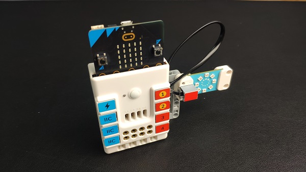
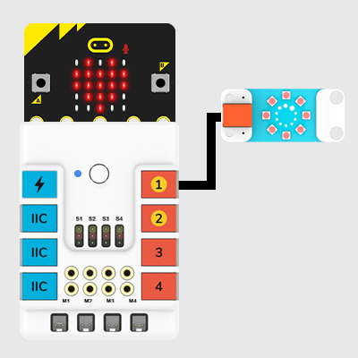
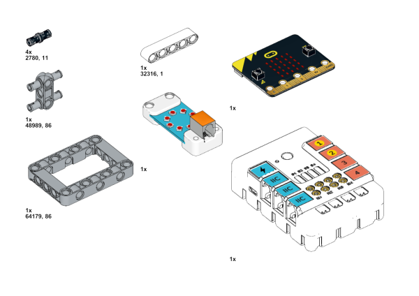
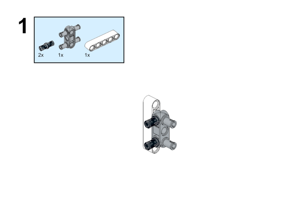
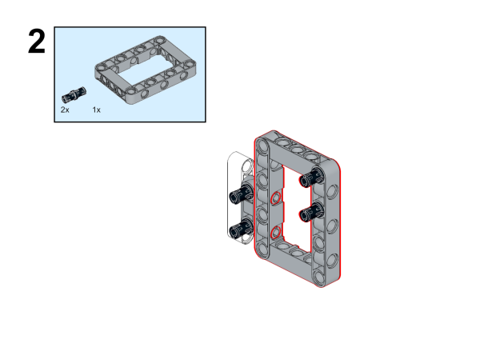
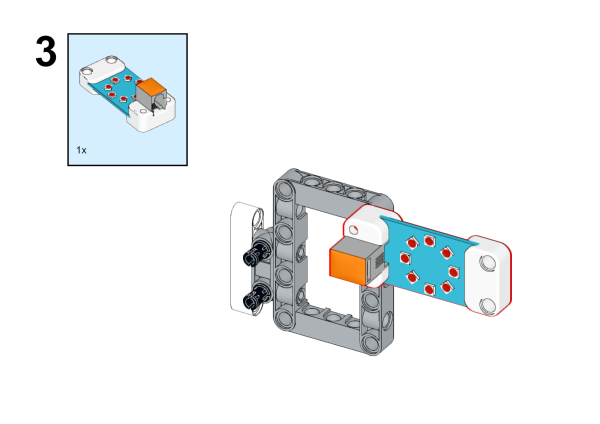
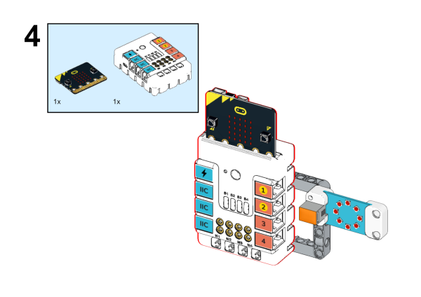
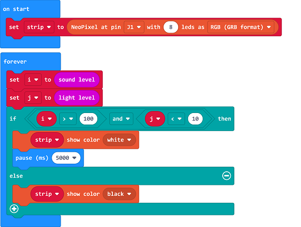
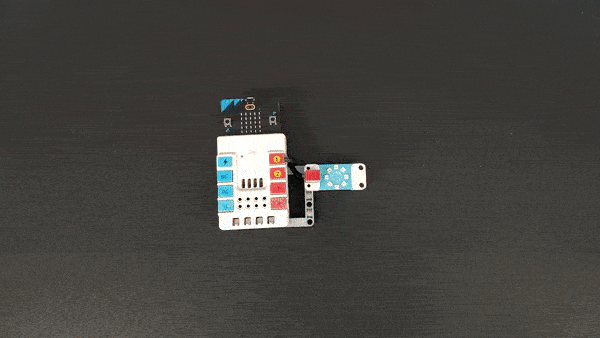

# Case 28: The Corridor Lights 

## Introduction 

This is a smart corridor light, which judges whether it needs to be turned on by the sound level and light level. Only when the light is dim and the sound of people walking is detected, the light will be automatically turned on, which saves more energy.

## Quick Start 

### Materials Required

Nezha expansion board × 1

micro:bit V2 × 1

Rainbow LED ring  × 1

Bricks × n

Tips:[Purchase Interactive coding accessories pack here.](https://www.elecfreaks.com/interactive-coding-accessories-pack.html)

### Connection Diagram 

Inset the micro:bit, and connect the rainbow led ring to J1 port on Nezha expansion board. 

### Assembly Video

Video link: [https://youtu.be/9LZHzZaXf8Y](https://youtu.be/9LZHzZaXf8Y)

<iframe width="560" height="315" src="https://www.youtube.com/embed/9LZHzZaXf8Y" title="YouTube video player" frameborder="0" allow="accelerometer; autoplay; clipboard-write; encrypted-media; gyroscope; picture-in-picture" allowfullscreen></iframe>

### Assembly Steps

## MakeCode Programming 

### Step 1

Click "Advanced" in the MakeCode drawer to see more choices. 

We need to add a package for programming. Click "Extensions" in the bottom of the drawer and search with "nezha" to download it. 

Note: If you met a tip indicating the codebase might be deleted due to incompatibility, you may continue as the tips say or create a new project in the menu. 

### Step 2

### Programme as the pictures indicate

### Reference

Link: [https://makecode.microbit.org/_7xqU5vTRwdvb](https://makecode.microbit.org/_7xqU5vTRwdvb)

You may download it directly below: 

<iframe style="position:absolute;top:0;left:0;width:100%;height:100%;" src="https://makecode.microbit.org/#pub:_7xqU5vTRwdvb" frameborder="0" sandbox="allow-popups allow-forms allow-scripts allow-same-origin"></iframe>
  
---

### Result
After powering on, the rainbow led ring lights on/off by its ambient light and sound level. 

