# Case 29: The Dazzling Car

## Introduction

This is a simple car. I installed a cool rainbow light ring on the car, and we can display different lighting effects through this light ring.

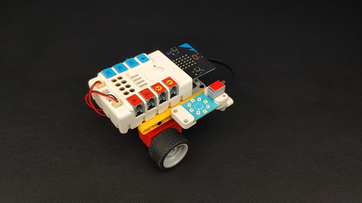

## Quick Start

### Materials Required

Nezha expansion board × 1

micro:bit V2 × 1

motors × 2

Color sensor  × 1

Rainbow LED ring  × 1

Bricks × n

Tips:[Purchase Interactive coding accessories pack here.](https://www.elecfreaks.com/interactive-coding-accessories-pack.html)

### Connection Diagram 

Insert the micro:bit, connect the motors to M1and M4, the color sensor to IIC port and the rainbow LED ring to J1 on the Nezha expansion board as the picture shows.

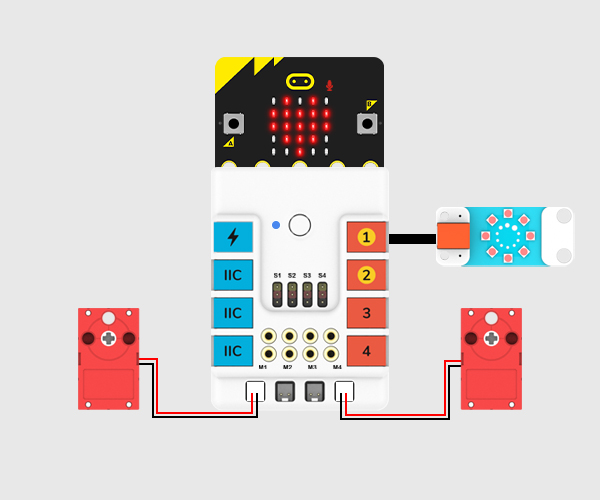

### Assembly Video

Link: [https://youtu.be/Am1ZEq1CqnY](https://youtu.be/Am1ZEq1CqnY)

<iframe width="560" height="315" src="https://www.youtube.com/embed/Am1ZEq1CqnY" title="YouTube video player" frameborder="0" allow="accelerometer; autoplay; clipboard-write; encrypted-media; gyroscope; picture-in-picture" allowfullscreen></iframe>

### Assembly Steps

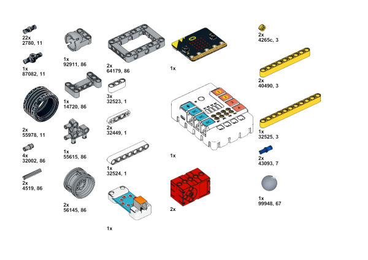

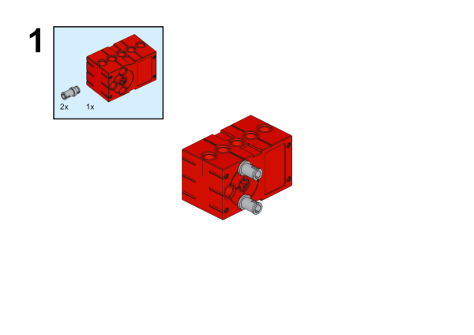

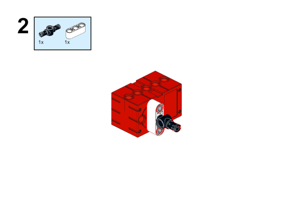

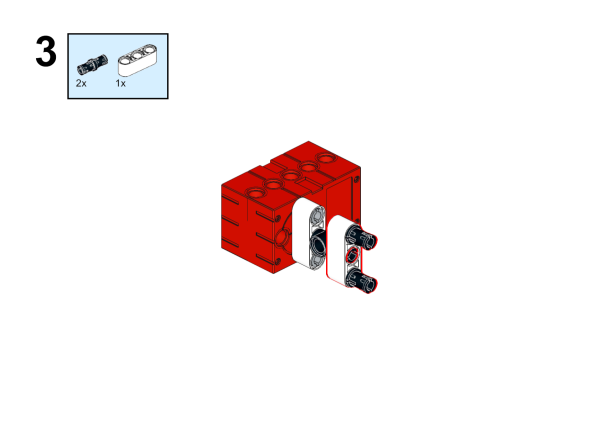

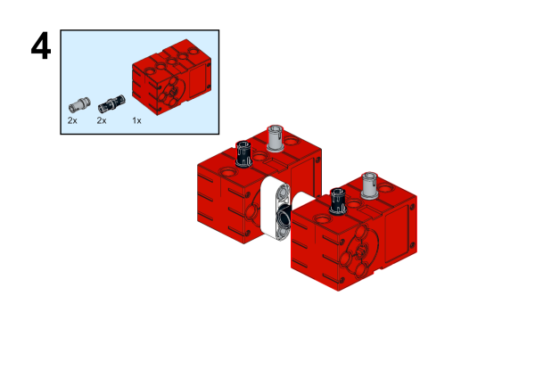

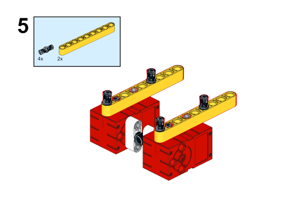

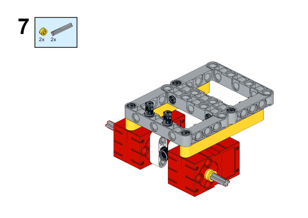

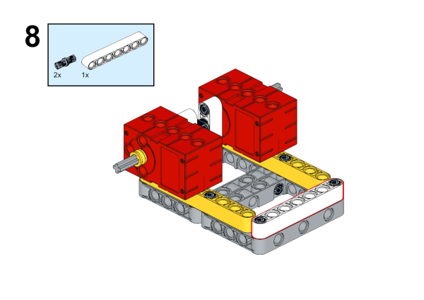

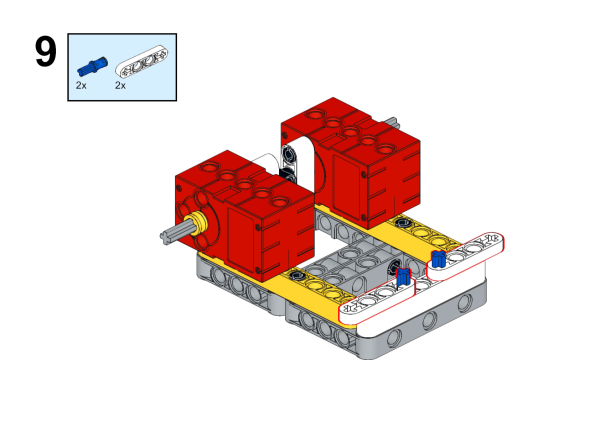

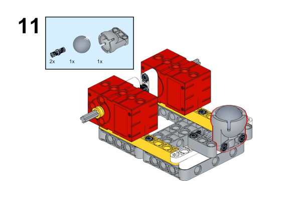

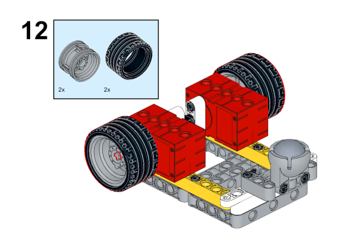

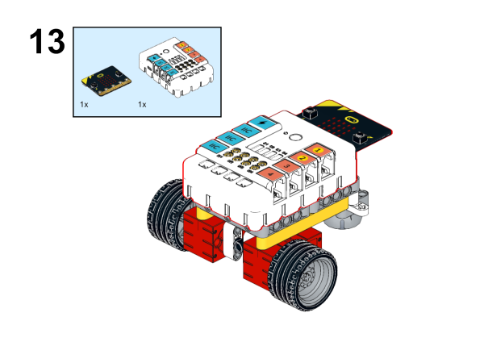

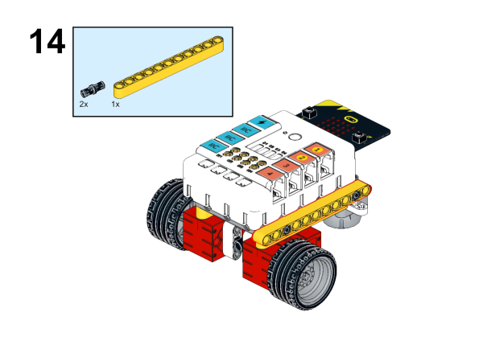

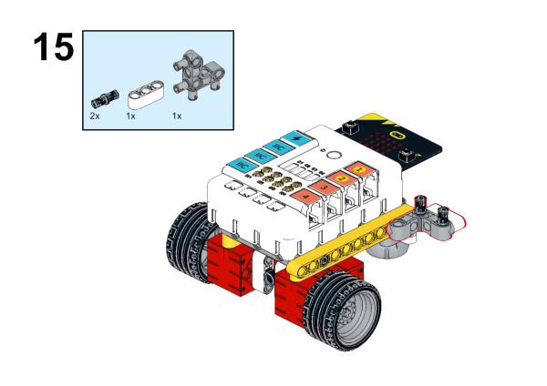

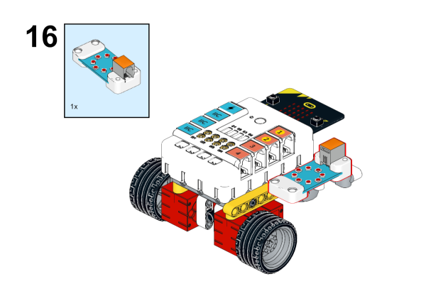

## MakeCode Programming

### Step 1

Click "Advanced" in the MakeCode to see more choices.

For programming, we need to add a package, click "Extensions" at the bottom of the MakeCode drawer and search with "nezha" in the dialogue box to download it

Notice: If you met a tip indicating that some codebases would be deleted due to incompatibility, you may continue as the tips say or create a new project in the menu. 

### Step 2

### Code as below:

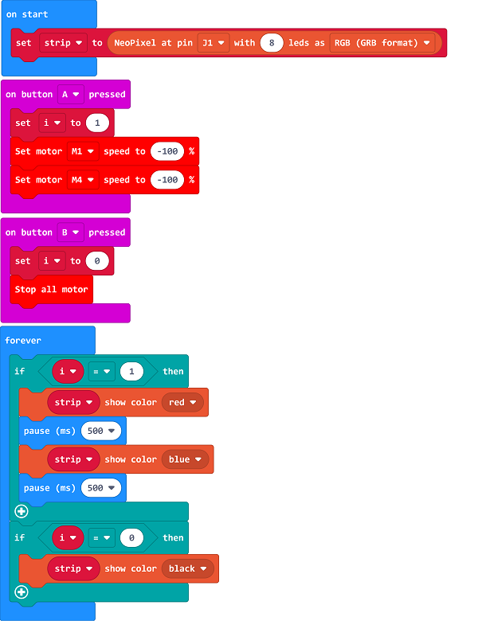

### Reference
Link: [https://makecode.microbit.org/_JtKg7ffF1YK7](https://makecode.microbit.org/_JtKg7ffF1YK7)

You may also download it directly below:

<iframe style="position:absolute;top:0;left:0;width:100%;height:100%;" src="https://makecode.microbit.org/#pub:_fzaisgJfKKKj" frameborder="0" sandbox="allow-popups allow-forms allow-scripts allow-same-origin"></iframe>
  
---

### Result
After powering on, press button A to drive the car foward and the LEDs light up in red and blue, press button B to stop the car and the LEDs light off. 

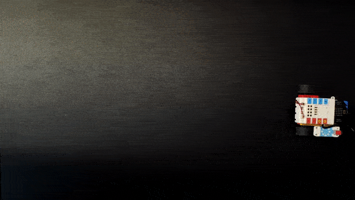

