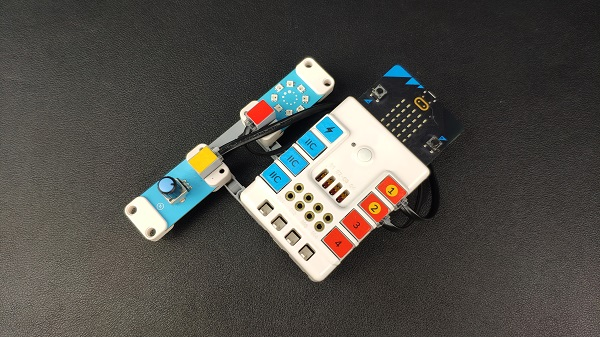
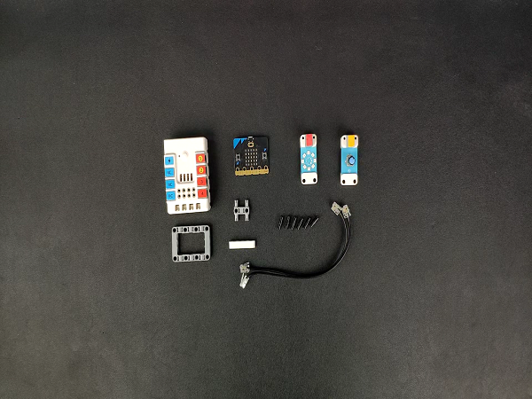
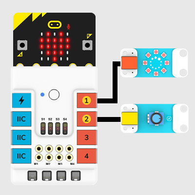
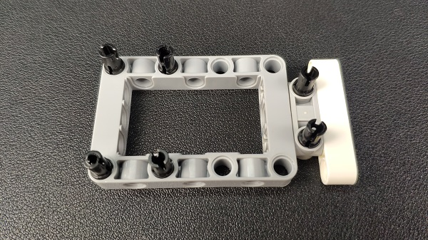
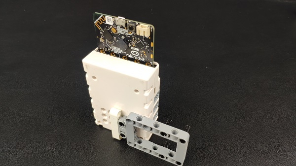
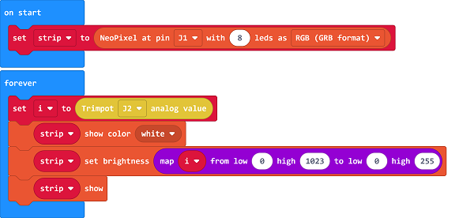

# Case 30: Adjustable lights

## Introduction
To make a lighting device in different  luminance levels. 

## Quick Start 

---

### Materials Required

---
Nezha expansion board × 1

micro:bit V2 × 1

Analog Rotation Potentiometer  × 1

Rainbow LED ring  × 1

Bricks × n

Tips: Purchase Interactive coding accessories pack here. 

### Bricks Required

### Connection Diagram 
---
- Inset the micro:bit, connect the rainbow led ring to J1 port and the trimpot to J2 port on Nezha expansion board. 

### Bricks Build-up 

---

- Build a device as the pictures indicate: 

Video link: [https://youtu.be/IDo75YvbOB8](https://youtu.be/IDo75YvbOB8)

<iframe width="560" height="315" src="https://www.youtube.com/embed/IDo75YvbOB8" title="YouTube video player" frameborder="0" allow="accelerometer; autoplay; clipboard-write; encrypted-media; gyroscope; picture-in-picture" allowfullscreen></iframe>

## MakeCode Programming 

---

### Step 1

---

Click "Advanced" in the MakeCode drawer to see more choices. 

We need to add a package for programming. Click "Extensions" in the bottom of the drawer and search with "nezha" to download it. 

Note: If you met a tip indicating the codebase might be deleted due to incompatibility, you may continue as the tips say or create a new project in the menu. 

### Step 2

---

### Programme as the pictures indicate

### Reference

Link: [https://makecode.microbit.org/_9zD1etLWh36q](https://makecode.microbit.org/_9zD1etLWh36q)

You may download it directly below: 

<iframe style="position:absolute;top:0;left:0;width:100%;height:100%;" src="https://makecode.microbit.org/#pub:_9zD1etLWh36q" frameborder="0" sandbox="allow-popups allow-forms allow-scripts allow-same-origin"></iframe>
  
---

### Result 
- After powering on, the luminance level is able to be adjusted by the trimpot.

