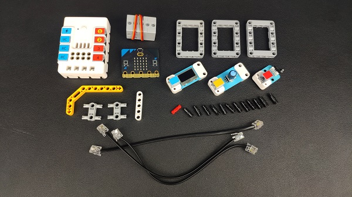
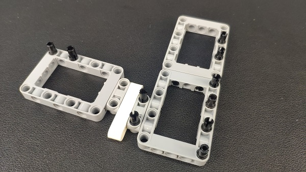
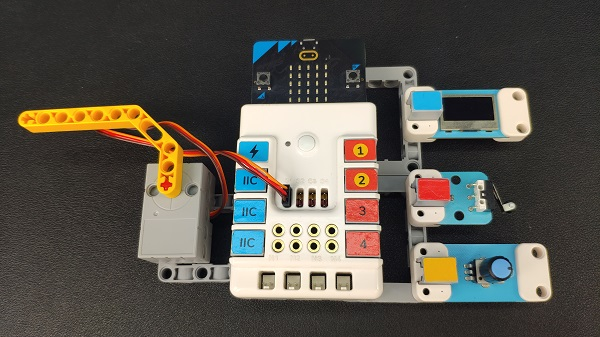

# Case 31: The Rotary Password Door
## Introduction
To make a rotary password door. 

## Quick Start 

---

### Materials Required

---
Nezha expansion board × 1

micro:bit V2 × 1

Trimpot × 1 

Servo  × 1

Crash sensor  × 1

OLED display  × 1

Bricks × n

Tips: Purchase Interactive coding accessories pack here. 

### Bricks Required

### Connection Diagram 
---
- Inset the micro:bit, connect the OLED display to IIC port, the servo to S1, the trimpot to J1and the crash sensor to J2 on Nezha expansion board. 

### Bricks Build-up 

---

- Build a device as the pictures indicate: 

Video link: [https://youtu.be/eniQAfqXym0](https://youtu.be/eniQAfqXym0)

<iframe width="560" height="315" src="https://www.youtube.com/embed/eniQAfqXym0" title="YouTube video player" frameborder="0" allow="accelerometer; autoplay; clipboard-write; encrypted-media; gyroscope; picture-in-picture" allowfullscreen></iframe>

## MakeCode Programming 

---

### Step 1

---

Click "Advanced" in the MakeCode drawer to see more choices. 

We need to add a package for programming. Click "Extensions" in the bottom of the drawer and search with "nezha" to download it. 

Note: If you met a tip indicating the codebase might be deleted due to incompatibility, you may continue as the tips say or create a new project in the menu. 

### Step 2

---

### Programme as the pictures indicate

### Reference

Link: [https://makecode.microbit.org/_Hc8CCTAUFXv9](https://makecode.microbit.org/_Hc8CCTAUFXv9)

You may download it directly below: 

<iframe style="position:absolute;top:0;left:0;width:100%;height:100%;" src="https://makecode.microbit.org/#pub:_Hc8CCTAUFXv9" frameborder="0" sandbox="allow-popups allow-forms allow-scripts allow-same-origin"></iframe>
  
---

### Result
- Adjust the numbers by rotating the trimpot, press the crash sensor after you choose the numbers ready, the door would open if the two passwords are in the correct ranges or the micro:bit displays "x" and the program reruns. 

