# Case 32: Gesture Recognition Ring LEDs

## Introduction
To make a light system that is controlled by hands gesture. 

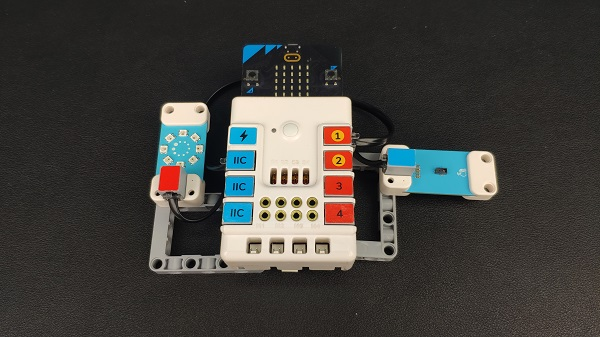

## Quick Start 

### Materials Required

Nezha expansion board × 1

micro:bit V2 × 1

Gesture sensor × 1

Rainbow LED ring  × 1

Bricks × n

Tips:[Purchase Interactive coding accessories pack here.](https://www.elecfreaks.com/interactive-coding-accessories-pack.html)

### Connection Diagram 

Inset the micro:bit, connect the gesture sensor to IIC port and the rainbow led ring to S1 on Nezha expansion board. 

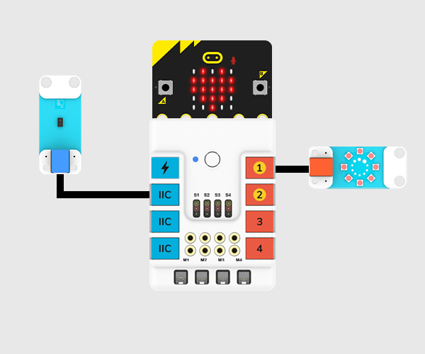

### Assembly Video 

Video link: [https://youtu.be/hq1rtbGvAwU](https://youtu.be/hq1rtbGvAwU)

<iframe width="560" height="315" src="https://www.youtube.com/embed/hq1rtbGvAwU" title="YouTube video player" frameborder="0" allow="accelerometer; autoplay; clipboard-write; encrypted-media; gyroscope; picture-in-picture" allowfullscreen></iframe>

### Assembly Steps

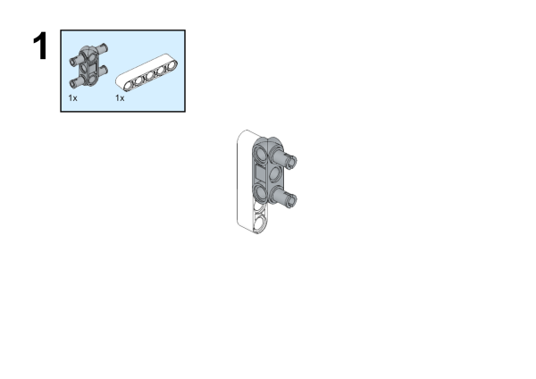

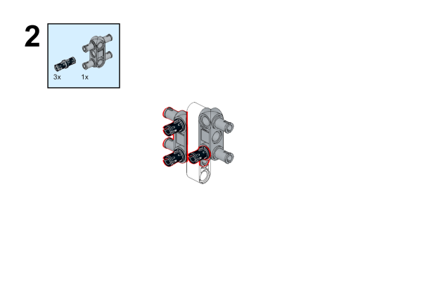

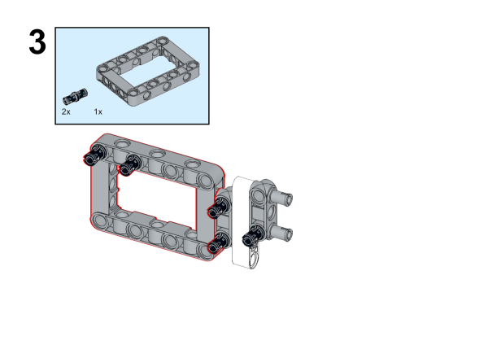

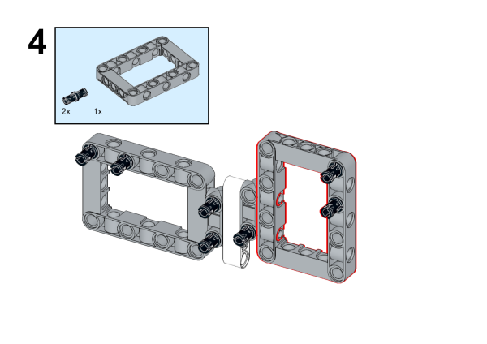

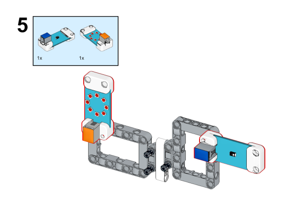

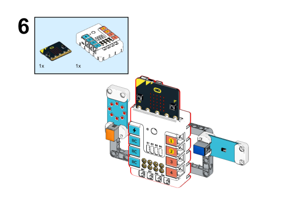

## MakeCode Programming 

### Step 1

Click "Advanced" in the MakeCode drawer to see more choices. 

We need to add a package for programming. Click "Extensions" in the bottom of the drawer and search with "nezha" to download it. 

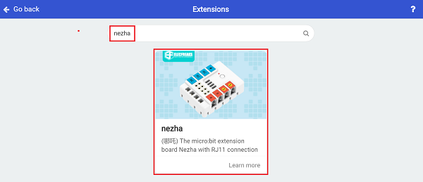

Note: If you met a tip indicating the codebase might be deleted due to incompatibility, you may continue as the tips say or create a new project in the menu. 

### Step 2

### Programme as the pictures indicate

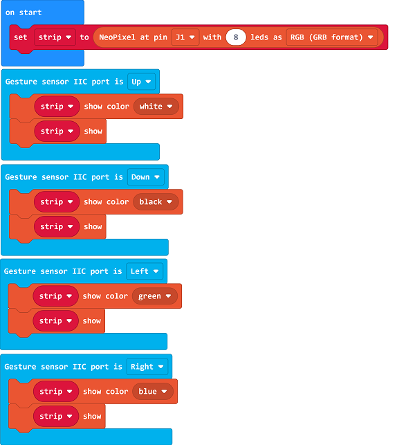

### Reference

Link: [https://makecode.microbit.org/_f3sDCoEzXfa8](https://makecode.microbit.org/_f3sDCoEzXfa8)

You may download it directly below: 

<iframe style="position:absolute;top:0;left:0;width:100%;height:100%;" src="https://makecode.microbit.org/#pub:_f3sDCoEzXfa8" frameborder="0" sandbox="allow-popups allow-forms allow-scripts allow-same-origin"></iframe>
  
---

### Result
The lights color is able to be changed by hands gesture. 

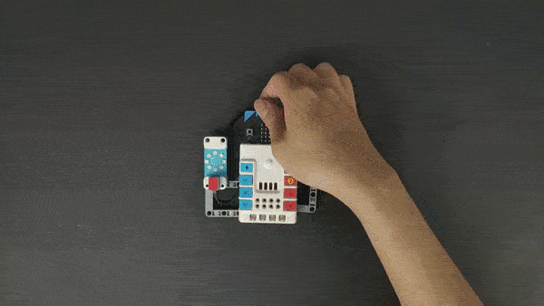
