# Case 34: Gesture Recognition Car

## Introduction

This is a simple car. We can install gesture recognition sensors on the car to control the car’s driving route based on gestures.

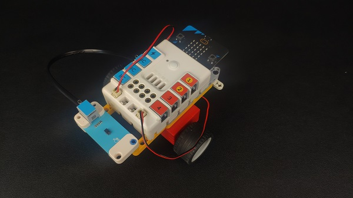

## Quick Start

### Materials Required

Nezha expansion board × 1

micro:bit V2 × 1

Motors × 2

Gesture sensor × 1

Bricks × n

Tips:[Purchase Interactive coding accessories pack here.](https://www.elecfreaks.com/interactive-coding-accessories-pack.html)

### Connection Diagram 

Insert the micro:bit, connect the motors to M1and M4 and the gesture sensor to IIC port on the Nezha expansion board as the picture shows.

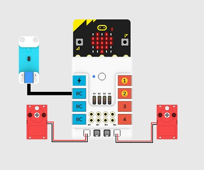

### Assembly Video

link: [https://youtu.be/ib-xX0MS41U](https://youtu.be/ib-xX0MS41U)

<iframe width="560" height="315" src="https://www.youtube.com/embed/ib-xX0MS41U" title="YouTube video player" frameborder="0" allow="accelerometer; autoplay; clipboard-write; encrypted-media; gyroscope; picture-in-picture" allowfullscreen></iframe>

### Assembly Steps

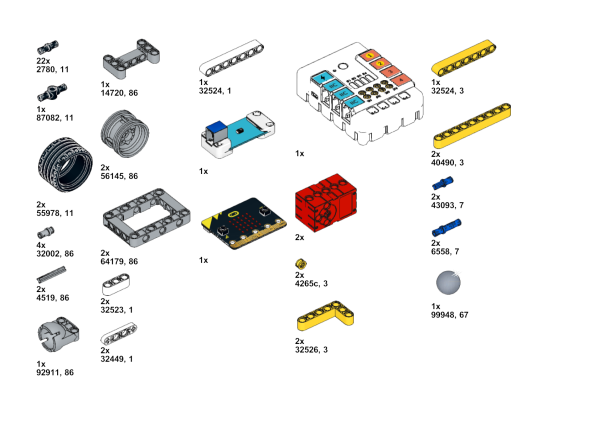

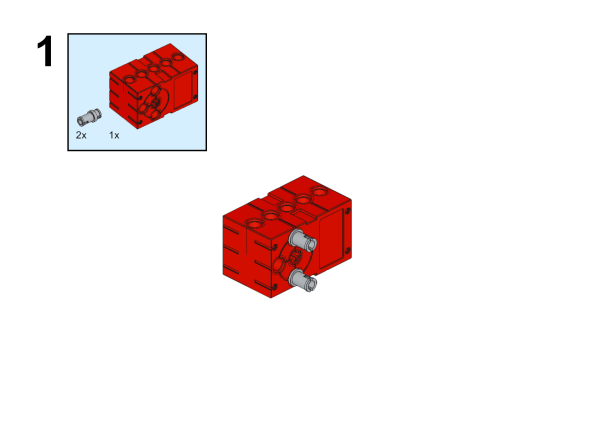

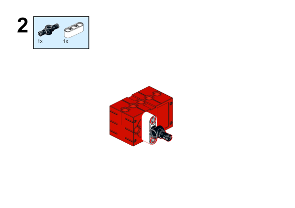

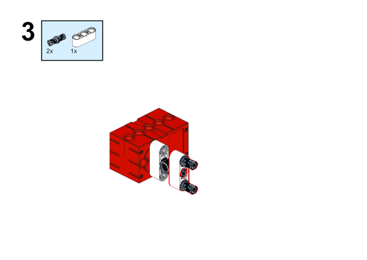

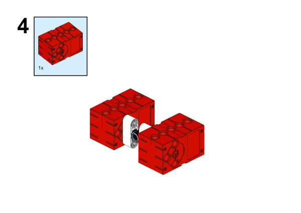

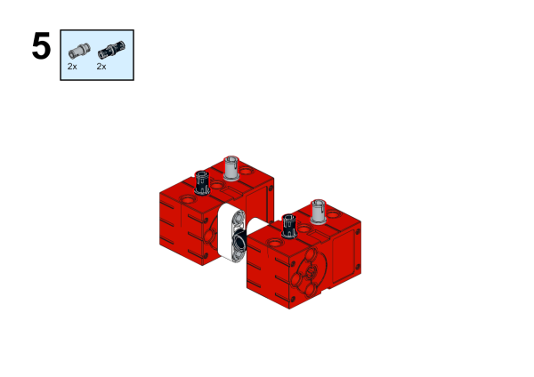

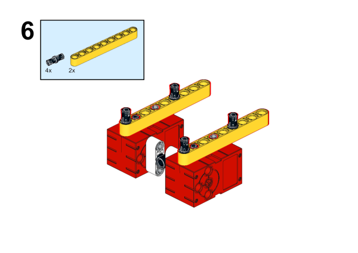

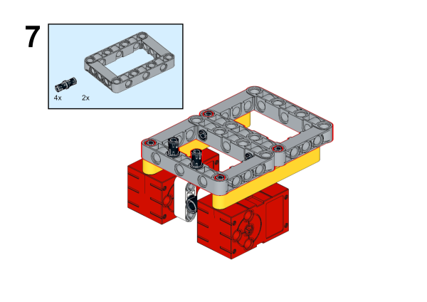

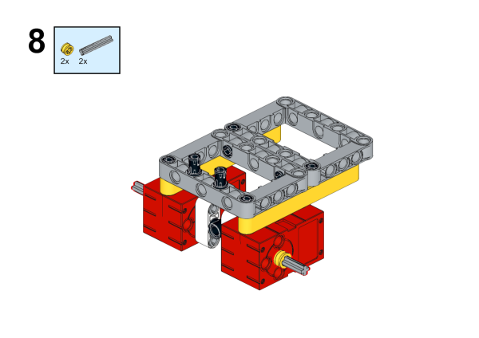

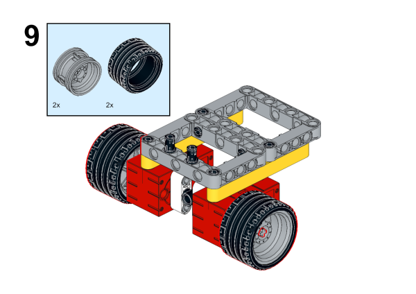

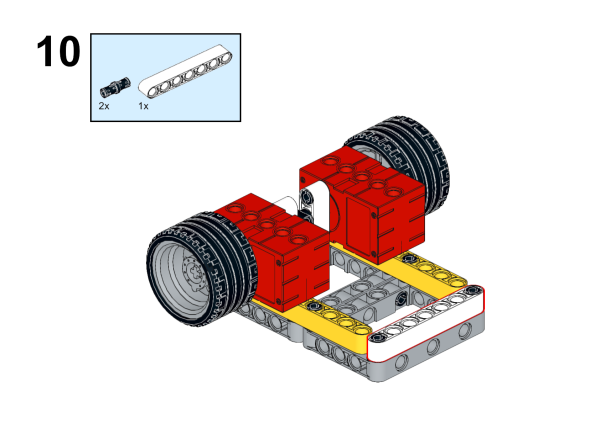

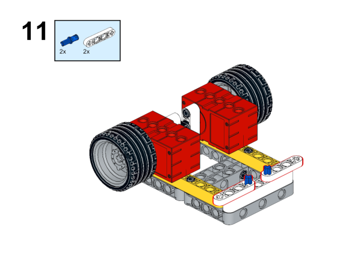

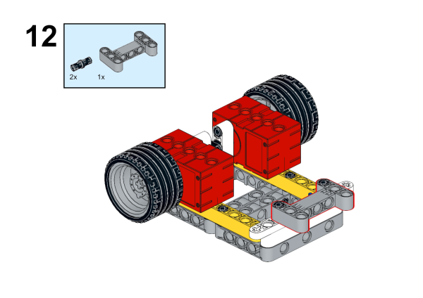

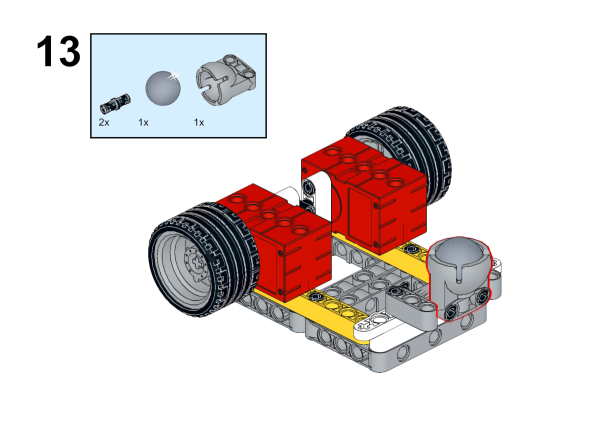

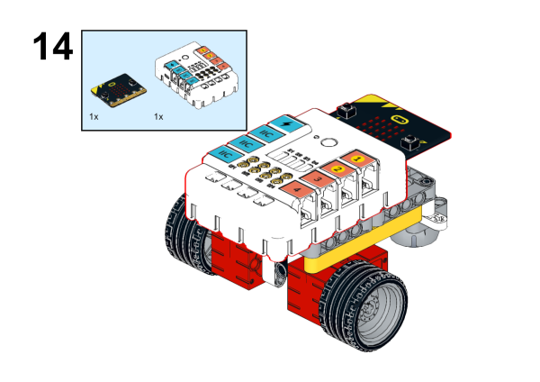

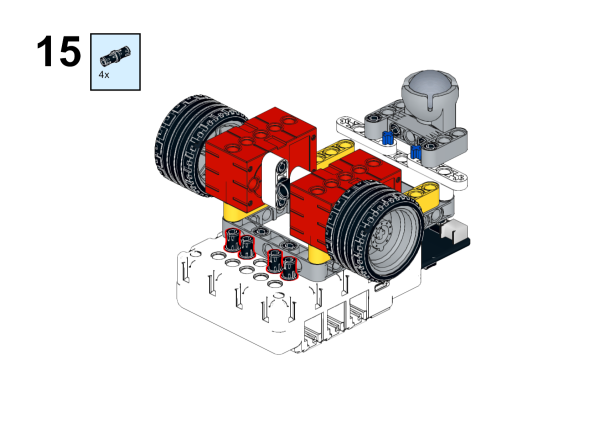

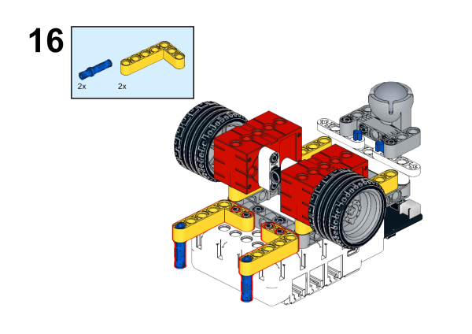

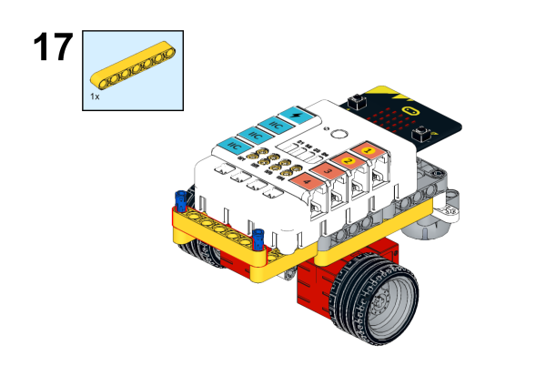

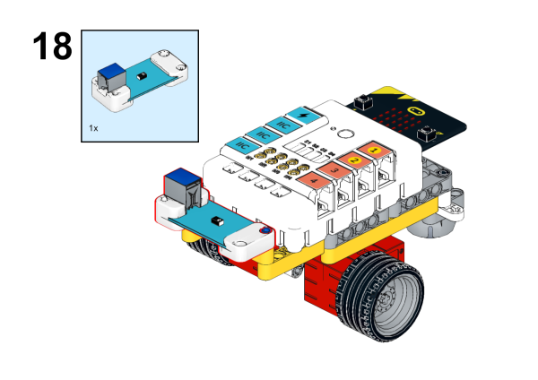

## MakeCode Programming

### Step 1

Click "Advanced" in the MakeCode to see more choices.

For programming, we need to add a package: click "Extensions" at the bottom of the MakeCode drawer and search with "nezha" in the dialogue box to download it. 

Notice: If you met a tip indicating that some codebases would be deleted due to incompatibility, you may continue as the tips say or create a new project in the menu. 

### Step 2

### Code as below:

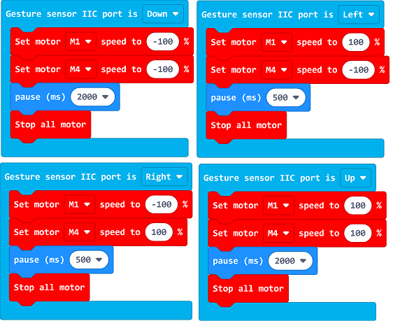

### Reference
Link: [https://makecode.microbit.org/_WkPER99xMP8e](https://makecode.microbit.org/_WkPER99xMP8e)

You may also download it directly below:

<iframe style="position:absolute;top:0;left:0;width:100%;height:100%;" src="https://makecode.microbit.org/#pub:_WkPER99xMP8e" frameborder="0" sandbox="allow-popups allow-forms allow-scripts allow-same-origin"></iframe>
  
---

### Result
After powering on, the car moves along with the indicated gestures. 

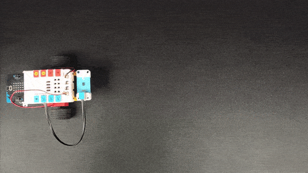
