# Case 37: Traffic Lights

## Introduction

In our daily life, many traffic accidents should have been avoided. These traffic accidents are often caused by people not observing the traffic rules, thus, we must understand the traffic rules. For example, the common traffic lights in our lives, red light means not passing, yellow light means warning, and green light means permission to pass. Let's make a traffic light controlled by the micro:bit.

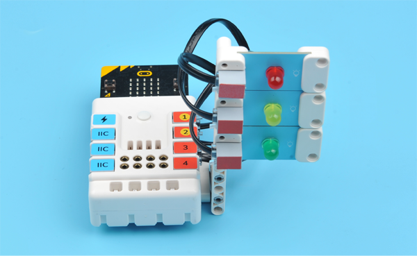

## Quick Start

### Materials Required

Nezha expansion board × 1

micro:bit × 1

LED-red × 1

LED-green × 1

LED-yellow × 1

RJ11 wires × 3

***Tips: You may need to purchase [Nezha Inventor's Kit](https://www.elecfreaks.com/nezha-inventor-s-kit-for-micro-bit-without-micro-bit-board.html) if you want all the above compoents.***

### Connection Diagram 

Connect the red LED to J1, yellow LED to J2 and green LED to J3 on the Nezha expansion board as the picture shows.

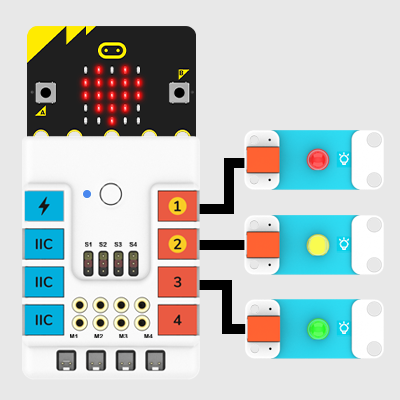

### Assembly Video

Video reference:[https://youtu.be/TmsDDWLcgcs](https://youtu.be/TmsDDWLcgcs)

<iframe width="560" height="315" src="https://www.youtube.com/embed/TmsDDWLcgcs" frameborder="0" allow="accelerometer; autoplay; clipboard-write; encrypted-media; gyroscope; picture-in-picture" allowfullscreen></iframe>

### Assembly Steps

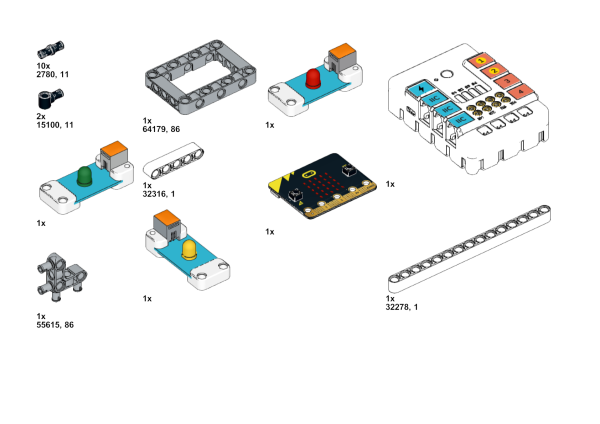

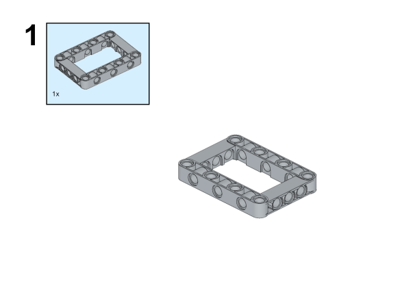

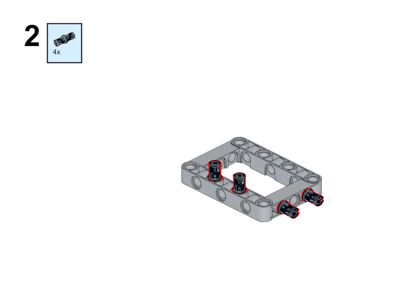

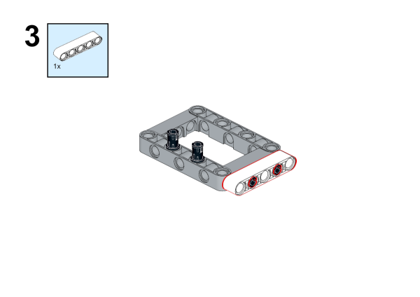

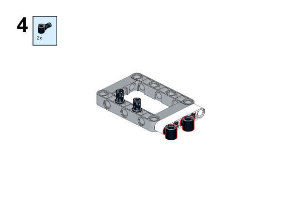

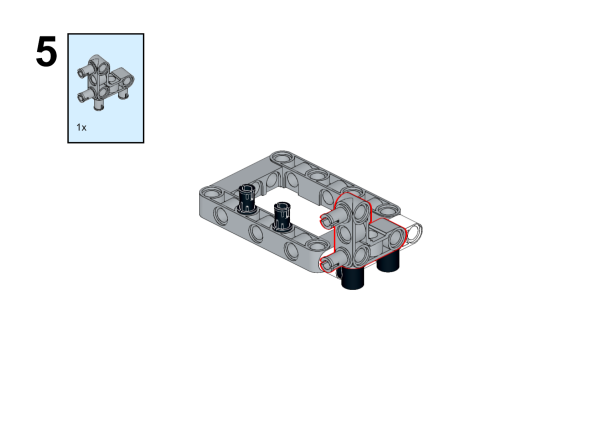

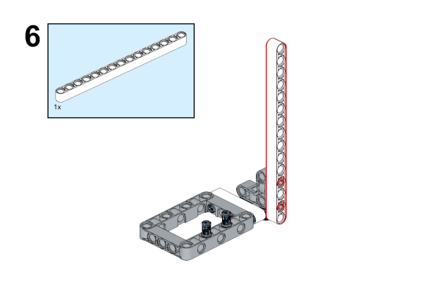

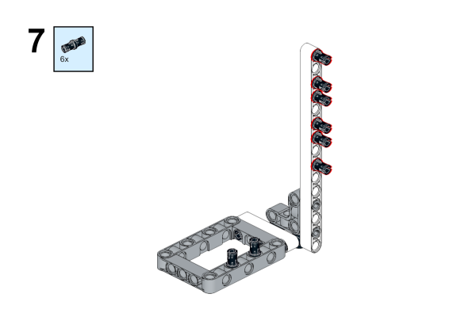

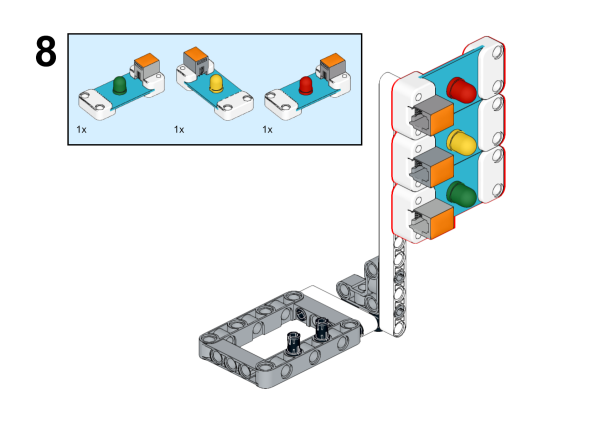

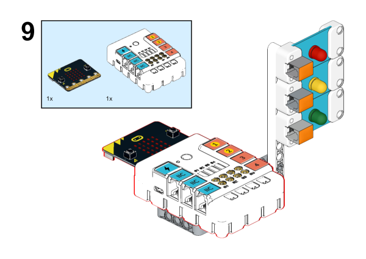

## Makecode Programming

### Step 1
Click "Advanced" in the MakeCode to see more choices.

For programming, we need to add a package: click "Extensions" at the bottom of the MakeCode drawer and search with "PlanetX" in the dialogue box to download it. 

***Notice:*** If you met a tip indicating that some codebases would be deleted due to incompatibility, you may continue as the tips say or create a new project in the menu. 

### Step 2
### Code as below:

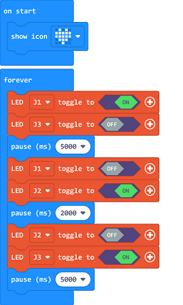

### Reference
Link：[https://makecode.microbit.org/_M6RiKA642WPP](https://makecode.microbit.org/_M6RiKA642WPP)

You may also download it directly below:

<iframe style="position:absolute;top:0;left:0;width:100%;height:100%;" src="https://makecode.microbit.org/#pub:_M6RiKA642WPP" frameborder="0" sandbox="allow-popups allow-forms allow-scripts allow-same-origin"></iframe>
  

### Result
The red LED lights on for 5 seconds and then lights off; the yellow LED lights on for 2 seconds and off then; the green LED lights on for 5 seconds and off then. 

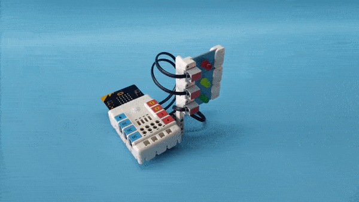
