# Case 38：The Mechanical Springtail

## Introduction
Build a mechanical springtail with the [Nezha Inventor's Kit](https://www.elecfreaks.com/nezha-inventor-s-kit-for-micro-bit-without-micro-bit-board.html). 

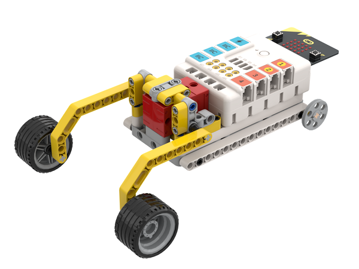

## Quick to Start

### Materials Required

[Nezha Inventor's Kit](https://www.elecfreaks.com/nezha-inventor-s-kit-for-micro-bit-without-micro-bit-board.html)

### Assembly

Components List

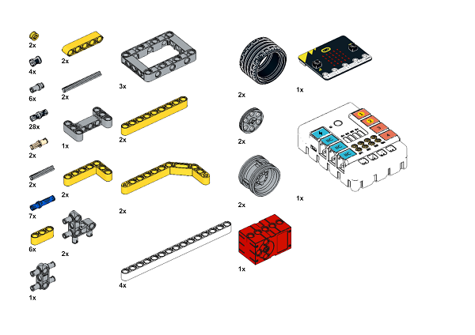

Build it as the assembly steps suggest: 

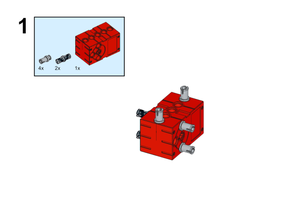

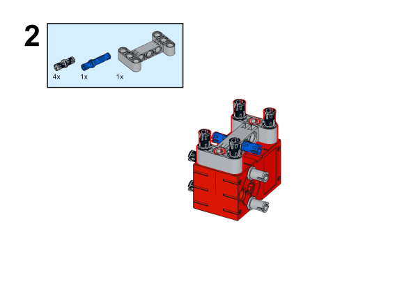

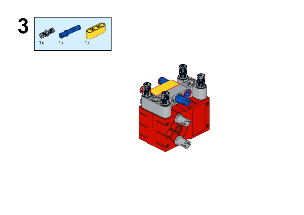

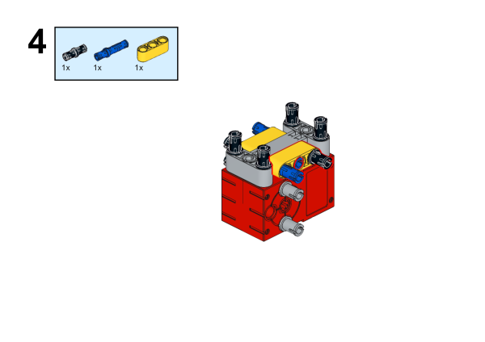

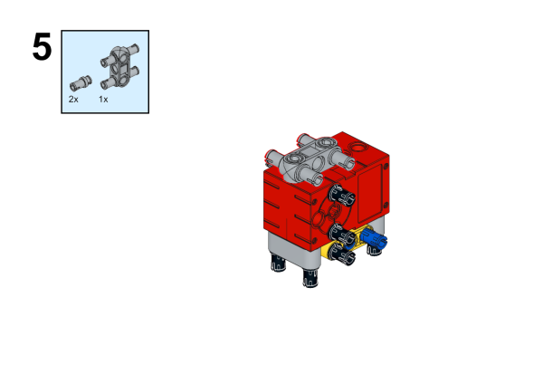

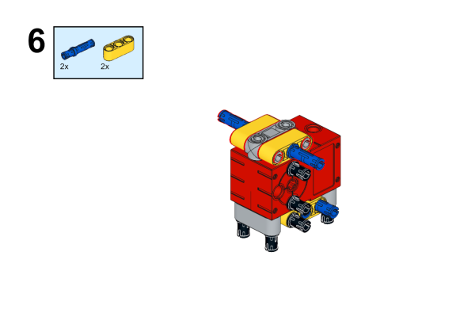

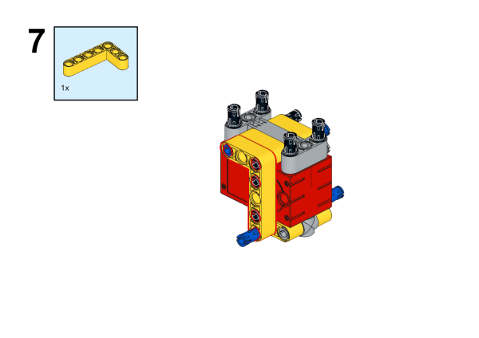

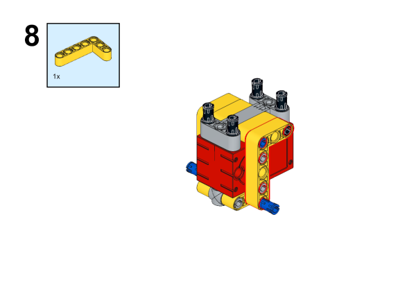

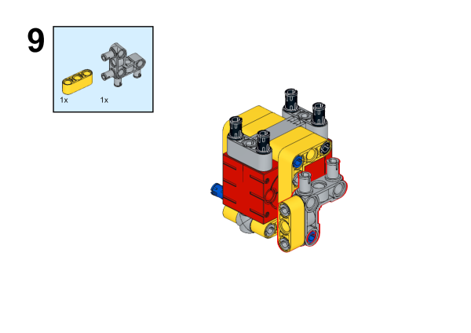

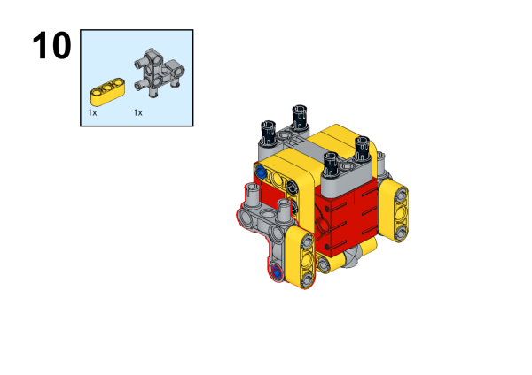

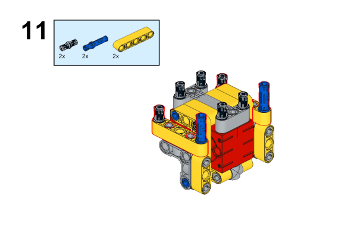

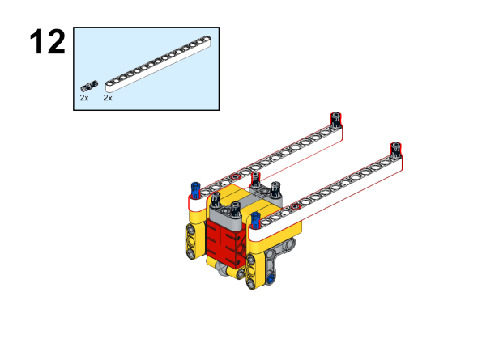

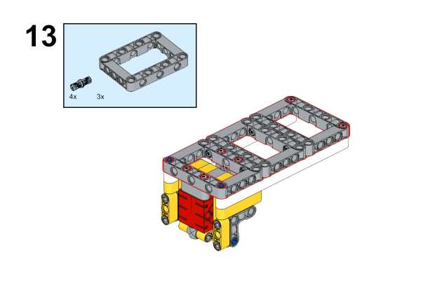

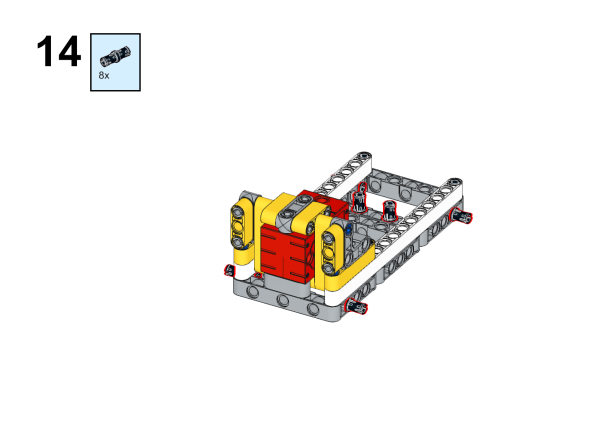

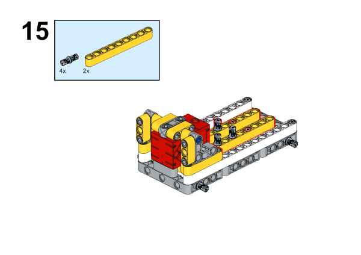

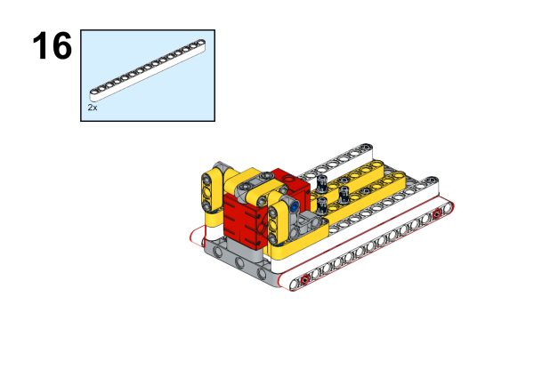

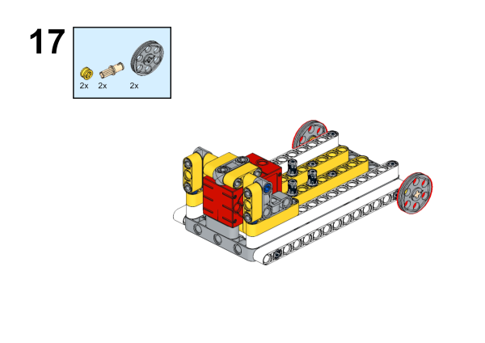

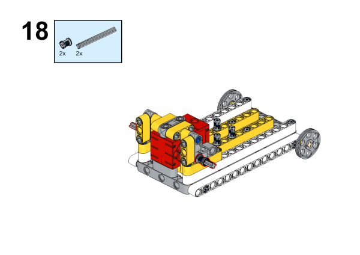

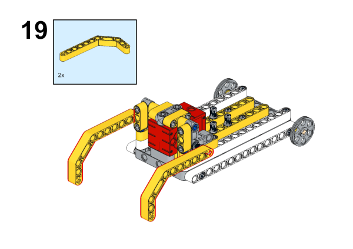

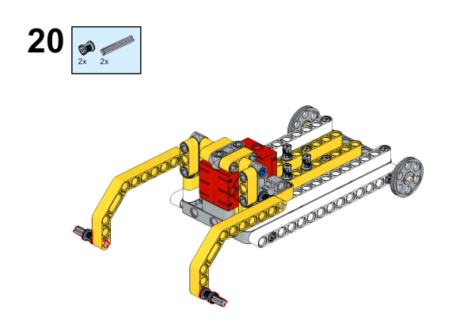

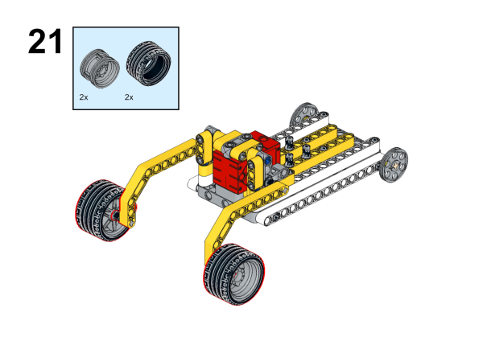

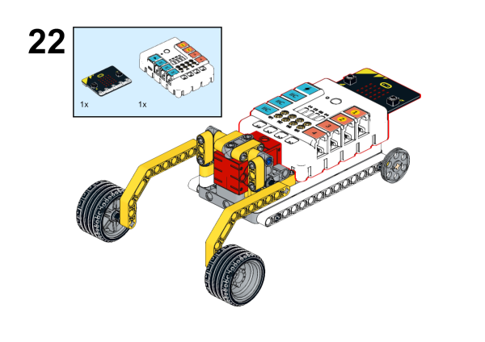

### Connection Diagram

Connect the [motor](https://www.elecfreaks.com/geekservo-motor-2kg-compatible-with-lego.html) to M1 on [Nezha Breakout Board](https://www.elecfreaks.com/nezha-breakout-board.html).

## MakeCode Programming

### Step 1
Click "Extensions''  in the MakeCode drawer to see more choices.

For programming [Nezha Breakout Board](https://www.elecfreaks.com/nezha-breakout-board.html), we need to add a package. Search with "Nezha" in the dialogue box and click to download it. 

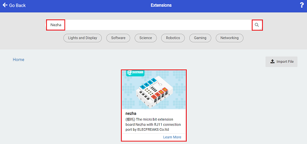

*Notice*: If you met a tip indicating that some codebases would be deleted due to incompatibility, you may continue as the tips say or create a new project in the menu. 

### Step 2

### Code as the picture suggests

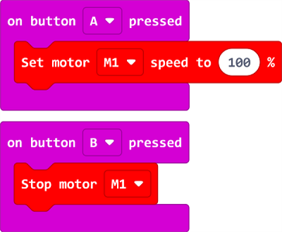

### Reference

Link: [https://makecode.microbit.org/_iscUF8CzzYMd](https://makecode.microbit.org/_iscUF8CzzYMd)

You may also download it directly: 

<iframe style="position:absolute;top:0;left:0;width:100%;height:100%;" src="https://makecode.microbit.org/#pub:_LjaFs5Ji634D" frameborder="0" sandbox="allow-popups allow-forms allow-scripts allow-same-origin"></iframe>
  
---

### Result
Press button A and the mechanical springtail crawls forward, press button B and the mechanical springtail stops moving.

### Thinking

Why do we install tires on the mechanical springtail's arms, and what will happen if we don't?

### Activity
Modify your own mechanical springtail and hold races.

