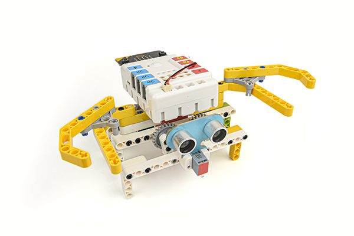
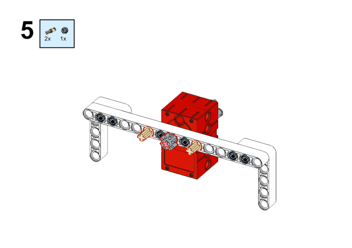

# Case 39：The Mechanical Crab

## Introduction
Build a mechanical crab with the [Nezha Inventor's Kit](https://shop.elecfreaks.com/products/elecfreaks-micro-bit-nezha-48-in-1-inventors-kit-without-micro-bit-board?_pos=2&_sid=ed1b6fbd2&_ss=r). 

## Quick to Start
---

### Materials Required

[Nezha Inventor's Kit](https://shop.elecfreaks.com/products/elecfreaks-micro-bit-nezha-48-in-1-inventors-kit-without-micro-bit-board?_pos=2&_sid=ed1b6fbd2&_ss=r)

### Assembly
---
Components List

Build it as the assembly steps suggest: 

We can see that the construction is completed as shown in the following figure:

### Connection Diagram

Connect the [Ultrasonic Sensor](https://shop.elecfreaks.com/products/elecfreaks-planetx-ultrasonic-sensor?_pos=1&_sid=d432fa273&_ss=r) to J1 and the [motor ](https://shop.elecfreaks.com/products/elecfreaks-high-speed-building-blocks-motor?_pos=4&_sid=bfad50d7f&_ss=r)to M1 on [Nezha Breakout Board](https://shop.elecfreaks.com/products/elecfreaks-nezha-breakout-board?_pos=1&_sid=c41e367c3&_ss=r).

## MakeCode Programming
---

### Step 1
Click "Advanced" in the MakeCode drawer to see more choices.

For programming the [Ultrasonic Sensor](https://www.elecfreaks.com/planetx-ultrasonic.html), we need to add a package. Search with "PlanetX" in the dialogue box and click to download it. 

For programming [Nezha Breakout Board](https://shop.elecfreaks.com/products/elecfreaks-nezha-breakout-board?_pos=1&_sid=00432325a&_ss=rl), we need to add a package. Search with "Nezha" in the dialogue box and click to download it. 

*Notice*: If you met a tip indicating that some codebases would be deleted due to incompatibility, you may continue as the tips say or create a new project in the menu. 

### Step 2

### Code as the picture suggests

### Reference
Link: [https://makecode.microbit.org/_09MCJLLdTYcr](https://makecode.microbit.org/_09MCJLLdTYcr)

You may also download it directly: 

<iframe style="position:absolute;top:0;left:0;width:100%;height:100%;" src="https://makecode.microbit.org/#pub:_09MCJLLdTYcr" frameborder="0" sandbox="allow-popups allow-forms allow-scripts allow-same-origin"></iframe>
  

---

### Result
After powering on, if the crab sees an approaching object ahead, it will crawl towards sideways.

