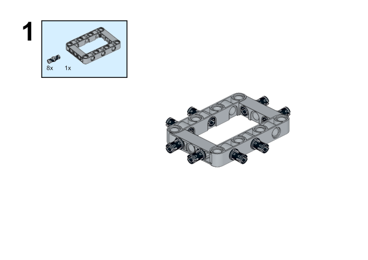

# Case 40：The Mechanical Motorcycle

## Introduction
Build a mechanical motorcycle with the [Nezha Inventor's Kit](https://www.elecfreaks.com/nezha-inventor-s-kit-for-micro-bit-without-micro-bit-board.html). 

## Quick to Start

### Materials Required

[Nezha Inventor's Kit](https://www.elecfreaks.com/nezha-inventor-s-kit-for-micro-bit-without-micro-bit-board.html)

### Assembly

Components List

Build it as the pictures suggest: 

We can see that the construction is completed as shown in the following figure:

### Connection Diagram

Connect the  the [geekservo](https://www.elecfreaks.com/geekservo-2kg-360-degrees-compatible-with-lego.html) to S1 and the [motors](https://www.elecfreaks.com/geekservo-motor-2kg-compatible-with-lego.html) to M1 on [Nezha Breakout Board](https://www.elecfreaks.com/nezha-breakout-board.html).

## MakeCode Programming

### Step 1
Click "Advanced" in the MakeCode drawer to see more choices.

For programming [Nezha Breakout Board](https://www.elecfreaks.com/nezha-breakout-board.html), we need to add a package. Search with "Nezha" in the dialogue box and click to download it. 

*Notice*: If you met a tip indicating that some codebases would be deleted due to incompatibility, you may continue as the tips say or create a new project in the menu. 

### Step 2

### Code as the picture suggests

### Reference
Link: [https://makecode.microbit.org/_VtTc8DAsFWMc](https://makecode.microbit.org/_VtTc8DAsFWMc)

You may also download it directly: 

<iframe style="position:absolute;top:0;left:0;width:100%;height:100%;" src="https://makecode.microbit.org/#pub:_VtTc8DAsFWMc" frameborder="0" sandbox="allow-popups allow-forms allow-scripts allow-same-origin"></iframe>
  
---

### Result

When the button A is pressed, the motorcycle turns left; when the button B is pressed, it drives to the right; and when the buttons A and B are pressed at the same time, the motorcycle stops driving.

