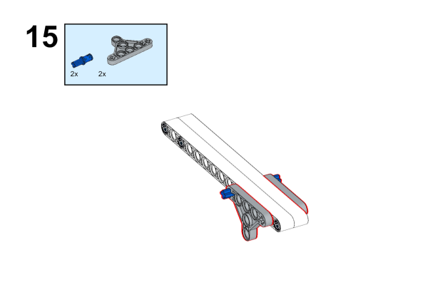
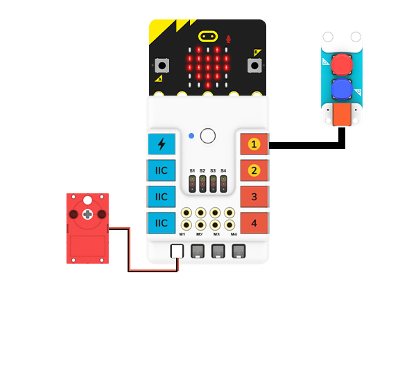

#  Case 43：The Bricks Launcher

## Introduction
Build a bricks launcher with the [Nezha Inventor's Kit](https://www.elecfreaks.com/nezha-inventor-s-kit-for-micro-bit-without-micro-bit-board.html). 

## Quick to Start

### Materials Required

[Nezha Inventor's Kit](https://www.elecfreaks.com/nezha-inventor-s-kit-for-micro-bit-without-micro-bit-board.html)

### Assembly

Components List

Build it as the assembly steps suggest: 

### Connection Diagram

Connect two [button](https://www.elecfreaks.com/planetx-button.html) to J1 and the [motor](https://www.elecfreaks.com/geekservo-motor-2kg-compatible-with-lego.html) to M1 and M2 on [Nezha Breakout Board](https://www.elecfreaks.com/nezha-breakout-board.html).

## MakeCode Programming

### Step 1

Click "Advanced" in the MakeCode drawer to see more choices.

For programming the [Ultrasonic Sensor](https://www.elecfreaks.com/planetx-ultrasonic.html), we need to add a package. Search with "PlanetX" in the dialogue box and click to download it. 

For programming [Nezha Breakout Board](https://www.elecfreaks.com/nezha-breakout-board.html), we need to add a package. Search with "Nezha" in the dialogue box and click to download it. 

*Notice*: If you met a tip indicating that some codebases would be deleted due to incompatibility, you may continue as the tips say or create a new project in the menu. 

### Step 2

### Code as the picture suggests

### Reference
Link: [https://makecode.microbit.org/_HEDitaH5CLRF](https://makecode.microbit.org/_HEDitaH5CLRF)

You may also download it directly: 

<iframe style="position:absolute;top:0;left:0;width:100%;height:100%;" src="https://makecode.microbit.org/#pub:_HEDitaH5CLRF" frameborder="0" sandbox="allow-popups allow-forms allow-scripts allow-same-origin"></iframe>
  

### Result

Press button C to launch the bricks. 

