# Case 45：The Grasping Car V2

## Introduction
In the previous case we built a grabbing car which can grasp objects very well, but it is not able to turn. We use [Nezha Inventor's Kit](https://shop.elecfreaks.com/products/elecfreaks-micro-bit-nezha-48-in-1-inventors-kit-without-micro-bit-board?_pos=2&_sid=ed1b6fbd2&_ss=r) to build a car that can both turn and grab objects here, the obvious feature in this case is that only one servo is applied to realize both the functions of lifting, lowering and grasping objects by the mechanical claw.

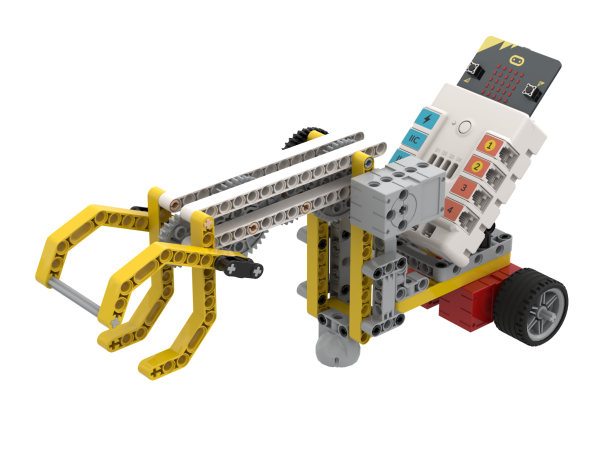

## Quick to Start

### Materials Required

[Nezha Inventor's Kit](https://shop.elecfreaks.com/products/elecfreaks-micro-bit-nezha-48-in-1-inventors-kit-without-micro-bit-board?_pos=2&_sid=ed1b6fbd2&_ss=r)

### Assembly

Components List

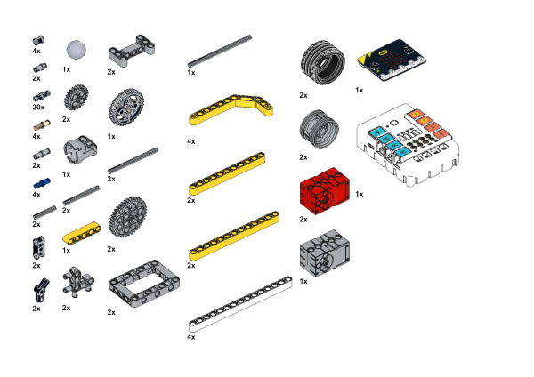

Build it as the assembly steps suggest: 

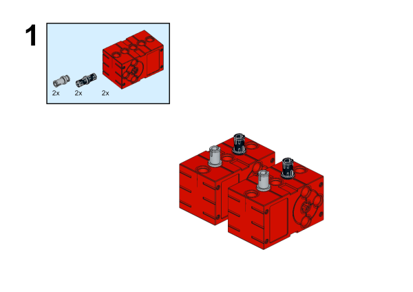

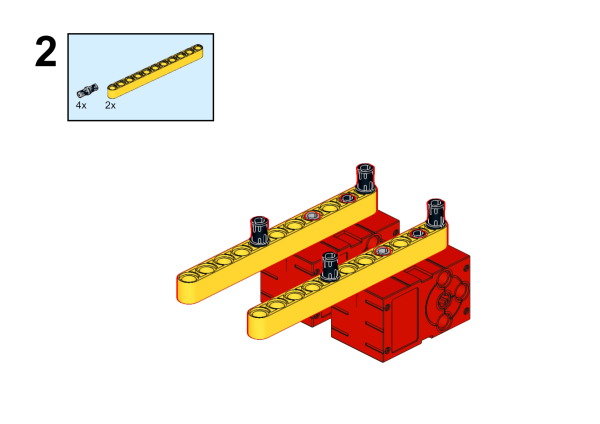

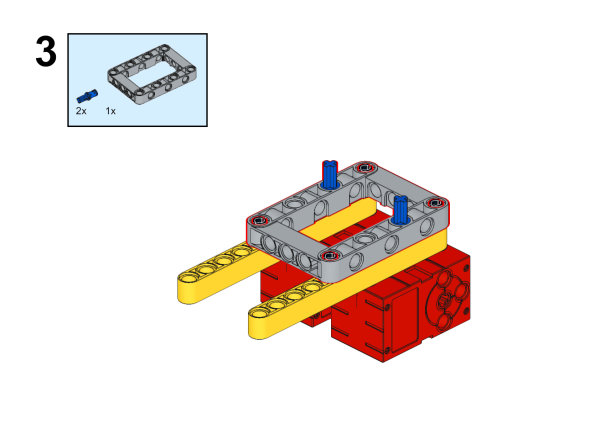

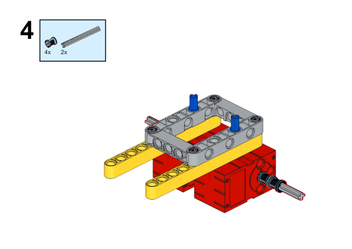

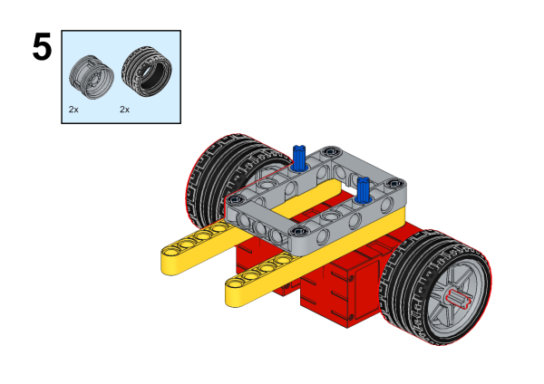

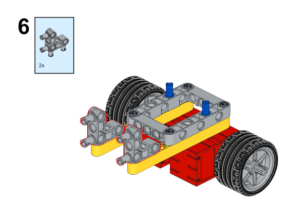

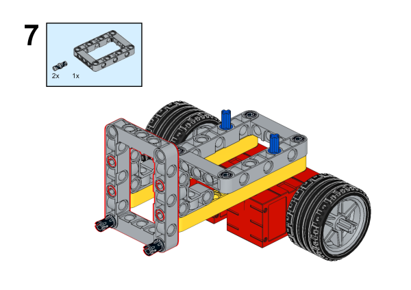

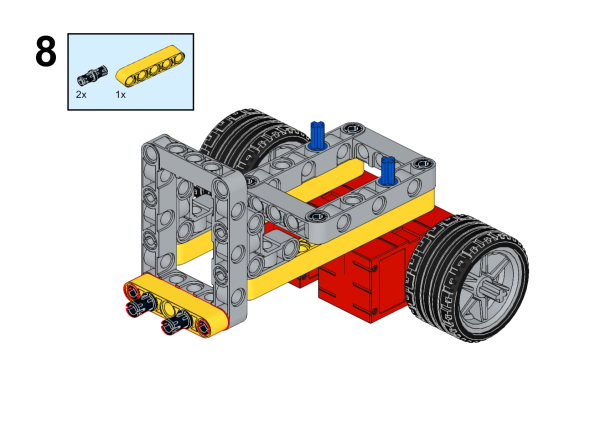

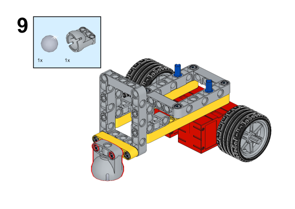

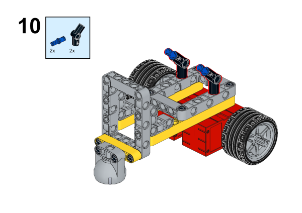

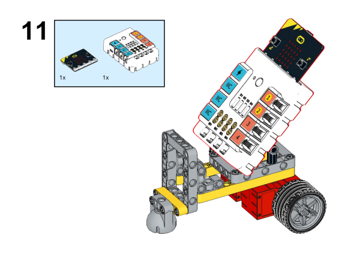

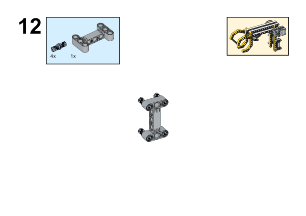

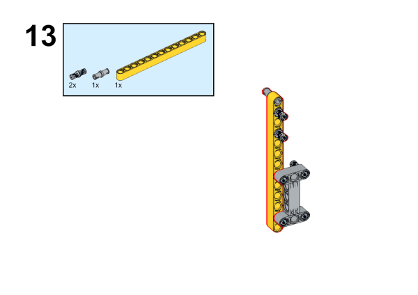

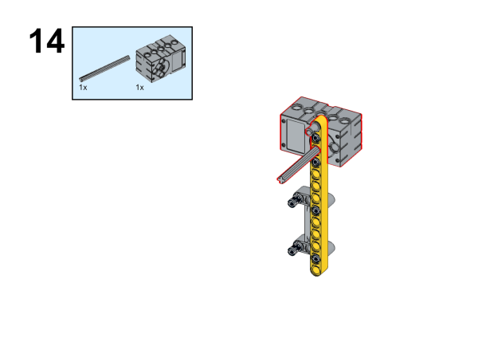

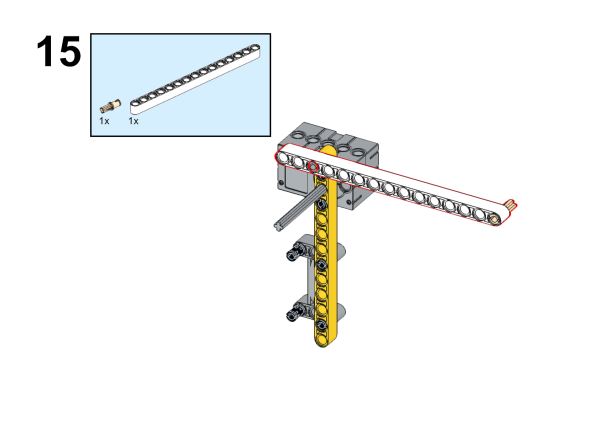

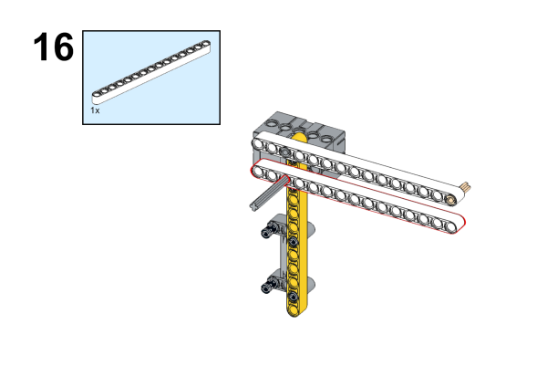

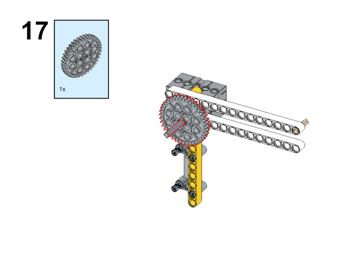

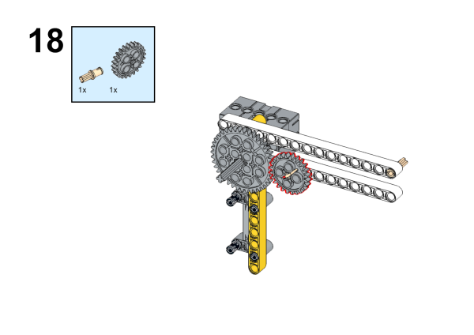

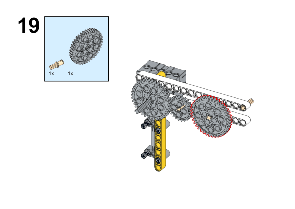

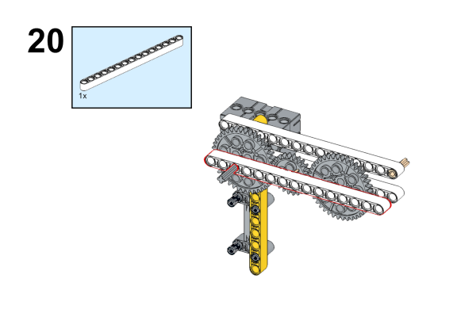

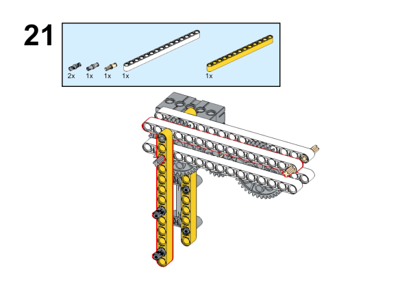

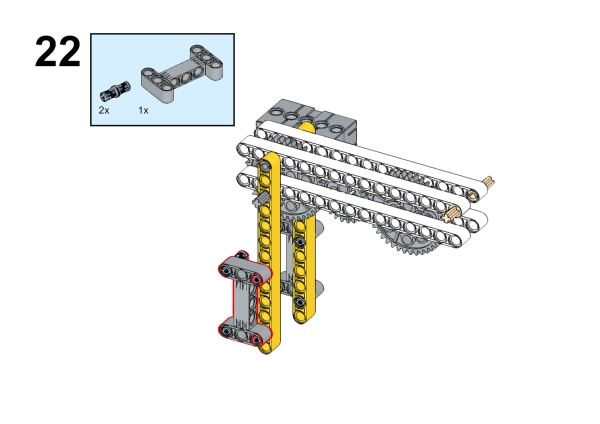

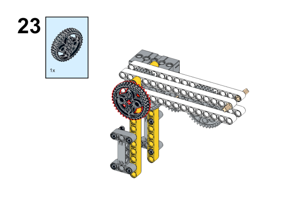

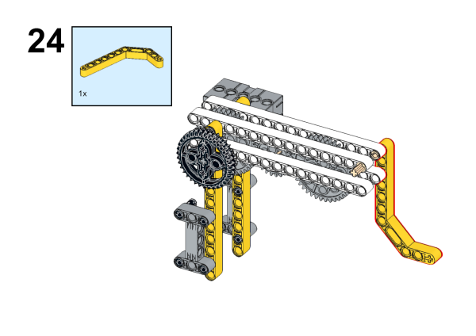

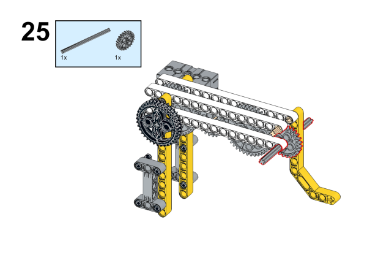

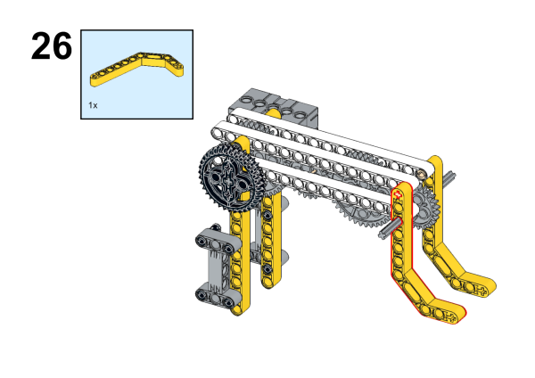

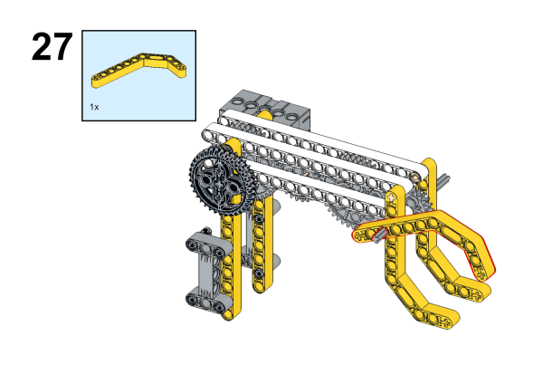

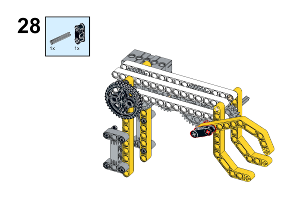

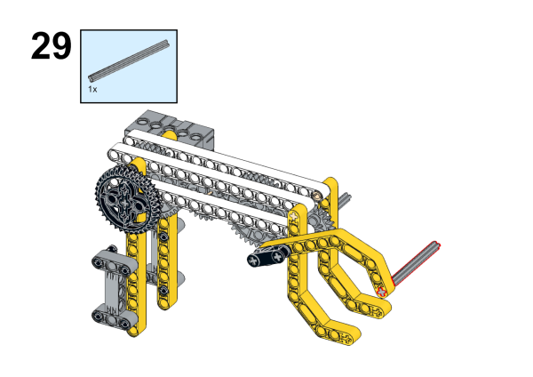

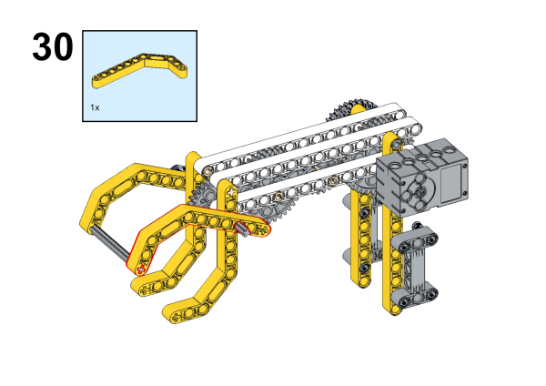

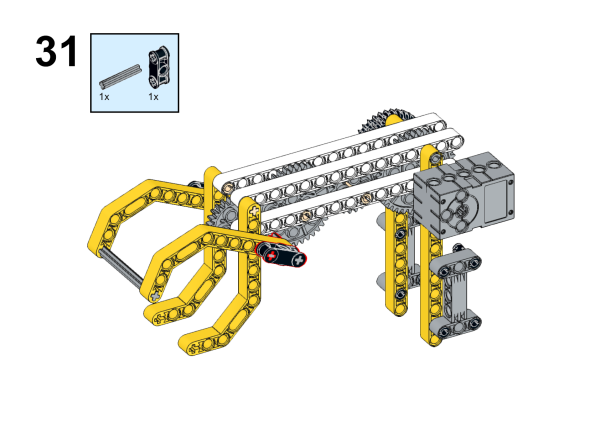

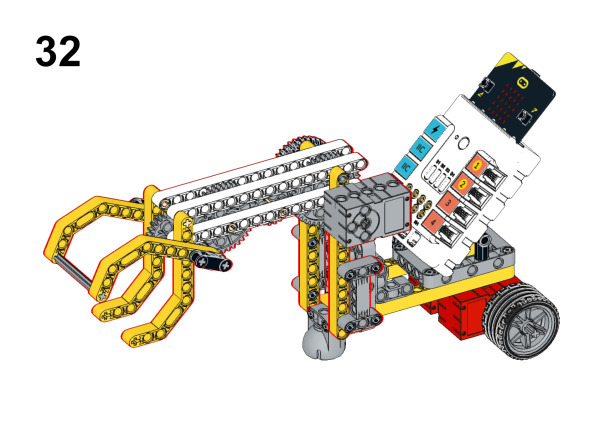

### Connection Diagram

Connect the [geekservo](https://shop.elecfreaks.com/products/elecfreaks-360-degrees-building-blocks-servo?_pos=1&_psq=servo&_ss=e&_v=1.0) to S1 and the two [motors](https://shop.elecfreaks.com/products/elecfreaks-high-speed-building-blocks-motor?_pos=4&_sid=a2da3fff8&_ss=r) to M1 and M2 on [Nezha Breakout Board](https://shop.elecfreaks.com/products/elecfreaks-nezha-breakout-board?_pos=1&_sid=00432325a&_ss=rl).

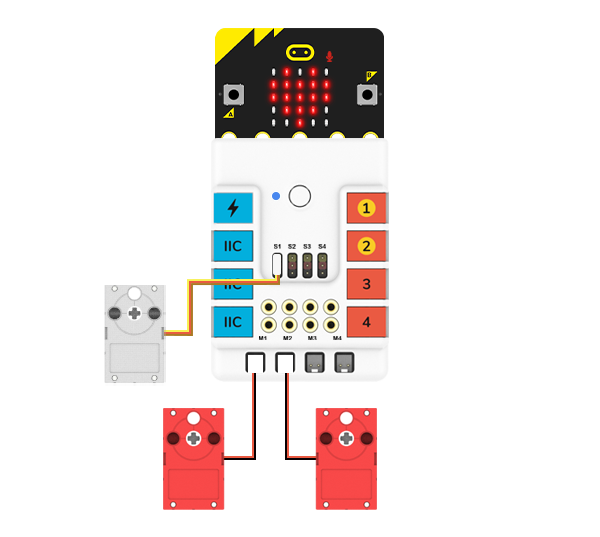

## MakeCode Programming

### Step 1

Click "Advanced" in the MakeCode drawer to see more choices.

For programming [Nezha Breakout Board](https://shop.elecfreaks.com/products/elecfreaks-nezha-breakout-board?_pos=1&_sid=00432325a&_ss=rl), we need to add a package. Search with "Nezha" in the dialogue box and click to download it. 

*Notice*: If you met a tip indicating that some codebases would be deleted due to incompatibility, you may continue as the tips say or create a new project in the menu. 

### Step 2
### Code as the picture suggests

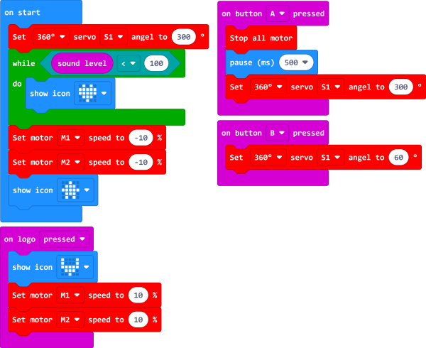

### Reference
Link: [https://makecode.microbit.org/_Mbm1a77fzcrK](https://makecode.microbit.org/_Mbm1a77fzcrK)

You may also download it directly: 

<iframe style="position:absolute;top:0;left:0;width:100%;height:100%;" src="https://makecode.microbit.org/#pub:_Mbm1a77fzcrK" frameborder="0" sandbox="allow-popups allow-forms allow-scripts allow-same-origin"></iframe>
  

### Result

After powering on the device, the arm will be put on the floor. Flap your hands or make some noise near the micro:bit, the robot will move forward.
While pressing button C on the PlanetX button module, the robot car stops moving and the robot arm starts grasping the goods and lifting them up.
Touching the micro:bit logo to reverse the robot car and press button D to put the goods down.

