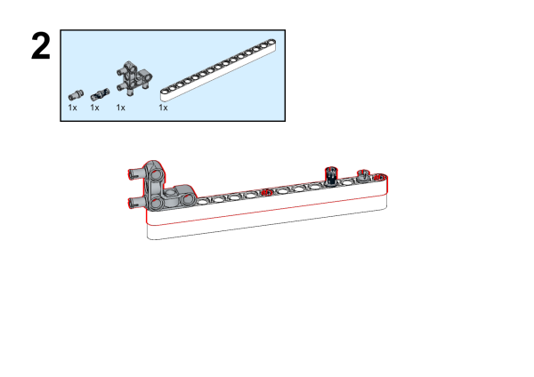

# Case 47：Wipers

## Introduction
Build a wiper with the [Nezha Inventor's Kit](https://shop.elecfreaks.com/products/elecfreaks-micro-bit-nezha-48-in-1-inventors-kit-without-micro-bit-board?_pos=2&_sid=ed1b6fbd2&_ss=r).

## Quick to Start

### Materials Required

[Nezha Inventor's Kit](https://shop.elecfreaks.com/products/elecfreaks-micro-bit-nezha-48-in-1-inventors-kit-without-micro-bit-board?_pos=2&_sid=ed1b6fbd2&_ss=r)

### Assembly

Components List

Build it as the assembly steps suggest: 

### Connection Diagram

Connect the [motors](https://shop.elecfreaks.com/products/elecfreaks-high-speed-building-blocks-motor?_pos=4&_sid=a2da3fff8&_ss=r) to M1 on [Nezha Breakout Board](https://shop.elecfreaks.com/products/elecfreaks-nezha-breakout-board?_pos=1&_sid=00432325a&_ss=rl).

## MakeCode Programming

### Step 1

Click "Advanced" in the MakeCode drawer to see more choices.

For programming [Nezha Breakout Board](https://shop.elecfreaks.com/products/elecfreaks-nezha-breakout-board?_pos=1&_sid=00432325a&_ss=rl), we need to add a package. Search with "Nezha" in the dialogue box and click to download it. 

*Notice*: If you met a tip indicating that some codebases would be deleted due to incompatibility, you may continue as the tips say or create a new project in the menu. 

### Step 2
### Code as the picture suggests

### Reference
Link: [https://makecode.microbit.org/_TgWEyTgdVL3z](https://makecode.microbit.org/_TgWEyTgdVL3z)

You may also download it directly: 

<iframe style="position:absolute;top:0;left:0;width:100%;height:100%;" src="https://makecode.microbit.org/#pub:_TgWEyTgdVL3z" frameborder="0" sandbox="allow-popups allow-forms allow-scripts allow-same-origin"></iframe>
  

### Result

When the microbit is powered on, it displays a heart pattern. When button A is pressed, the wiper starts to driving. When button A is pressed again, the wiper accelerates the movement. When button B is pressed, the wiper slows down.

