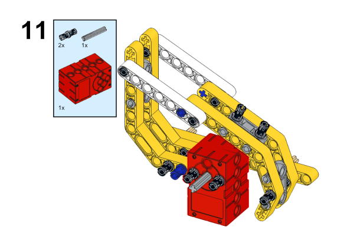
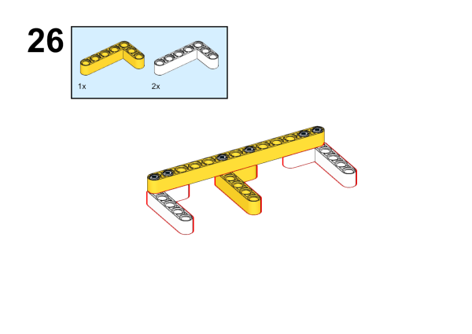
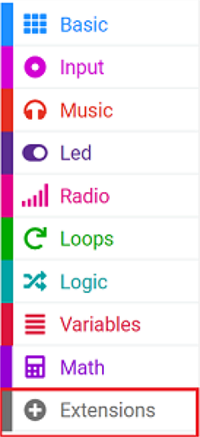
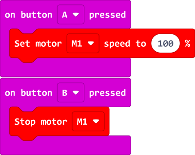

# The Walking Robot

## Introduction
Build a walking robot with the [Nezha Inventor's Kit](https://www.elecfreaks.com/nezha-inventor-s-kit-for-micro-bit-without-micro-bit-board.html).

## Quick to Start

### Materials Required

[Nezha Inventor's Kit](https://www.elecfreaks.com/nezha-inventor-s-kit-for-micro-bit-without-micro-bit-board.html)

### Assembly

Components List

Build it as the assembly steps suggest: 

### Connection Diagram

Connect the [motors](https://www.elecfreaks.com/geekservo-motor-2kg-compatible-with-lego.html) to M1 on [Nezha Breakout Board](https://www.elecfreaks.com/nezha-breakout-board.html).

## MakeCode Programming

### Step 1
Click "Advanced" in the MakeCode drawer to see more choices.

For programming [Nezha Breakout Board](https://www.elecfreaks.com/nezha-breakout-board.html), we need to add a package. Search with "Nezha" in the dialogue box and click to download it. 

*Notice*: If you met a tip indicating that some codebases would be deleted due to incompatibility, you may continue as the tips say or create a new project in the menu. 

### Step 2
### Code as the picture suggests

### Reference
Link: [https://makecode.microbit.org/_3UHdg3D2jeWy](https://makecode.microbit.org/_3UHdg3D2jeWy)

You may also download it directly: 

<iframe style="position:absolute;top:0;left:0;width:100%;height:100%;" src="https://makecode.microbit.org/#pub:_3UHdg3D2jeWy" frameborder="0" sandbox="allow-popups allow-forms allow-scripts allow-same-origin"></iframe>
  

### Result

After pressing button A, the robot moves forward. After pressing button B, the robot stops moving.

