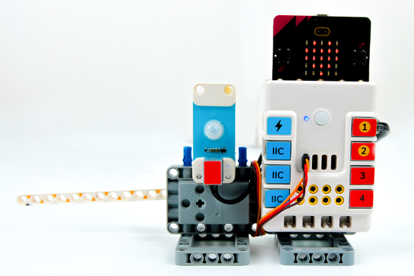
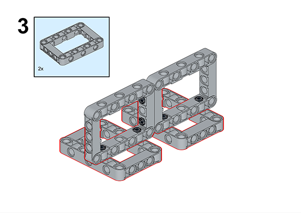
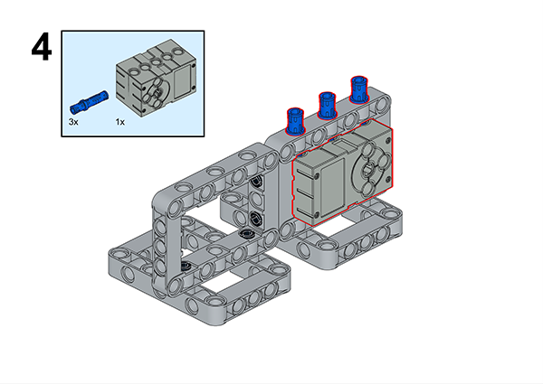
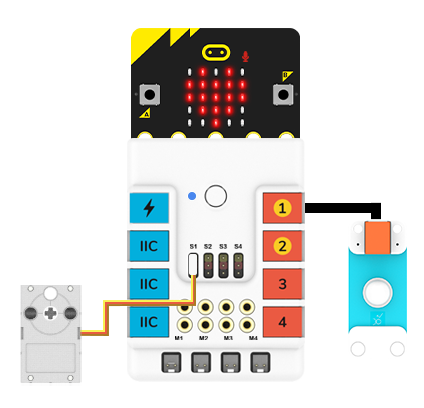

# Case 49: The PIR Railing

## Introduction

When we enter some communities or companies, we will see that there are railings to stop the entry and exit of vehicles, but when we are about to walk in front of the railings, they will automatically rise again to let people enter, these applications are mostly using the human infrared sensor.

The human infrared sensor application is very wide, it can be used in shopping malls, hotels, scenic spots, and so on. Now let's do a small project with the infrared sensor to understand how it helps to improve our living experiences.

### Materials Required

Nezha expansion board × 1

micro:bit V2 × 1

 PIR sensor × 1

RJ11 cable × 1

Bricks × n

**Note: If you want all of the above components, you may purchase the [Nezha 48 IN 1 Inventor's Kit](https://www.elecfreaks.com/nezha-inventor-s-kit-for-micro-bit-without-micro-bit-board.html)**.

### Assembly Steps

Component Details

Build it as the assembly steps suggest:

## Connection Diagram

Connect the PIR sensor to J1 and the servo to S1 as the picture indicates below.

##  MakeCode Programming

### Step 1

Click “Advanced” in the MakeCode drawer to see more choices.

For programming the servo , We need to add a package. Click “Extensions” at the bottom of the drawer and search with “nezha” to download it.

For programming the PIR sensor, we need to add a package. Search with “PlanetX” in the dialogue box and click to download it.

*Notice*: If you met a tip indicating that some codebases would be deleted due to incompatibility, you may continue as the tips say or create a new project in the menu.

### Reference

Link: https://makecode.microbit.org/#editor

You may also download it directly:

<iframe style="position:absolute;top:0;left:0;width:100%;height:100%;" src="https://makecode.microbit.org/#pub:_bDD9CUcw85k5" frameborder="0" sandbox="allow-popups allow-forms allow-scripts allow-same-origin"></iframe>

### Result

After powering on the NEZHA expansion board,  if the PIR sensor detects the arrival of someone, the railing will be raised automatically and it will drop after a while. 
