# Case 51: Lifting Dry Rack

## Introduction

When we do our daily chores, washing clothes should be considered a task that we often have to do, especially after washing clothes in the washing machine, drying clothes on top of a high drying rack is particularly laborious. Well, in order to solve this trouble, we do a lifting drying rack here, which not only can help us save physical strength, but also give us the experience of the way that is getting changed from the technology.  

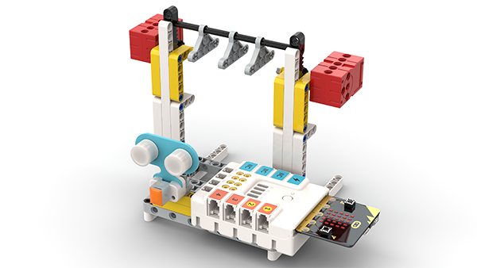

### Materials Required

Nezha expansion board × 1

micro:bit V2 × 1

Ultrasonic sensor × 1

RJ11 cable × 1

Bricks × n

**Note: If you want all of the above components, you may purchase the [Nezha 48 IN 1 Inventor's Kit](https://shop.elecfreaks.com/products/elecfreaks-micro-bit-nezha-48-in-1-inventors-kit-without-micro-bit-board?_pos=2&_sid=ed1b6fbd2&_ss=r)**.

### Assembly Steps

Component Details

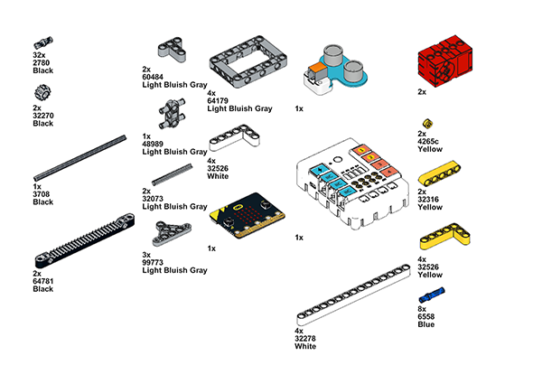

Build it as the assembly steps suggest:

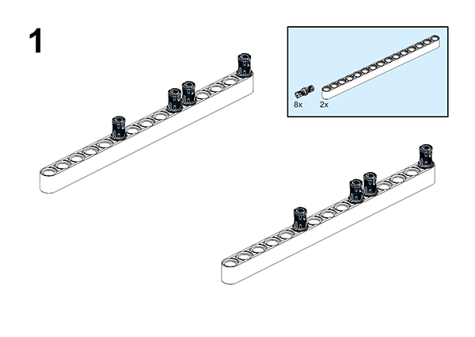

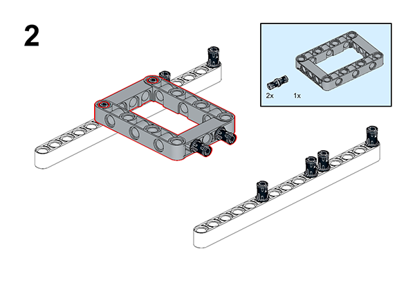

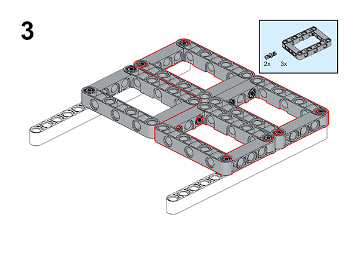

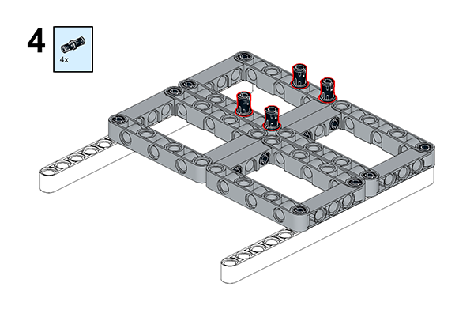

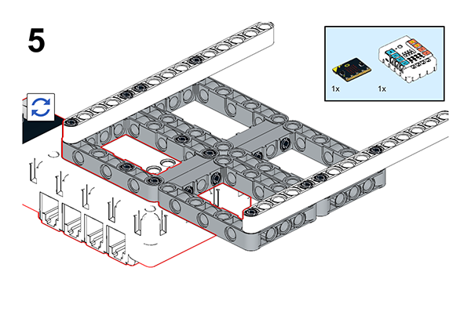

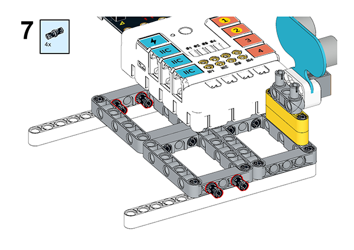

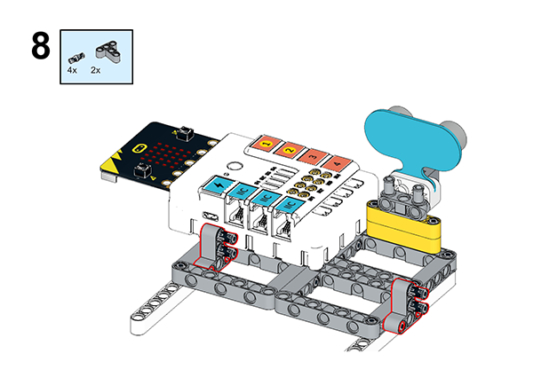

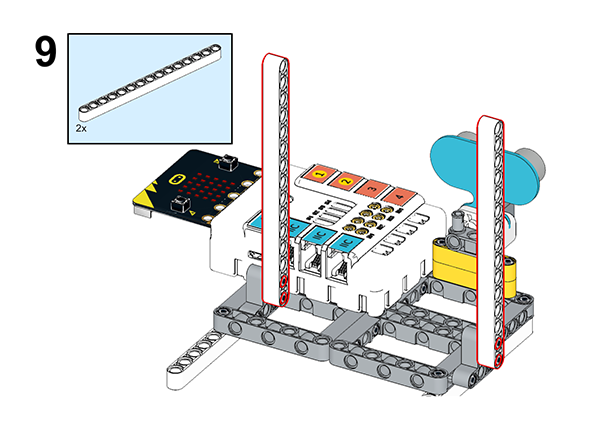

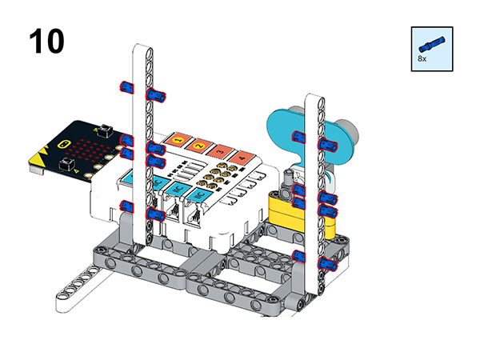

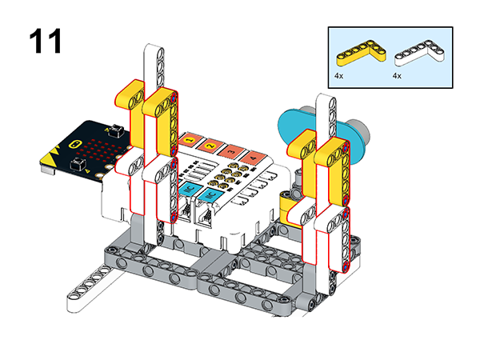

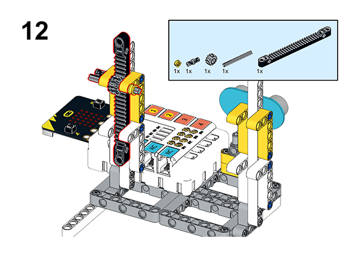

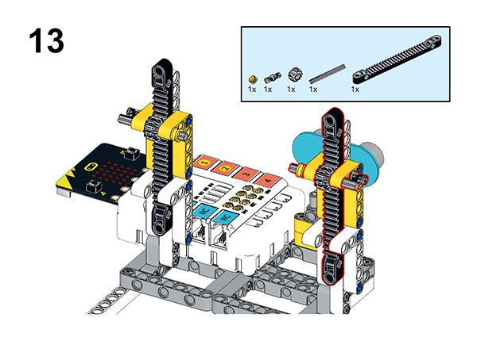

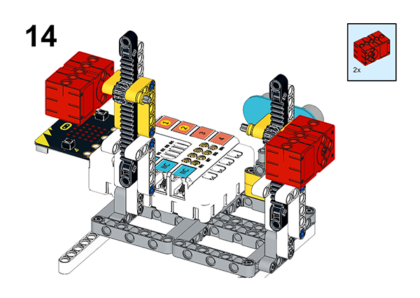

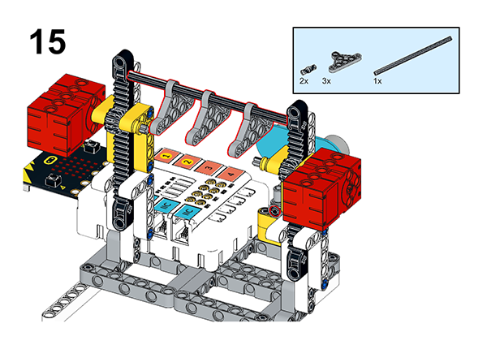

## Connection Diagram

Connect the two motors to the M1 and M4 , and the ultrasonic sensor to the J1, as the diagram suggests.

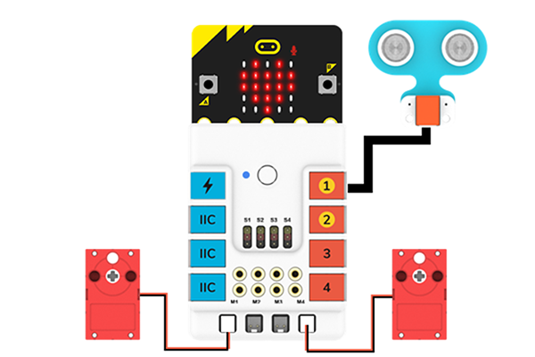

##  MakeCode Programming

### Step 1

Click “Advanced” in the MakeCode drawer to see more choices.

For programming the servo, we need to add a package. Click “Extensions” at the bottom of the drawer and search with “nezha” to download it.

For programming the PIR sensor, we need to add a package. Search with “PlanetX” in the dialogue box and click to download it.

*Notice*: If you met a tip indicating that some codebases would be deleted due to incompatibility, you may continue as the tips say or create a new project in the menu.

### Reference

Link: https://makecode.microbit.org/_h9DHW1dEa6rT

You may also download it directly:

<iframe style="position:absolute;top:0;left:0;width:100%;height:100%;" src="https://makecode.microbit.org/#pub:_h9DHW1dEa6rT" frameborder="0" sandbox="allow-popups allow-forms allow-scripts allow-same-origin"></iframe>

### Result

When we want to dry the clothes, press the A button, the drying rack will drop, and when the clothes rack is placed on the drying rod, the drying rack will automatically rise.
