# Case 52: Smart Sweeper

## Introduction

When we are doing housework or volunteering, floor cleaning may be the activity to be performed. With the development of our technology, we can make sweeping robots that can automatically clean the floor of a room and can initially replace our work. In this lesson, let's initially make a simple sweeping robot that we can let the machine do our chores for us during our break. So let's start.

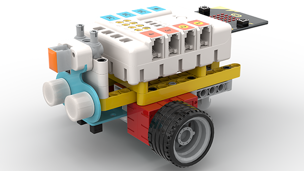

### Materials Required

Nezha expansion board × 1

micro:bit V2 × 1

Ultrasonic sensors× 1

Line tracking sensor × 1

Line tracking map × 1

RJ11 cable × 1

Bricks × n

**Note: If you want all of the above components, you may purchase the [Nezha 48 IN 1 Inventor's Kit](https://www.elecfreaks.com/nezha-inventor-s-kit-for-micro-bit-without-micro-bit-board.html)**.

### Assembly Steps

Component Details

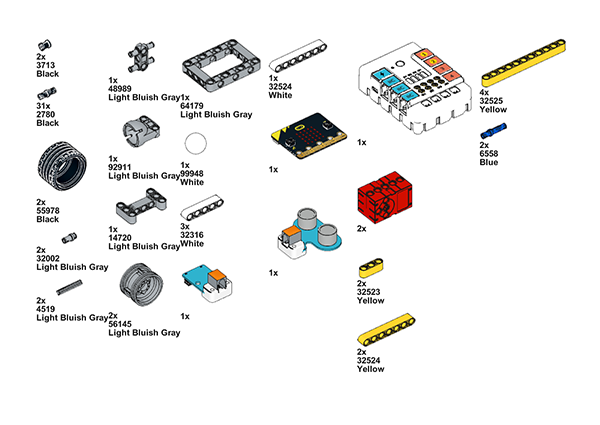

Build it as the assembly steps suggest:

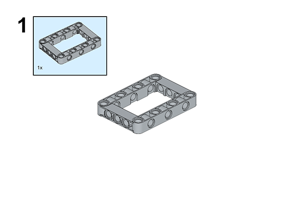

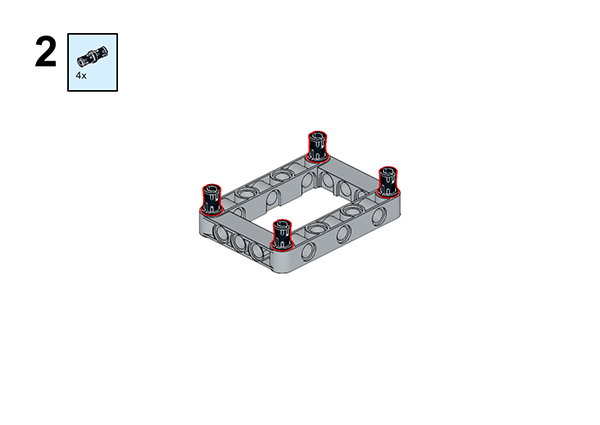

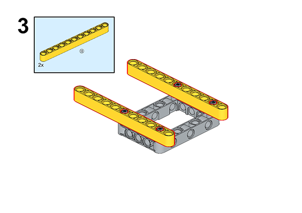

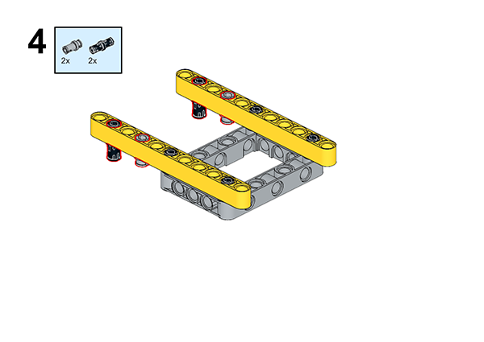

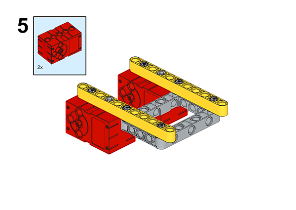

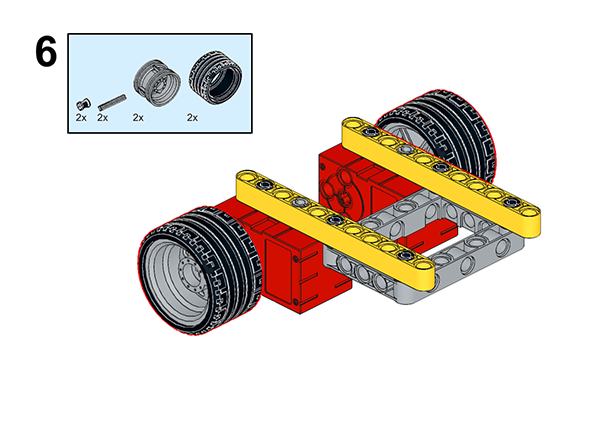

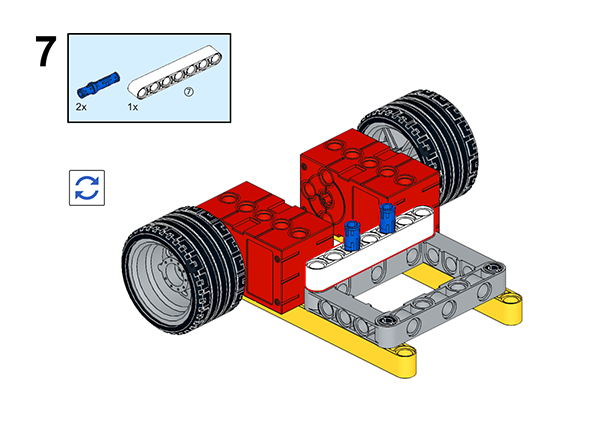

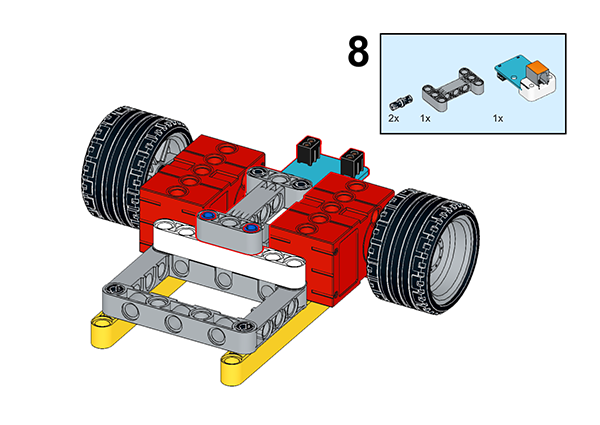

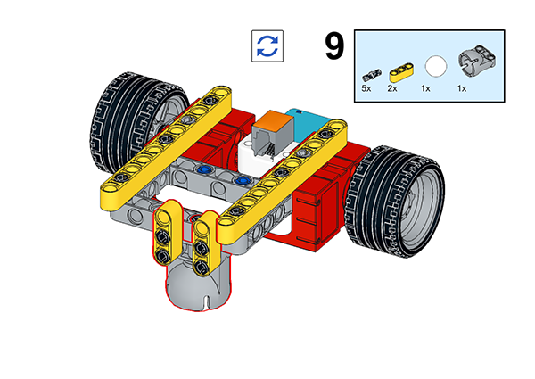

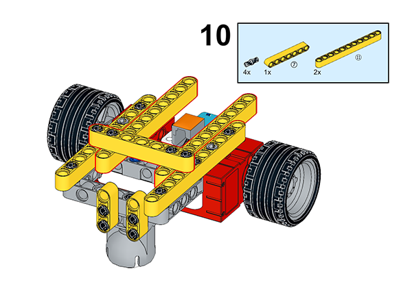

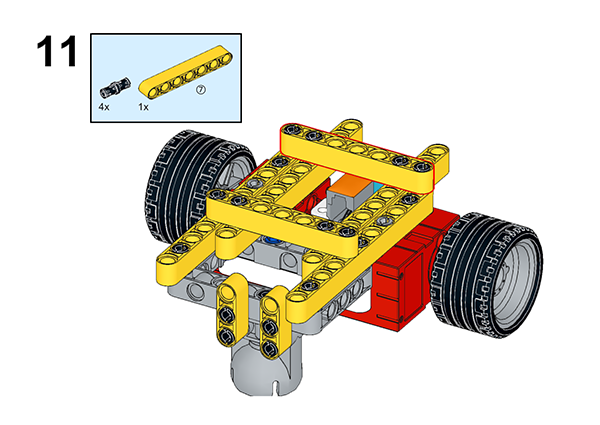

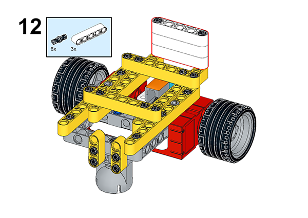

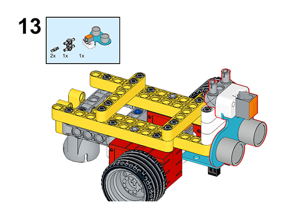

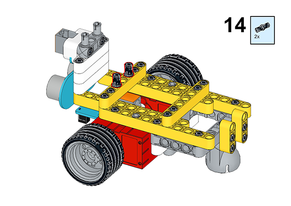

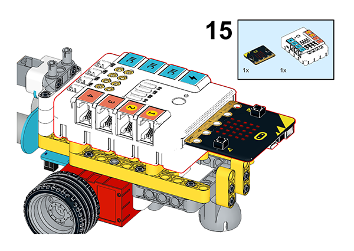

## Connection Diagram

Connect two motors to M1 and M4, ultrasonic sensor to J2, and the line tracking sensor to J1 interface as the picture suggests.

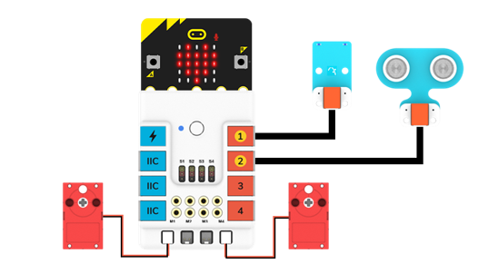

##  MakeCode Programming

### Step 1

Click “Advanced” in the MakeCode drawer to see more choices.

For programming the servo, we need to add a package. Click “Extensions” at the bottom of the drawer and search with “nezha” to download it.

For programming the PIR sensor, we need to add a package. Search with “PlanetX” in the dialogue box and click to download it.

*Notice*: If you met a tip indicating that some codebases would be deleted due to incompatibility, you may continue as the tips say or create a new project in the menu.

### Reference

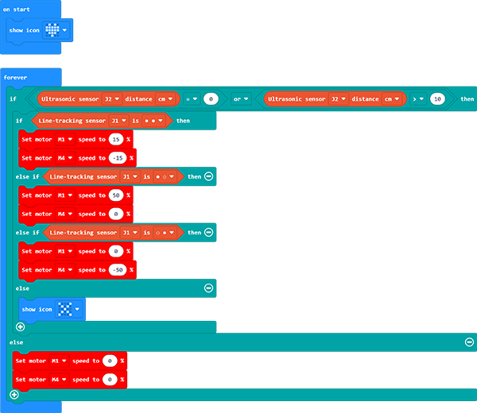

Link: https://makecode.microbit.org/_JeJUjJJkCPEp

You may also download it directly:

<iframe style="position:absolute;top:0;left:0;width:100%;height:100%;" src="https://makecode.microbit.org/#pub:JeJUjJJkCPEp" frameborder="0" sandbox="allow-popups allow-forms allow-scripts allow-same-origin"></iframe>

### Result

As you can see, when the sweeping robot will stop when it hits an obstacle, the obstacle will leave and start cleaning again.
