# Case 53: The Lunar Exploration Vehicle

## Introduction

Since ancient times we have never stopped exploring the Moon, and before the development of spacecraft, we could only see it with the naked eye and with telescopes, but now we want to know more about the Moon. We have built lunar spacecraft and lunar rovers and brought back lunar soil samples, which have allowed us to learn more specific information about the Moon. In this lesson, let's build a simple lunar exploration rover and make a preliminary foray into the great interstellar journey of exploring the Moon.

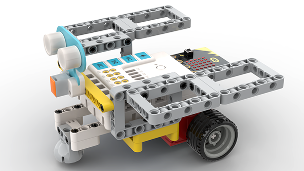

### Materials Required

Nezha expansion board × 1

micro:bit V2 × 1

Ultrasonic sensors  × 1

RJ11 cable × 1

Bricks × n

**Note: If you want all of the above components, you may purchase the [Nezha 48 IN 1 Inventor's Kit](https://www.elecfreaks.com/nezha-inventor-s-kit-for-micro-bit-without-micro-bit-board.html)**.

### Assembly Steps

Component Details

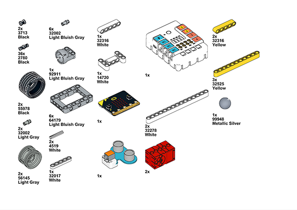

Build it as the assembly steps suggest:

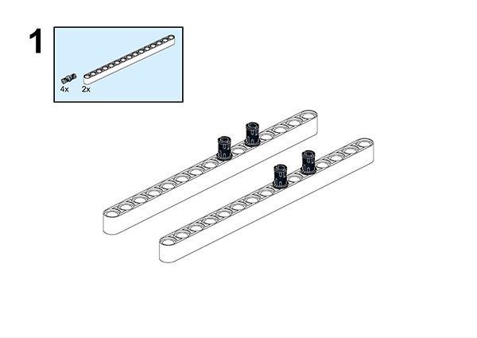

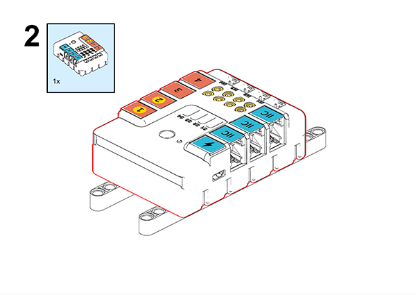

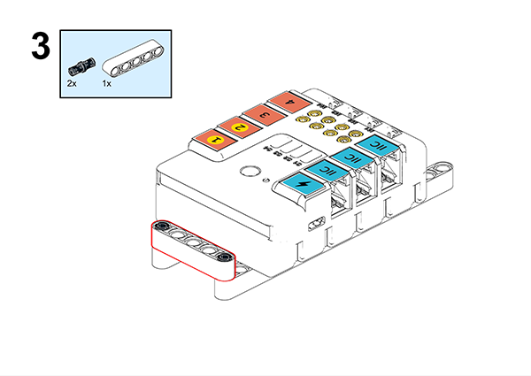

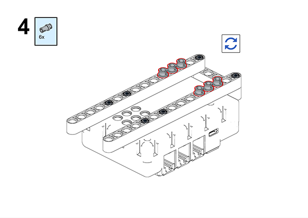

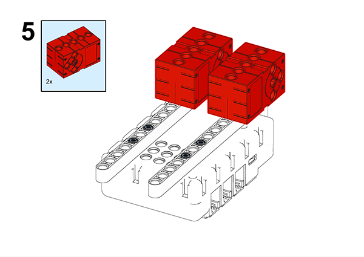

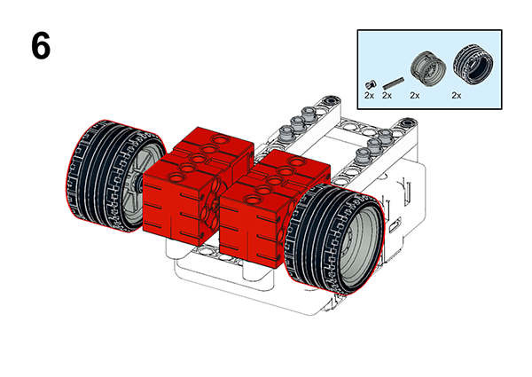

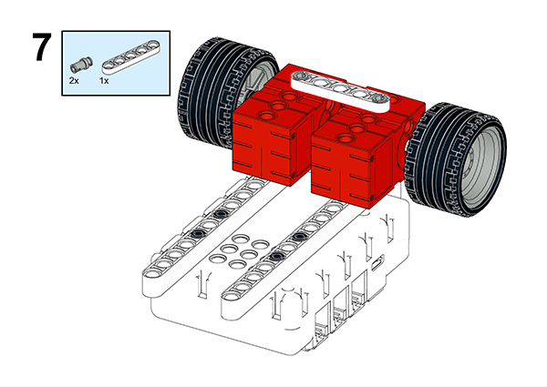

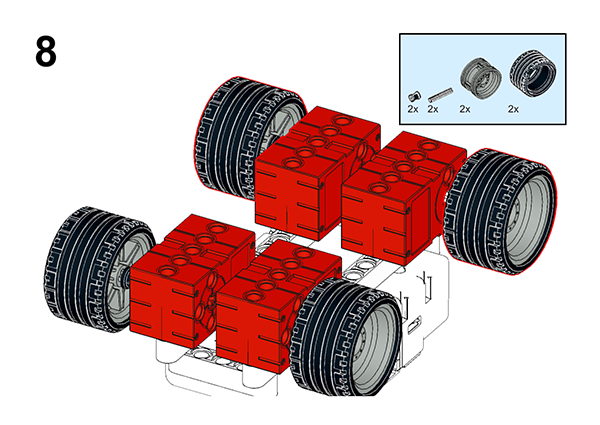

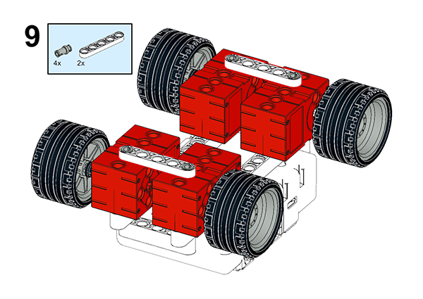

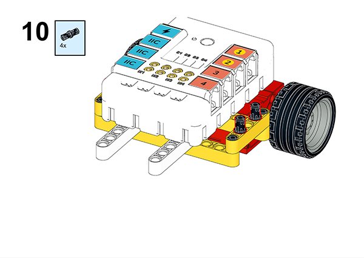

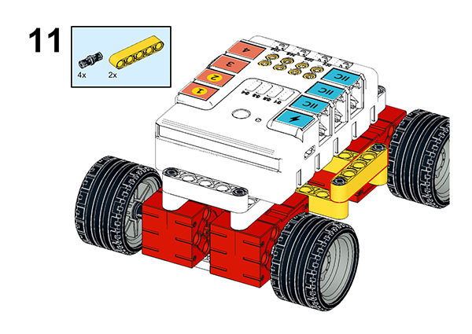

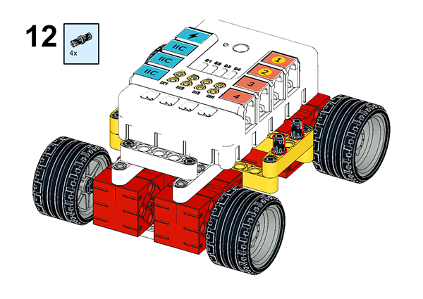

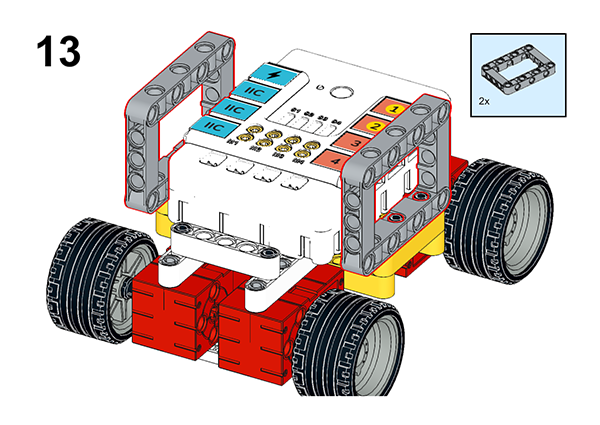

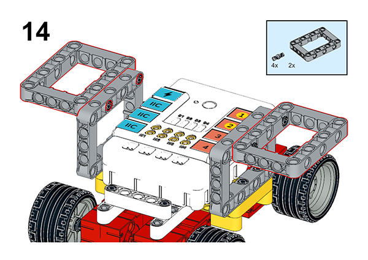

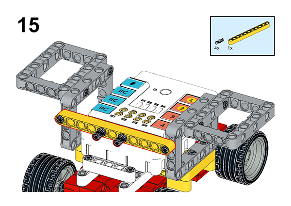

## Connection Diagram

Connect the four motors to the M1, M4, and the ultrasonic sensor to the J1as the picture suggests.

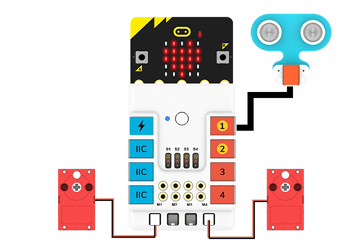

##  MakeCode Programming

### Step 1

Click “Advanced” in the MakeCode drawer to see more choices.

For programming the servo, we need to add a package. Click “Extensions” at the bottom of the drawer and search with “nezha” to download it.

For programming the PIR sensor, we need to add a package. Search with “PlanetX” in the dialogue box and click to download it.

*Notice*: If you met a tip indicating that some codebases would be deleted due to incompatibility, you may continue as the tips say or create a new project in the menu.

### Reference

Lunar exploration vehicle remote control program:

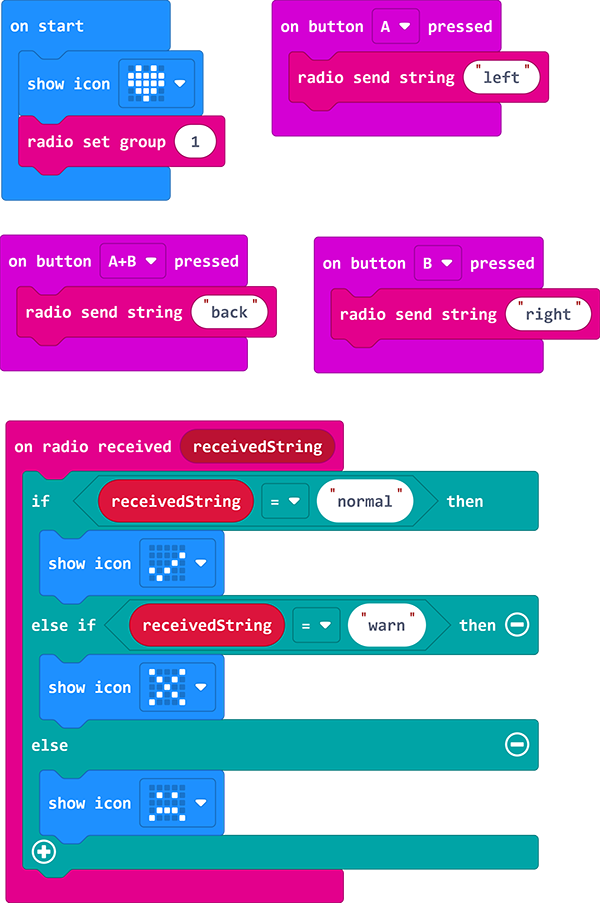

Link: https://makecode.microbit.org/_LDD7oafxoHup

You may also download it directly:

<iframe style="position:absolute;top:0;left:0;width:100%;height:100%;" src="https://makecode.microbit.org/#pub:_LDD7oafxoHup" frameborder="0" sandbox="allow-popups allow-forms allow-scripts allow-same-origin"></iframe>

Lunar exploration vehicle remote control program:

Link: https://makecode.microbit.org/_EP6do6JC67tj

<iframe style="position:absolute;top:0;left:0;width:100%;height:100%;" src="https://makecode.microbit.org/#pub:_EP6do6JC67tj" frameborder="0" sandbox="allow-popups allow-forms allow-scripts allow-same-origin"></iframe>

### Result

As you can see, the lunar rover can turn left and right, stop and back up when we press different buttons of the remote control.
