# Case 54: Happy Seesaw
## Introduction

Make a seesaw with [Nezha 48 IN 1 Inventor's Kit](https://www.elecfreaks.com/nezha-inventor-s-kit-for-micro-bit-without-micro-bit-board.html).

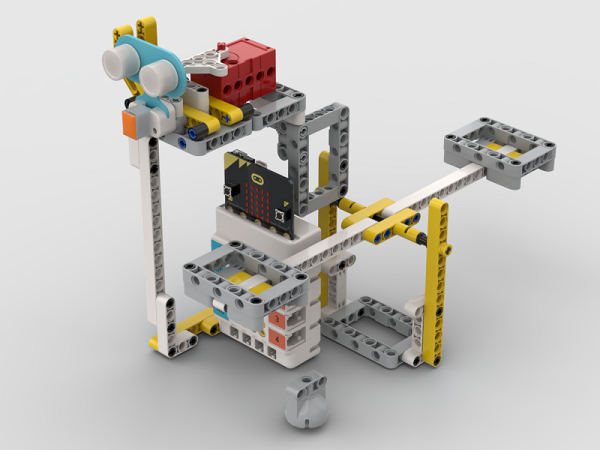

## Quick to Start

### Materials Required

[Nezha 48 IN 1 Inventor's Kit](https://www.elecfreaks.com/nezha-inventor-s-kit-for-micro-bit-without-micro-bit-board.html)

### Assembly Steps

Component Details

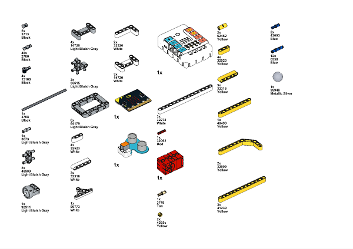

Build it as the assembly steps suggest:

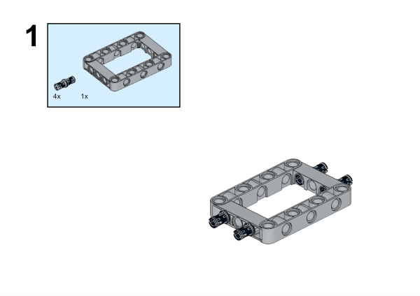

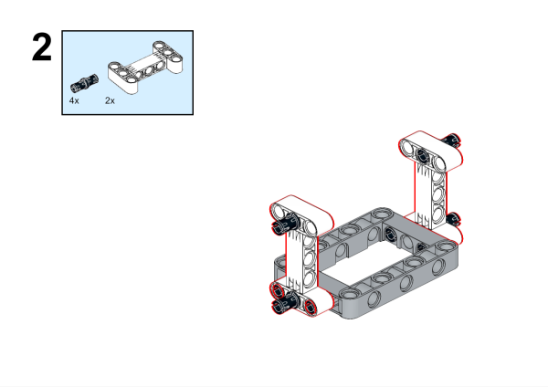

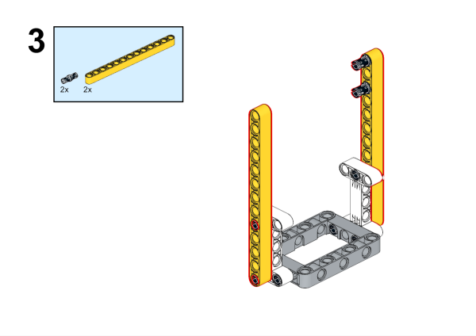

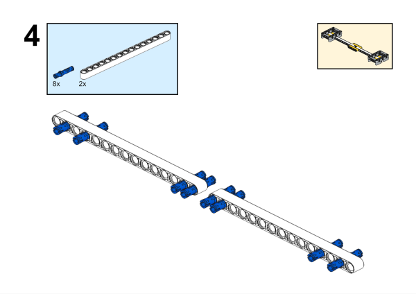

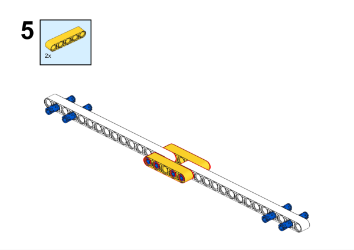

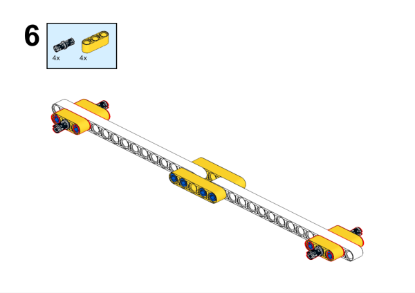

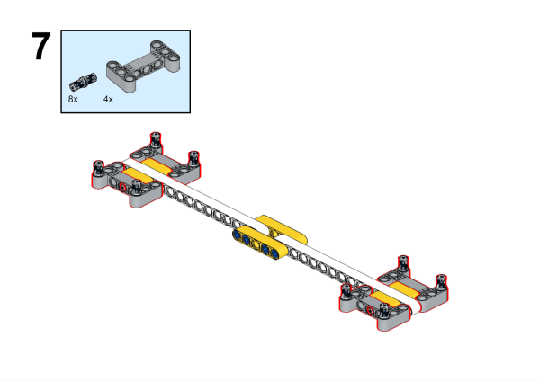

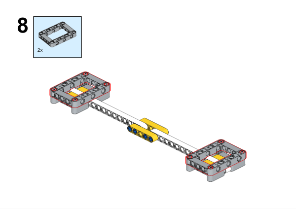

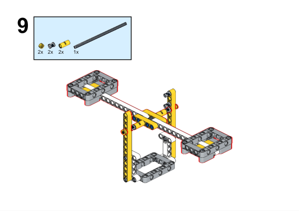

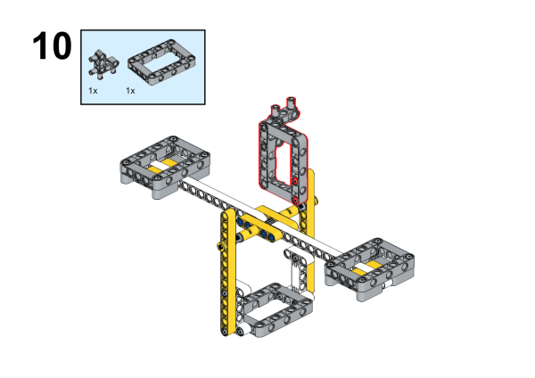

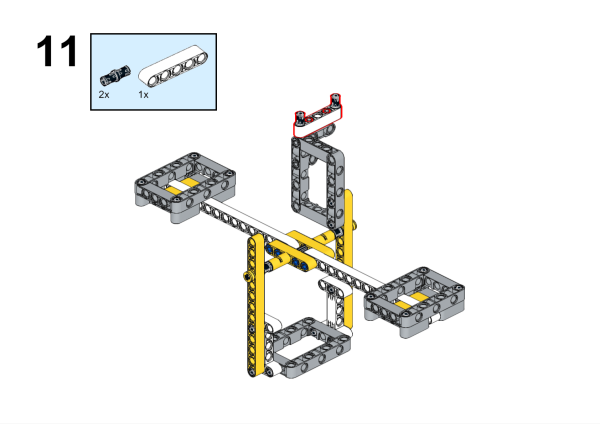

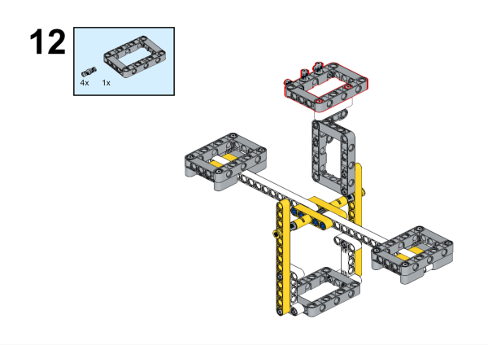

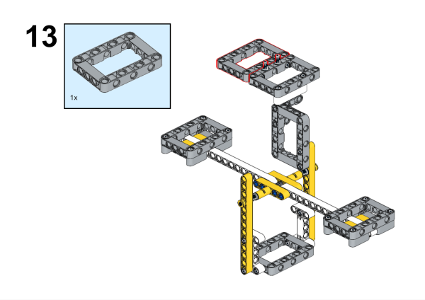

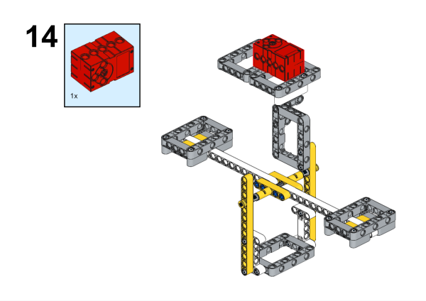

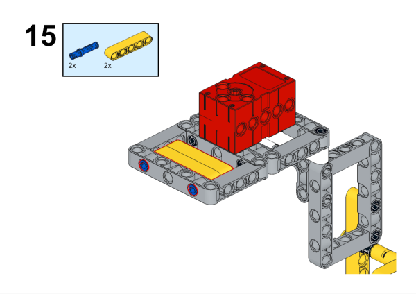

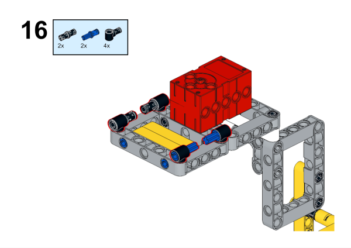

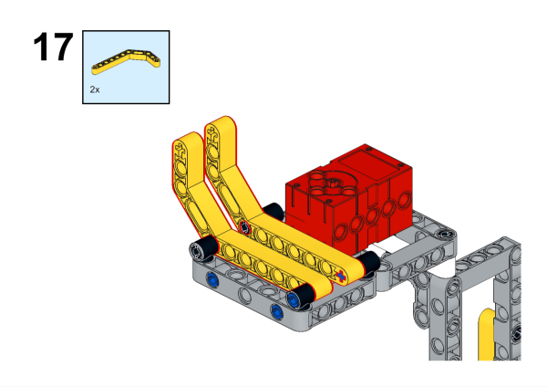

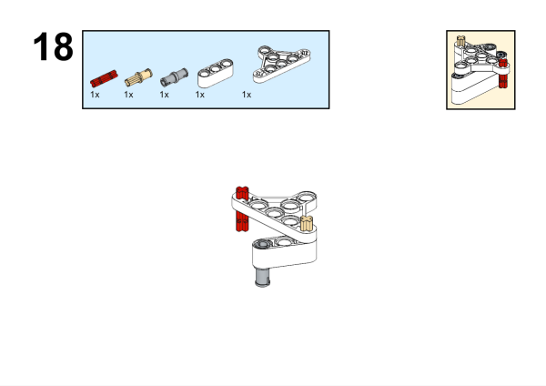

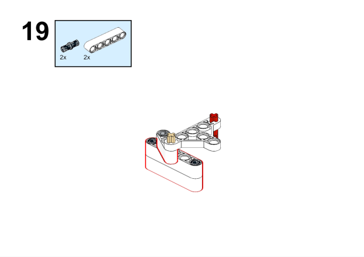

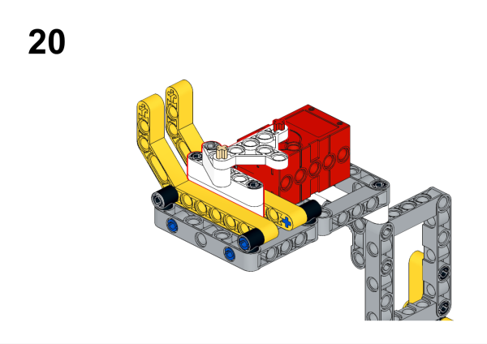

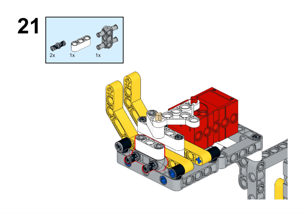

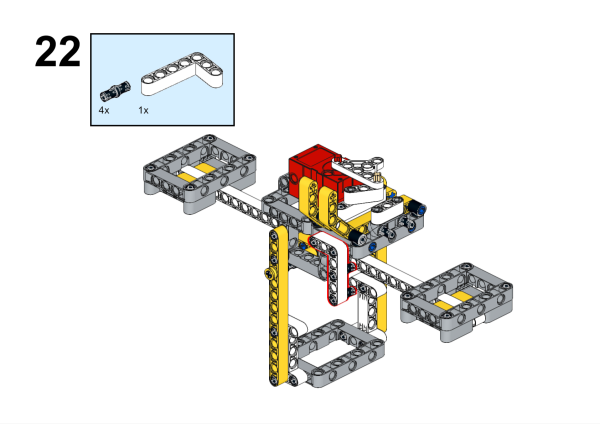

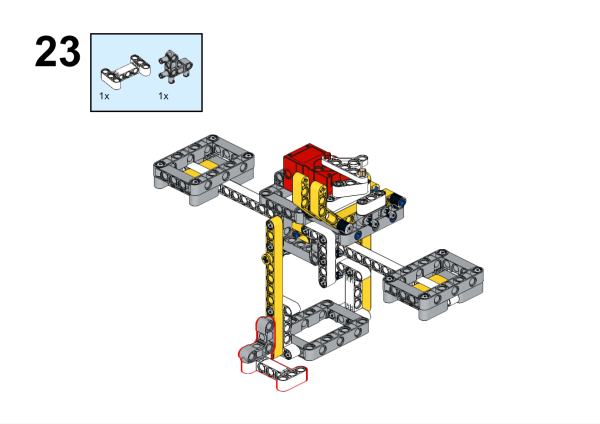

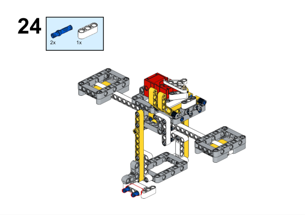

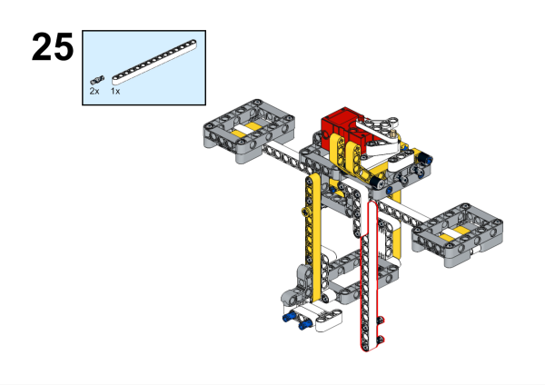

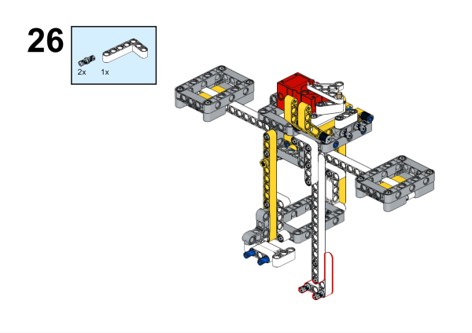

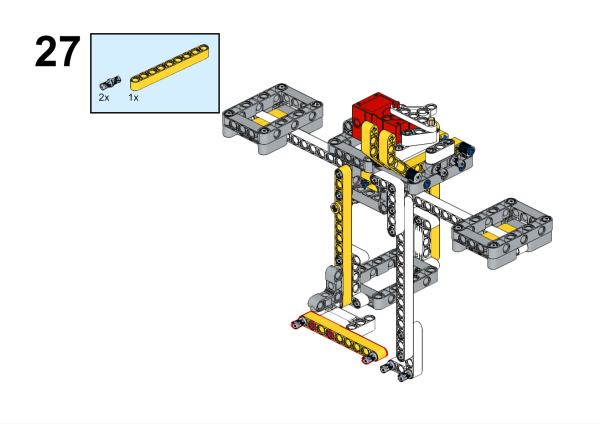

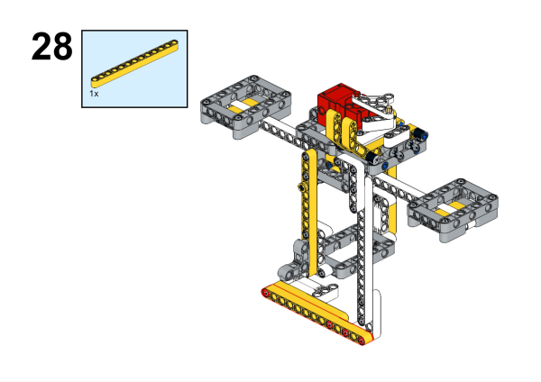

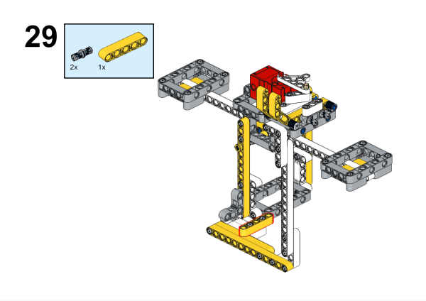

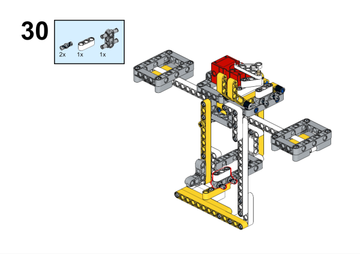

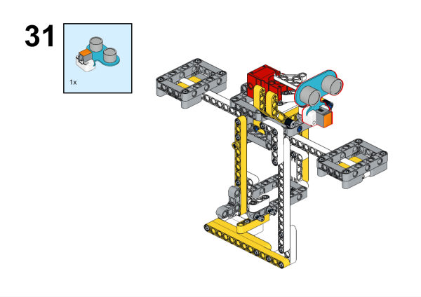

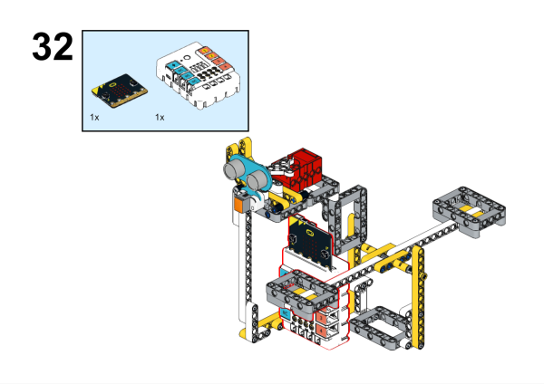

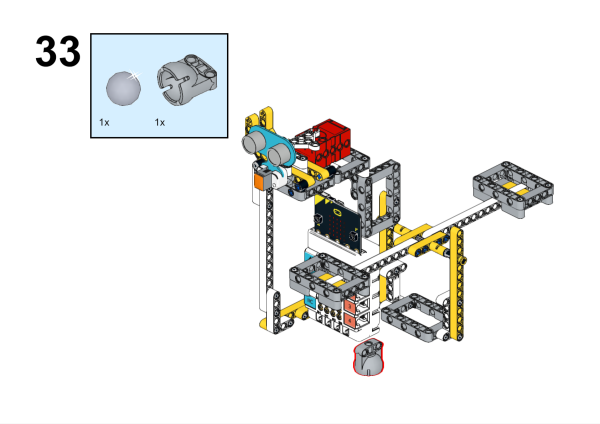

## Connection Diagram

As the picture suggests,connect the sonar:bit to J1,connect the [Motors](https://www.elecfreaks.com/geekservo-motor-2kg-compatible-with-lego.html) to the [Nezha](https://www.elecfreaks.com/nezha-breakout-board.html)  M1.

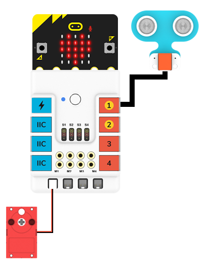

## MakeCode Programming

### Step 1

Click “Advanced” in the MakeCode drawer to see more choices.

For programming the servo, we need to add a package. Click “Extensions” at the bottom of the drawer and search with “nezha” to download it.

*Notice*: If you met a tip indicating that some codebases would be deleted due to incompatibility, you may continue as the tips say or create a new project in the menu.

### Step 2
### Write the program as picture suggests

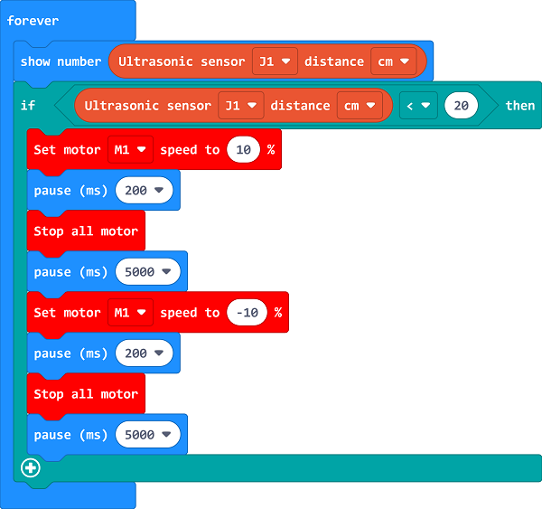

### Reference

Link: [https://makecode.microbit.org/_2bfKgv7KbVVV](https://makecode.microbit.org/_2bfKgv7KbVVV)

You may also download it directly:

<iframe style="position:absolute;top:0;left:0;width:100%;height:100%;" src="https://makecode.microbit.org/#pub:_2bfKgv7KbVVV" frameborder="0" sandbox="allow-popups allow-forms allow-scripts allow-same-origin"></iframe>
  

### Result

When there is an obstruction in front of it. the objects will be pushed down automatically.

