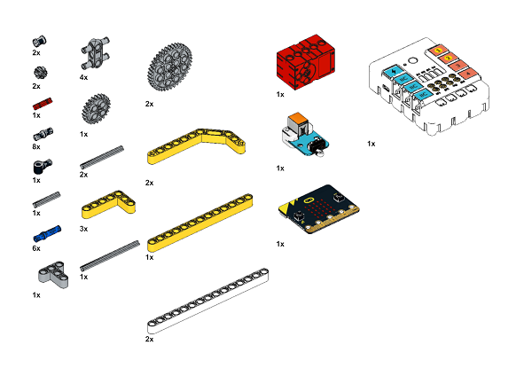
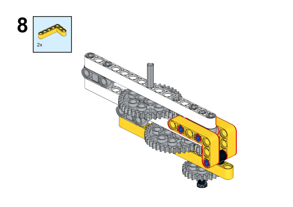

# Case 55: Gyro Transmitter
## Introduction

Make a gyro transmitter with [Nezha 48 IN 1 Inventor's Kit](https://www.elecfreaks.com/nezha-inventor-s-kit-for-micro-bit-without-micro-bit-board.html).

## Quick to Start

### Materials Required

[Nezha 48 IN 1 Inventor's Kit](https://www.elecfreaks.com/nezha-inventor-s-kit-for-micro-bit-without-micro-bit-board.html)

### Assembly steps

Component Details

Build it as the assembly steps suggest:

### Connection Diagram

As the picture suggests, onnect the [Crash sensors](https://www.elecfreaks.com/planetx-crash.html) to J1 port and the  [Motors](https://www.elecfreaks.com/geekservo-motor-2kg-compatible-with-lego.html) to M1 on [Nezha breakout board](https://www.elecfreaks.com/nezha-breakout-board.html).

## MakeCode Programming

### Step 1
Click “Advanced” in the MakeCode drawer to see more choices.

For programming the Crash sensor, we need to add a package. Enter "PlanetX" in the dialog box, and click search to download it.

For programming the Nezha.  Click “Extensions” at the bottom of the drawer and search with “nezha” to download it.

*Notice*: If you met a tip indicating that some codebases would be deleted due to incompatibility, you may continue as the tips say or create a new project in the menu.

### Step 2
### Program as picture suggests

### Reference
Link: [https://makecode.microbit.org/_09hAgCAM1XFk](https://makecode.microbit.org/_09hAgCAM1XFk)

You may also download it directly:

<iframe style="position:absolute;top:0;left:0;width:100%;height:100%;" src="https://makecode.microbit.org/#pub:_09hAgCAM1XFk" frameborder="0" sandbox="allow-popups allow-forms allow-scripts allow-same-origin"></iframe>
  

### Result

When the Crash sensor is pressed, the gyro transmitter starts to rotate, and when the crash sensor is released, the gyro transmitter stops rotating.

