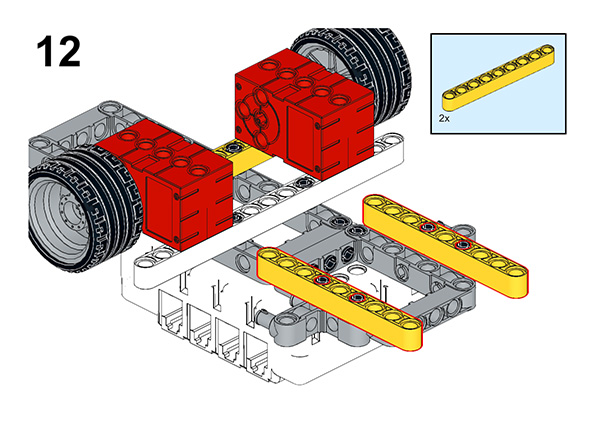

# Case 56: Powerful Fighter

## Introduction

When we see increasingly advanced civil airliners and military fighter jets at air shows and on the Internet, we marvel at how fast technology is advancing. And, with the introduction of the fifth generation of stealth fighter jets marks a whole new level of technology in fighter jets. In this class, we will not only make a fighter of our own, but we can also program the operating procedures of the fighter. Of course, I think you may not be satisfied with the abbreviated version of the fighter model, I hope you can improve and innovate the completed work, not only in terms of appearance but also in terms of functionality and programming, so let's start.

### Materials Required

Nezha expansion board × 1

micro:bit V2 × 1

Ultrasonic sensor × 1

RJ11 cable × 1

Bricks × n

**Note: If you want all of the above components, you may purchase the [Nezha 48 IN 1 Inventor's Kit](https://www.elecfreaks.com/nezha-inventor-s-kit-for-micro-bit-without-micro-bit-board.html)**.

### Assembly Steps

Component Details

Build it as the assembly steps suggest:

## Connection Diagram

Connect the four motors to the M1, M4, and the ultrasonic sensor to the J1 port as the picture suggests.

##  MakeCode Programming

### Step 1

Click “Advanced” in the MakeCode drawer to see more choices.

For programming the servo, we need to add a package. Click “Extensions” at the bottom of the drawer and search with “nezha” to download it.

For programming the PIR sensor, we need to add a package. Search with “PlanetX” in the dialogue box and click to download it.

*Notice*: If you met a tip indicating that some codebases would be deleted due to incompatibility, you may continue as the tips say or create a new project in the menu.

### Reference

The program is shown in the figure below:

Link: https://makecode.microbit.org/_AtzHu38c8Wwx

You may also download it directly:

<iframe style="position:absolute;top:0;left:0;width:100%;height:100%;" src="https://makecode.microbit.org/#pub:_AtzHu38c8Wwx" frameborder="0" sandbox="allow-popups allow-forms allow-scripts allow-same-origin"></iframe>

### Result

We can see that the fighter turns when it encounters an obstacle and shows how many times it encounters the obstacle.
