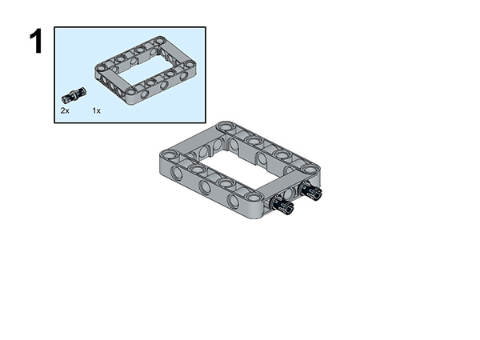
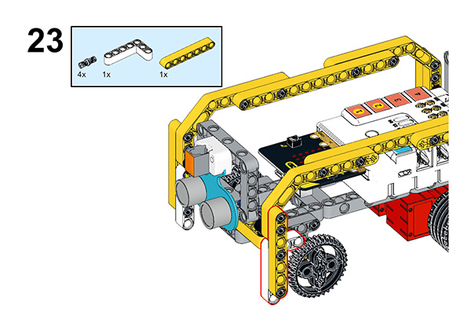
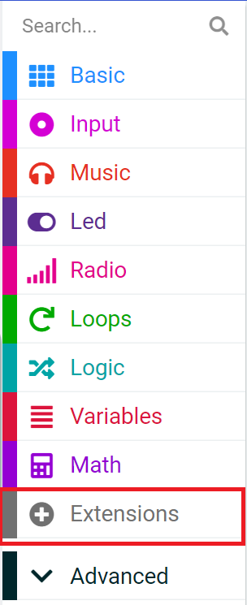

# Case 57: An Unmanned Bus

## Introduction

Now, with the maturity of artificial intelligence and driverless technology, driverless buses are beginning to appear, and the fares are lower. Therefore, in this class, we will make an unmanned bus work to experience the riding mode of unmanned bus and the convenience of future transportation.

### Materials Required

Nezha expansion board × 1

micro:bit V2 × 1

Crash sensor× 1

Ultrasonic sensor × 1

RJ11 cable × 1

Bricks × n

**Note: If you want all of the above components, you may purchase the [Nezha 48 IN 1 Inventor's Kit](https://www.elecfreaks.com/nezha-inventor-s-kit-for-micro-bit-without-micro-bit-board.html)**.

### Assembly Steps

Component Details

Build it as the assembly steps suggest:

## Connection Diagram

Connect the four motors to the M1, M4,  the crash sensor to J1 port, the Ultrasonic sensor to J2 port. 

##  MakeCode Programming

### Step 1

Click “Advanced” in the MakeCode drawer to see more choices.

For programming the servo, we need to add a package. Click “Extensions” at the bottom of the drawer and search with “nezha” to download it.

For programming the PIR sensor, we need to add a package. Search with “PlanetX” in the dialogue box and click to download it.

*Notice*: If you met a tip indicating that some codebases would be deleted due to incompatibility, you may continue as the tips say or create a new project in the menu.

### Reference

The program is shown in the figure below:

Link: https://makecode.microbit.org/_Cz7hETb9V9pL

You may also download it directly:

<iframe style="position:absolute;top:0;left:0;width:100%;height:100%;" src="https://makecode.microbit.org/#pub:_Cz7hETb9V9pL" frameborder="0" sandbox="allow-popups allow-forms allow-scripts allow-same-origin"></iframe>

### Result

We can see that when the bus encounters a bus stop it will stop and wait for passengers to get on, and after passengers get on the bus and press the crash sensor the bus will leave again.
