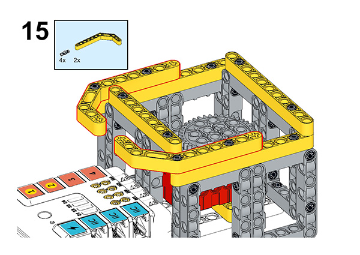
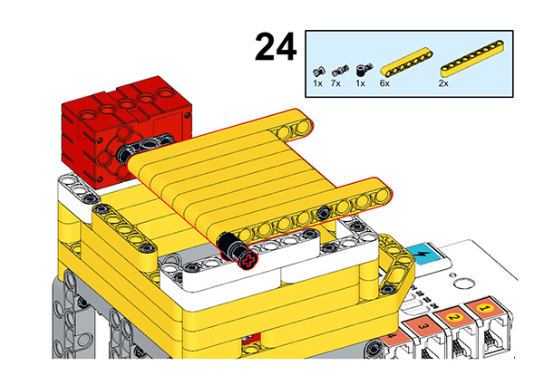

# Case 58: Smart Washing Machine

## Introduction

With the improvement of people's living standards and the upgrading of household appliances technology, we rely more and more on the washing machine for this chore, so we learn to make a smart washing machine in this lesson, and we can press different buttons to select different functions, let's start.

### Materials Required

Nezha expansion board × 1

micro:bit V2 × 1

RJ11 cable × 1

Bricks × n

**Note: If you want all of the above components, you may purchase the [Nezha 48 IN 1 Inventor's Kit](https://www.elecfreaks.com/nezha-inventor-s-kit-for-micro-bit-without-micro-bit-board.html)**.

### Assembly Steps

Component Details

Build it as the assembly steps suggest:

## Connection Diagram

Connect the four motors to the M1, M2.

##  MakeCode Programming

### Step 1

Click “Advanced” in the MakeCode drawer to see more choices.

For programming the servo, we need to add a package. Click “Extensions” at the bottom of the drawer and search with “nezha” to download it.

For programming the PIR sensor, we need to add a package. Search with “PlanetX” in the dialogue box and click to download it.

*Notice*: If you met a tip indicating that some codebases would be deleted due to incompatibility, you may continue as the tips say or create a new project in the menu.

### Reference

The program is shown below:

Link: https://makecode.microbit.org/_fLAKpugFgdLW

You may also download it directly:

<iframe style="position:absolute;top:0;left:0;width:100%;height:100%;" src="https://makecode.microbit.org/#pub:_fLAKpugFgdLW" frameborder="0" sandbox="allow-popups allow-forms allow-scripts allow-same-origin"></iframe>

The remote control program is shown below:

Link: https://makecode.microbit.org/_C6LAycMHibK1

<iframe style="position:absolute;top:0;left:0;width:100%;height:100%;" src="https://makecode.microbit.org/#pub:_C6LAycMHibK1" frameborder="0" sandbox="allow-popups allow-forms allow-scripts allow-same-origin"></iframe>

### Result

As we can see, we use the remote control to control the speed of rotation of the turntable of the smart washing machine.
