# Case 59: Submarines

## Introduction

We have seen submarines on TV news or internet pages, and submarines are broadly divided into nuclear-powered and conventional-powered submarines. We know that the technology used in submarines is very diverse and advanced, reflecting the comprehensive technology and economic strength of a country. Of course, there are also submarines used for scientific exploration of the ocean, so let's make a submarine for ocean exploration in this lesson.

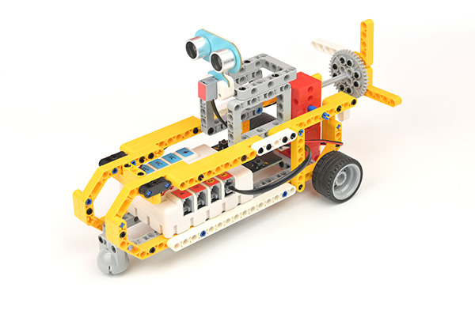

### Materials Required

Nezha expansion board × 1

micro:bit V2 × 1

Ultrasonic Sound Sensor × 1

Motors × 2

RJ11 cable × 1

Bricks × n

**Note: If you want all of the above components, you may purchase the [Nezha 48 IN 1 Inventor's Kit](https://www.elecfreaks.com/nezha-inventor-s-kit-for-micro-bit-without-micro-bit-board.html)**.

### Assembly Steps

Component Details

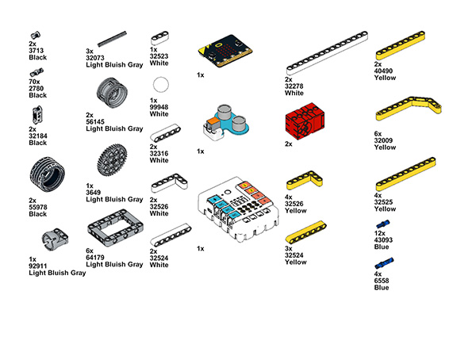

Build it as the assembly steps suggest:

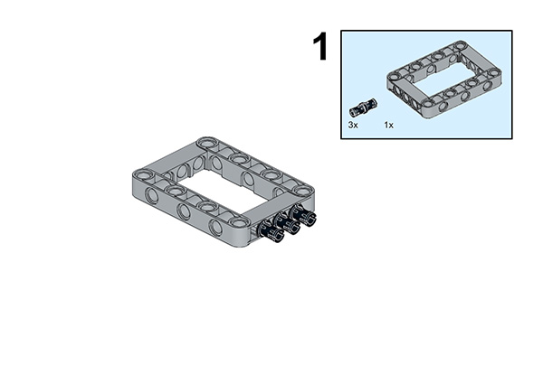

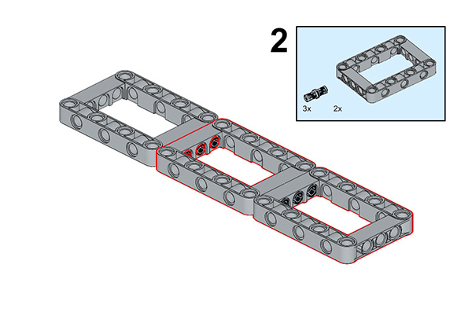

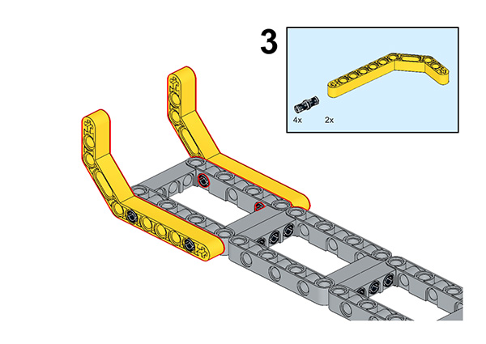

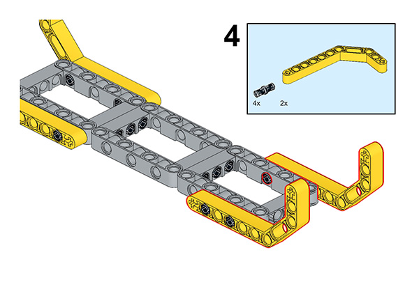

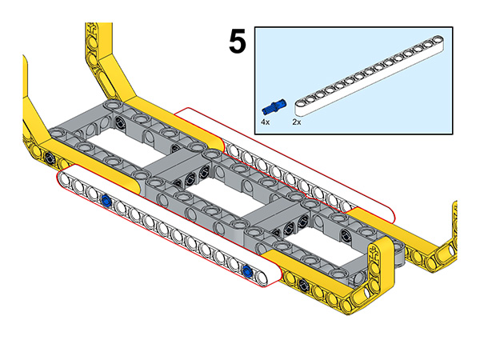

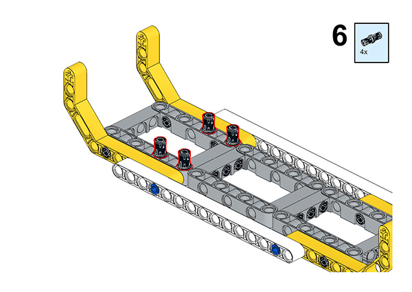

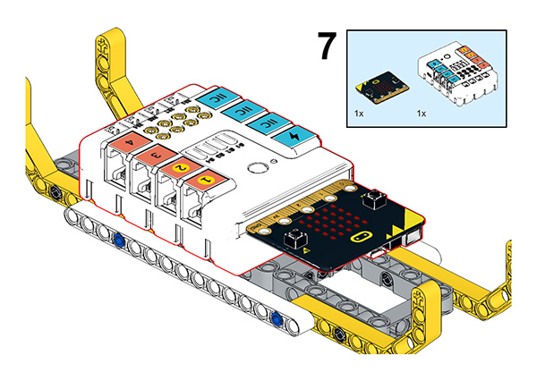

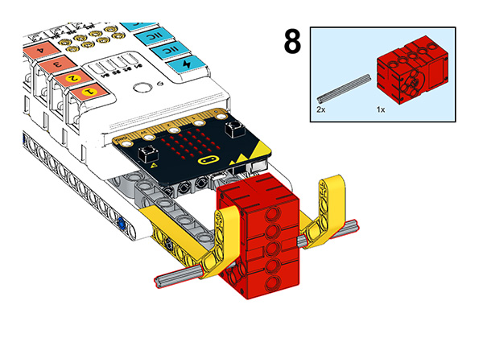

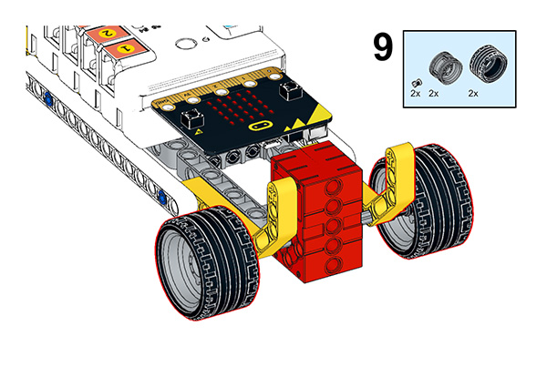

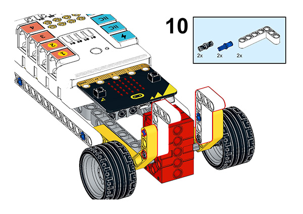

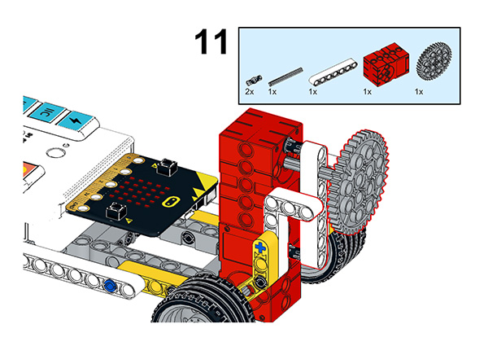

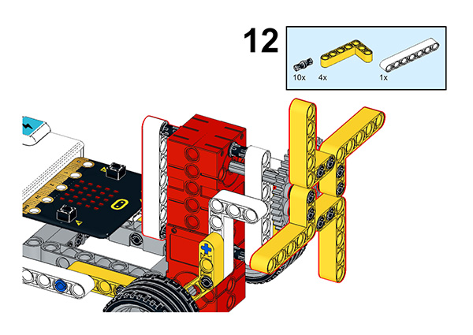

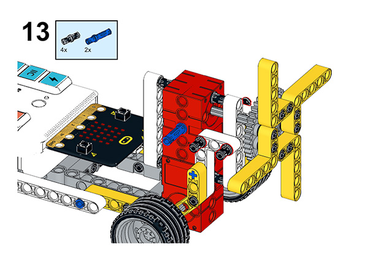

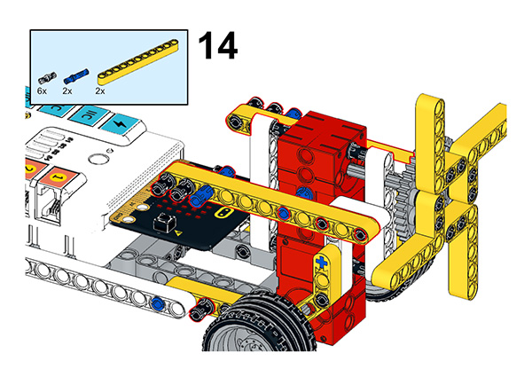

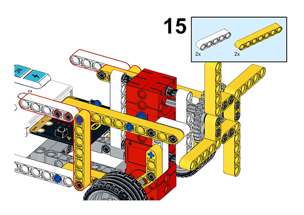

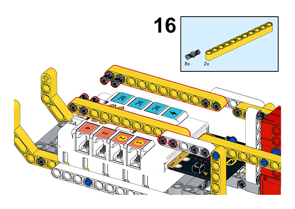

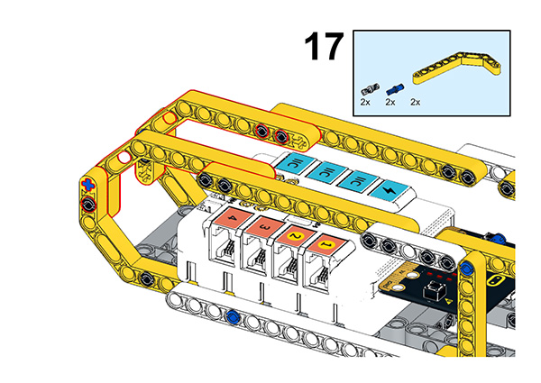

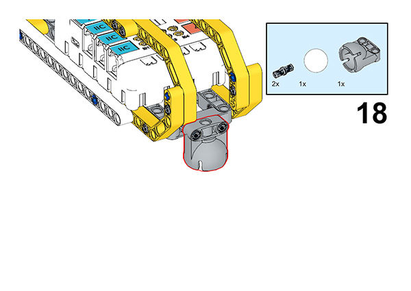

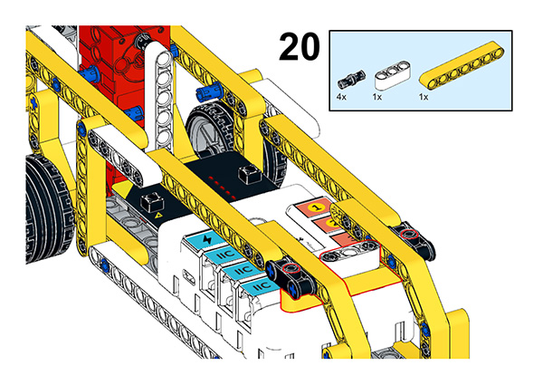

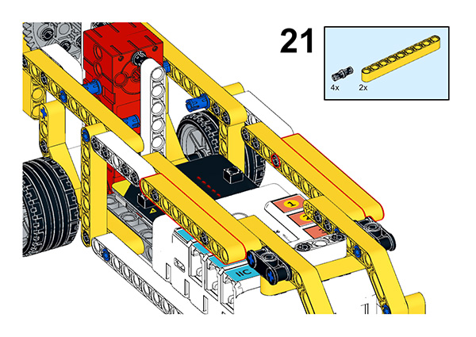

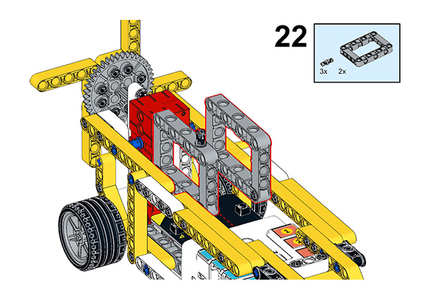

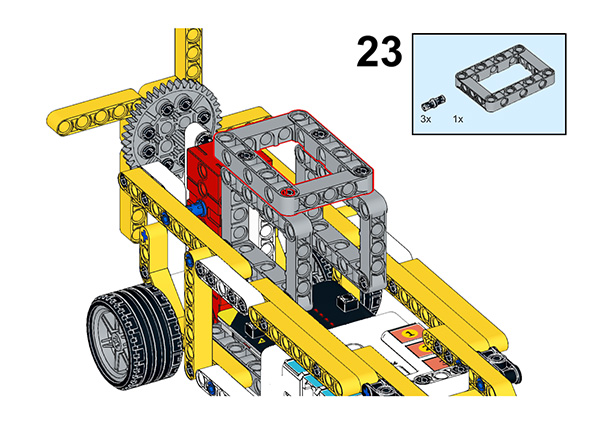

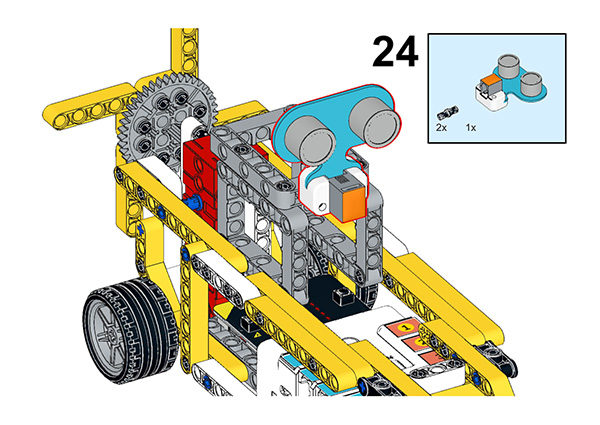

## Connection Diagram

Connect the four motors to the M1, and M4. and Connect the ultrasonic sensor to the J1

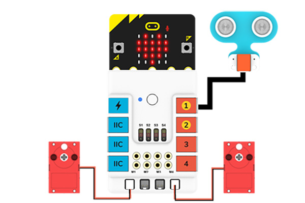

##  MakeCode Programming

### Step 1

Click “Advanced” in the MakeCode drawer to see more choices.

For programming the servo, we need to add a package. Click “Extensions” at the bottom of the drawer and search with “nezha” to download it.

For programming the PIR sensor, we need to add a package. Search with “PlanetX” in the dialogue box and click to download it.

*Notice*: If you met a tip indicating that some codebases would be deleted due to incompatibility, you may continue as the tips say or create a new project in the menu.

### Reference

The program is shown below:

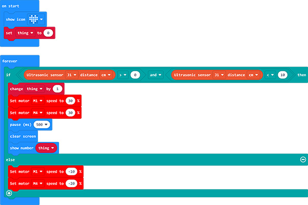

Link:  https://makecode.microbit.org/_hLPTR36MJCrE

You may also download it directly:

<iframe style="position:absolute;top:0;left:0;width:100%;height:100%;" src="https://makecode.microbit.org/#pub:_hLPTR36MJCrE" frameborder="0" sandbox="allow-popups allow-forms allow-scripts allow-same-origin"></iframe>

### Result

As we can see, the submarine will move forward at a constant speed when there are no rocks in the way, back up when there is an obstacle in front of it, and then move forward again. Of course, you can also improve the program to achieve the submarine trajectory we see in real life.

