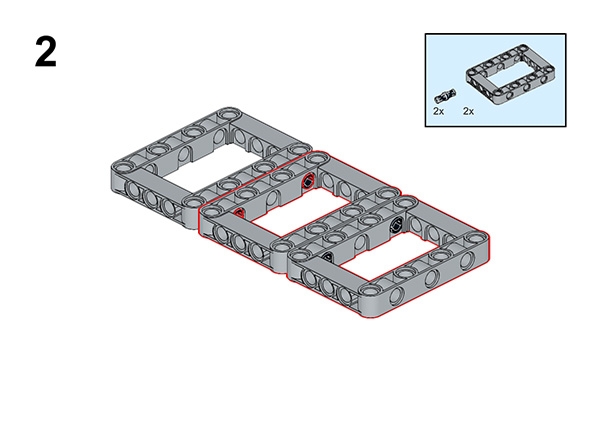
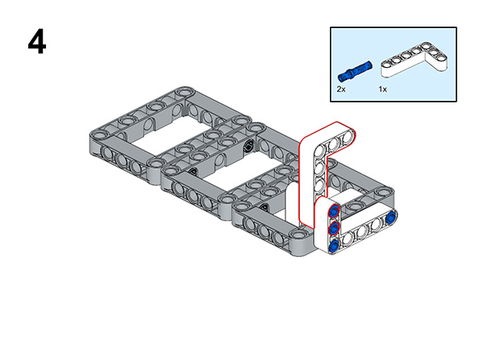

# Case 60: Raising the National Flag

## Introduction

We deeply love our country, and the symbols that best represent our country are the national flag that we often see and the national anthem that we often hear, in this lesson we will do the case of raising the national flag to express our love for our country, let's start.

### Materials Required

Nezha expansion board × 1

micro:bit V2 × 1

RJ11 cable × 1

Bricks × n

**Note: If you want all of the above components, you may purchase the [Nezha 48 IN 1 Inventor's Kit](https://www.elecfreaks.com/nezha-inventor-s-kit-for-micro-bit-without-micro-bit-board.html)**.

### Assembly Steps

Component Details

Build it as the assembly steps suggest:

## Connection Diagram

Connect the four motors to the M1.

##  MakeCode Programming

### Step 1

Click “Advanced” in the MakeCode drawer to see more choices.

For programming the servo, we need to add a package. Click “Extensions” at the bottom of the drawer and search with “nezha” to download it.

For programming the PIR sensor, we need to add a package. Search with “PlanetX” in the dialogue box and click to download it.

*Notice*: If you met a tip indicating that some codebases would be deleted due to incompatibility, you may continue as the tips say or create a new project in the menu.

### Reference

The program is shown below:

Link: https://makecode.microbit.org/_e5L634aT28YU

You may also download it directly:

<iframe style="position:absolute;top:0;left:0;width:100%;height:100%;" src="https://makecode.microbit.org/#pub:_e5L634aT28YU" frameborder="0" sandbox="allow-popups allow-forms allow-scripts allow-same-origin"></iframe>

### Result

We can see that when the A button is pressed, the music is played as the flag rises, and when the B button is pressed, the flag falls.

