# Case 61: The Boxing Robot
## Introduction

Make a boxing robot with [Nezha 48 IN 1 Inventor's Kit](https://www.elecfreaks.com/nezha-inventor-s-kit-for-micro-bit-without-micro-bit-board.html).

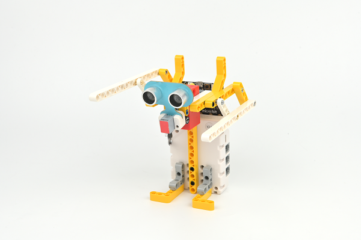

## Quick to Start

### Materials Required

[Nezha 48 IN 1 Inventor's Kit](https://www.elecfreaks.com/nezha-inventor-s-kit-for-micro-bit-without-micro-bit-board.html)

### Assembly steps

Components Details

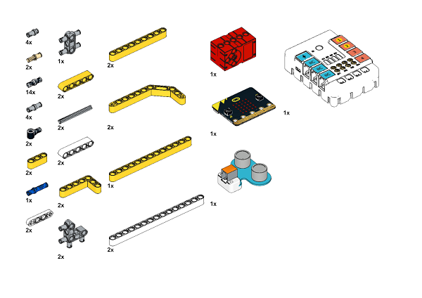

Build it as the assembly steps suggest:

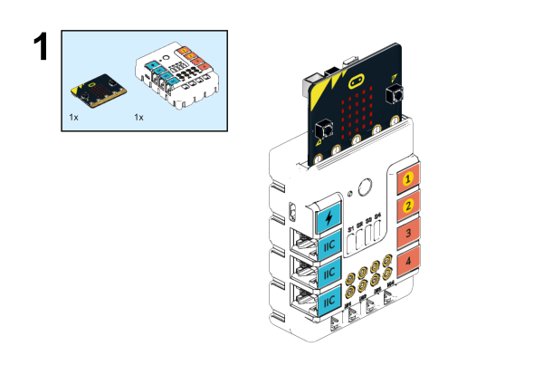

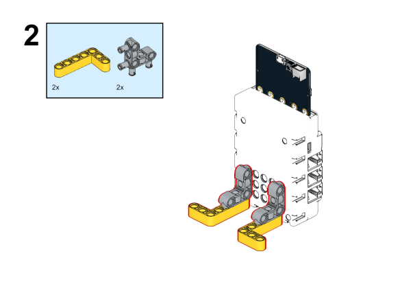

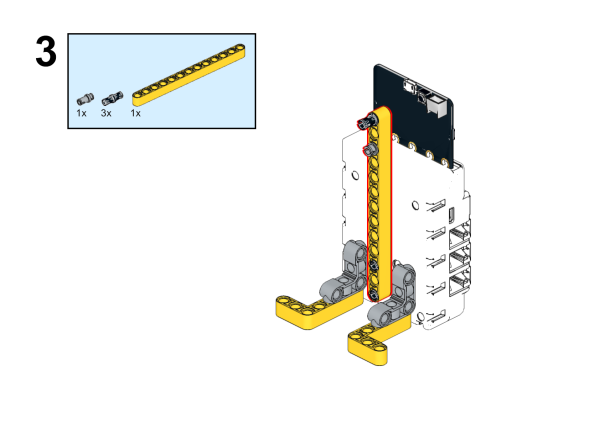

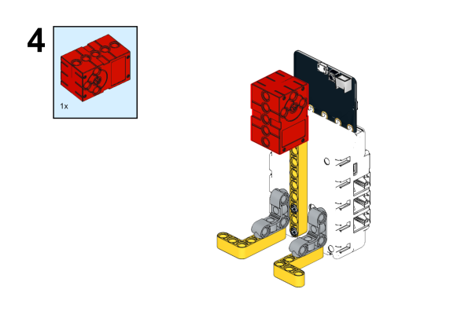

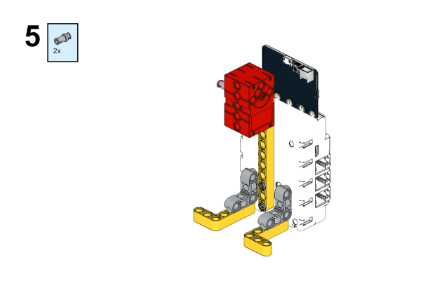

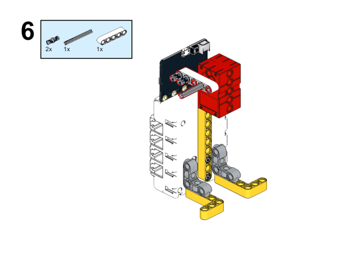

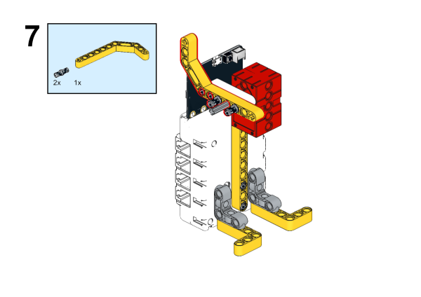

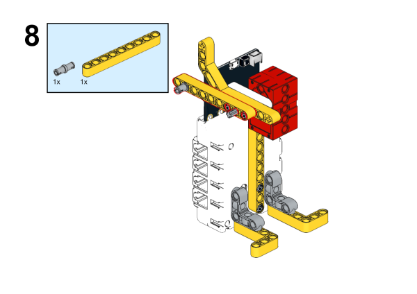

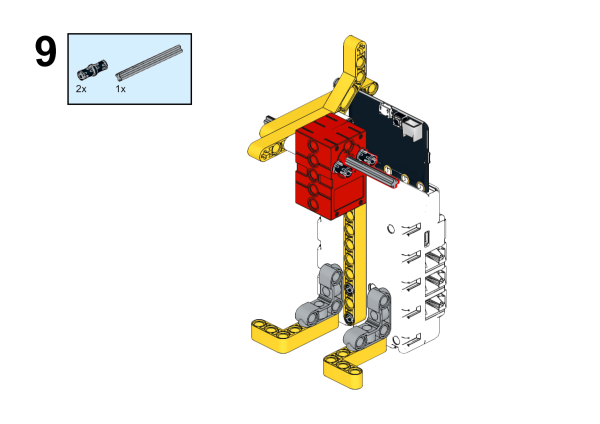

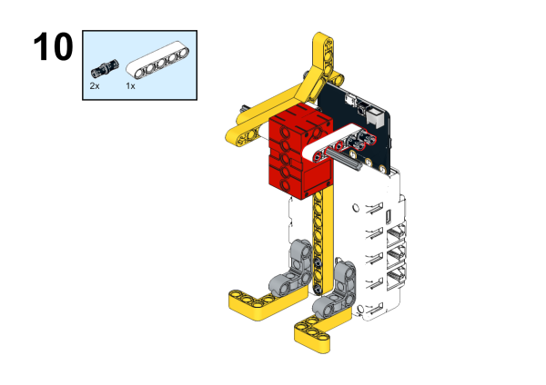

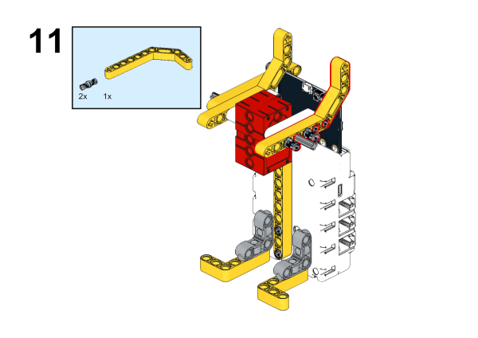

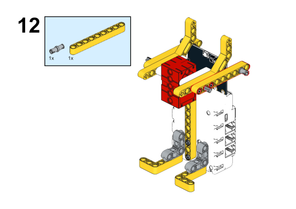

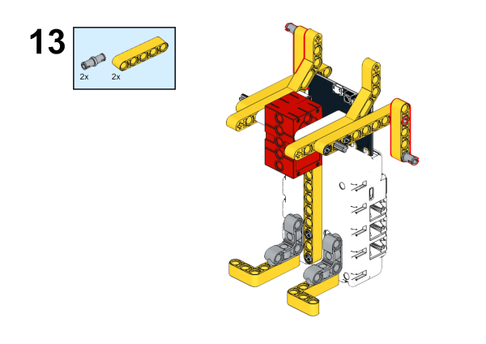

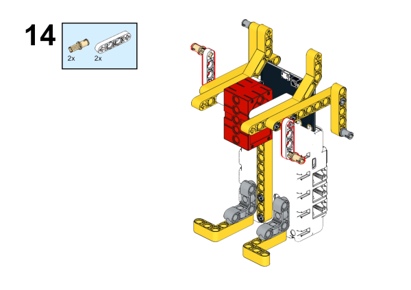

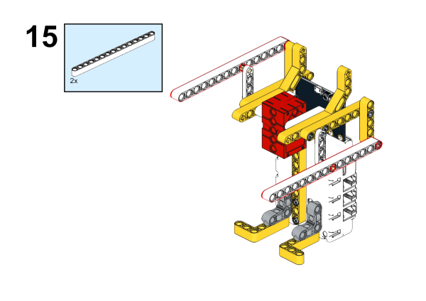

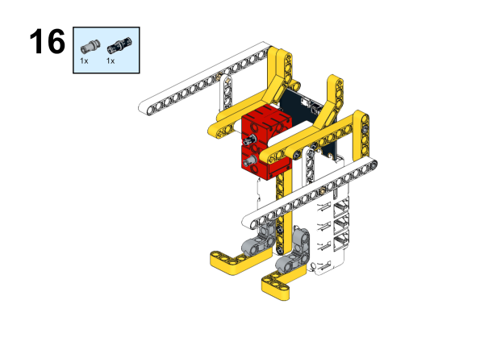

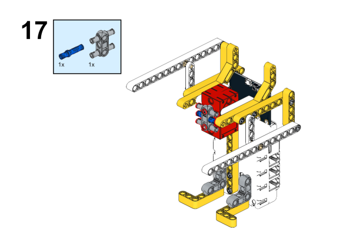

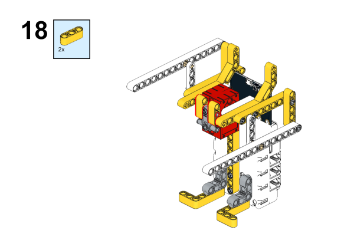

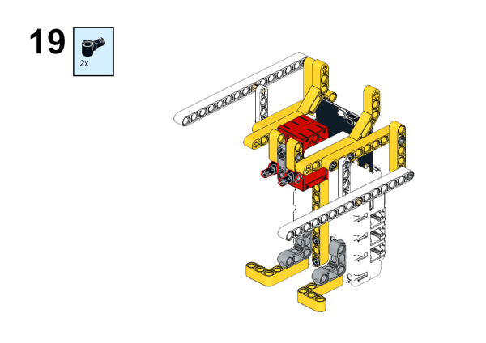

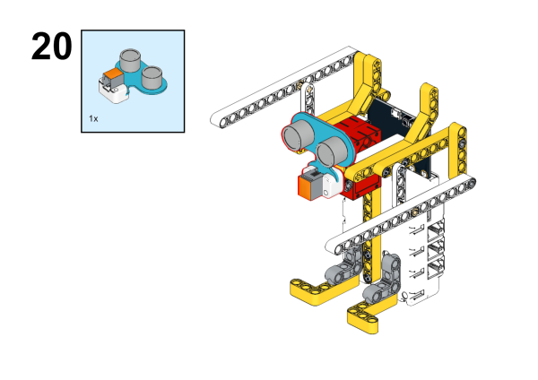

Completed:

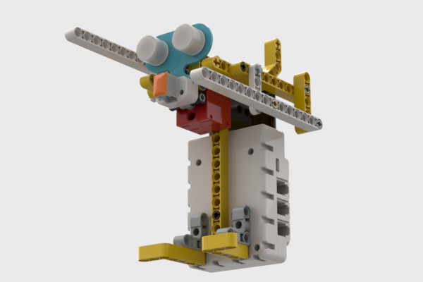

### Connection Diagram

As the picture suggests, connect the [Ultrasonic sensors ](https://www.elecfreaks.com/planetx-ultrasonic.html)to J1,and the [Motors ](https://www.elecfreaks.com/geekservo-motor-2kg-compatible-with-lego.html)to M1 on [Nezha breakout board](https://www.elecfreaks.com/nezha-breakout-board.html).

## MakeCode Programming

### Step 1

Click “Advanced” in the MakeCode drawer to see more choices.

For programming the Ultrasonic sensor, we need to add a package. Search with "PlanetX" in the dialogue box download it.

For programming the Nezha. Click “Extensions” at the bottom of the drawer and search with “nezha” to download it.

*Notice*: If you met a tip indicating that some codebases would be deleted due to incompatibility, you may continue as the tips say or create a new project in the menu.

### Step 2

### Program as picture suggests

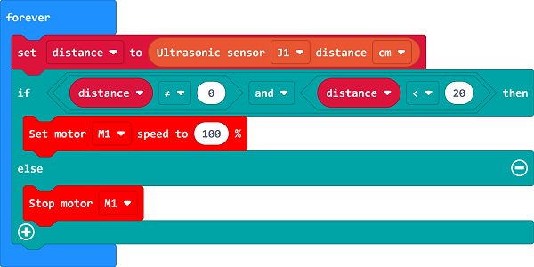

### Reference

Link: [https://makecode.microbit.org/_M07U5hgYV8ws](https://makecode.microbit.org/_M07U5hgYV8ws)

You may also download it directly:

<iframe style="position:absolute;top:0;left:0;width:100%;height:100%;" src="https://makecode.microbit.org/#pub:_M07U5hgYV8ws" frameborder="0" sandbox="allow-popups allow-forms allow-scripts allow-same-origin"></iframe>
  

### Result

When an item comes close to the boxing robot, the robot starts boxing.

