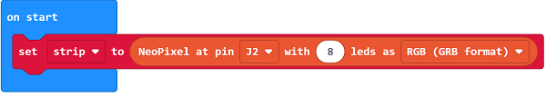

# Case 62: The Gesture-controlled Fan
## Introduction

Use [Nezha 48 IN 1 Inventor's Kit](https://www.elecfreaks.com/nezha-inventor-s-kit-for-micro-bit-without-micro-bit-board.html) with [ELECFREAKS Planetx Gesture Sensor](https://www.elecfreaks.com/planetx-gesture.html), [8 RGB Rainbow LED Ring](https://www.elecfreaks.com/planetx-rainbow-led.html) and [ELECFREAKS PlanetX Motor Fan](https://www.elecfreaks.com/planetx-motor-fan.html) to create a fan that can control the wind speed through gestures.

## Case Build-up

### Materials Required

[Nezha 48 IN 1 Inventor's Kit](https://www.elecfreaks.com/nezha-inventor-s-kit-for-micro-bit-without-micro-bit-board.html)

[ELECFREAKS Planetx Gesture Sensor](https://www.elecfreaks.com/planetx-gesture.html)

[8 RGB Rainbow LED Ring](https://www.elecfreaks.com/planetx-rainbow-led.html)

[ELECFREAKS PlanetX Motor Fan](https://www.elecfreaks.com/planetx-motor-fan.html)

### Structure building

Component Details

Build it as the assembly steps suggest:

Build completion :

### Connection Diagram

As the picture suggests, Connect the [ELECFREAKS Planetx Gesture Sensor](https://www.elecfreaks.com/planetx-gesture.html) to IIC port and the [ELECFREAKS PlanetX Motor Fan](https://www.elecfreaks.com/planetx-motor-fan.html) to J1 port and the [8 RGB Rainbow LED Ring](https://www.elecfreaks.com/planetx-rainbow-led.html) to J2 port on [Nezha breakout board](https://www.elecfreaks.com/nezha-breakout-board.html).

## MakeCode Programming

### Step 1

Click “Advanced” in the MakeCode drawer to see more choices.

For programming the ELECFREAKS Planetx Gesture Sensor, ELECFREAKS PlanetX Motor Fan, and the 8 RGB Rainbow LED Ring, enter "PlanetX" in the dialog box and click search to download it.

For programming the Nezha, click “Extensions” at the bottom of the drawer and search with “nezha” to download it.

*Notice*: If you met a tip indicating that some codebases would be deleted due to incompatibility, you may continue as the tips say or create a new project in the menu.

### Step 2

### Program as picture suggests

Initialize the 8 RGB Rainbow LED Ring to connect to the J2 port of the Nezha expansion board.

Set when the gesture sensor detects upward gesture, judge whether the level is less than 8, if less than 8 then the variable level will automatically add one.
Set when the gesture sensor detects a downward gesture, judge whether the level is greater than 0, if greater than 0 then the variable level is automatically minus one, and set the light to black.
Set when the gesture sensor detects the gesture to the left, turn off the fan, and lights, and set the variable level to 0.

When the value of the variable level is not 0, set speed=level×10+20, set the speed of the motor fan module connected to the J1 port of which Zha expansion board to speed%, set the number of lights to be lit according to the value of level, and set the light color to blue.

Full procedure : 

### Reference

Link: [https://makecode.microbit.org/v4.0.18#editor/_fv3Fht0bbEXT](https://makecode.microbit.org/v4.0.18#editor/_fv3Fht0bbEXT)

You may also download it directly:

<iframe style="position:absolute;top:0;left:0;width:100%;height:100%;" src="https://makecode.microbit.org/#pub:_fv3Fht0bbEXT" frameborder="0" sandbox="allow-popups allow-forms allow-scripts allow-same-origin"></iframe>
  

### Result

Fan speed is controlled by gestures. Upward gestures control fan acceleration, downward gestures control fan deceleration, leftward gestures control fan stop rotation, and fan speed is displayed by the LED rings, and the faster the speed is, the stronger lights are lit.

