# Case 63: The Intelligent Pitching Machine

## Introduction

In daily life we can see ball pitching machines in some amusement park. They are in very large sizes and basically can't be installed in a home for fun. To make it available,  we can use our Nezha Inventor's kit to make an intelligent ball pitching machine. We will use an AI lens to identify the card, and if it is the card that we set to recognize,  program to lauch the ball. At the same time, the four-digit digital tube will record the number of times the ball is launched. This work sounds very interesting, let's get started.

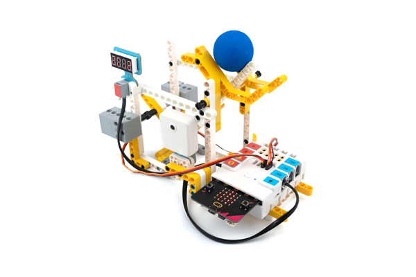

### Materials Required

Nezha expansion board × 1

micro:bit V2 × 1

AI Lens × 1

Seven-segment 4-digit digital tube × 1

360° Servo × 2

Red Card × 1

Leather straps × 2

RJ11 cables × 2

Bricks × n

**Note: If you want all of the above components, you may purchase the [Nezha 48 IN 1 Inventor's Kit](https://www.elecfreaks.com/nezha-inventor-s-kit-for-micro-bit-without-micro-bit-board.html)**.

### Assembly Steps

Component Details

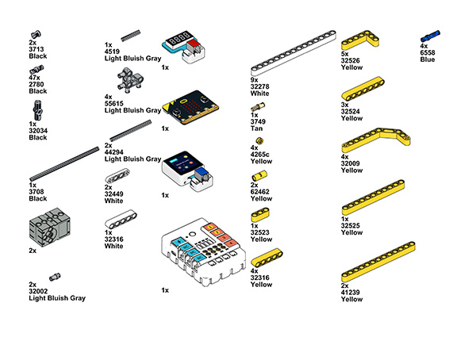

Build it as the assembly steps suggest:

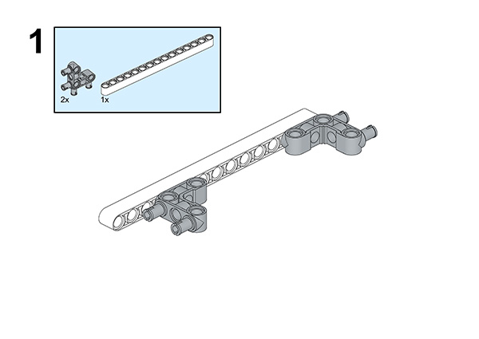

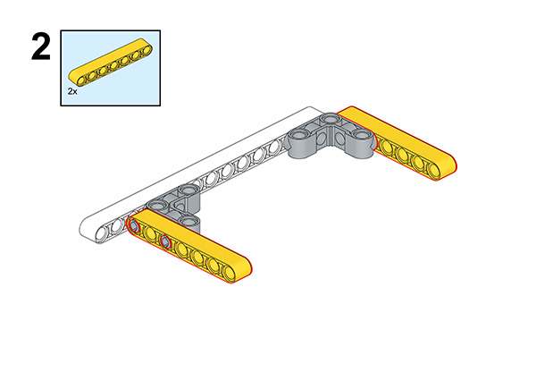

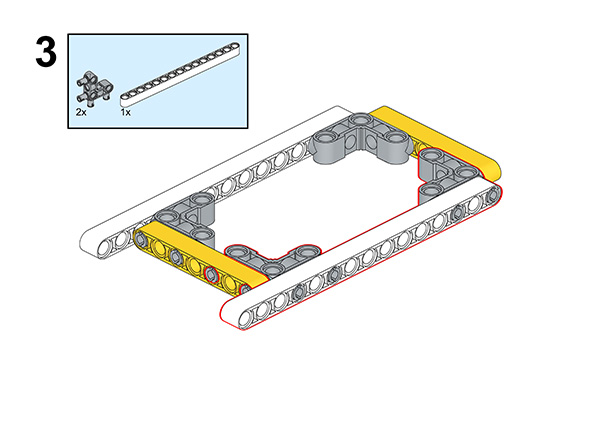

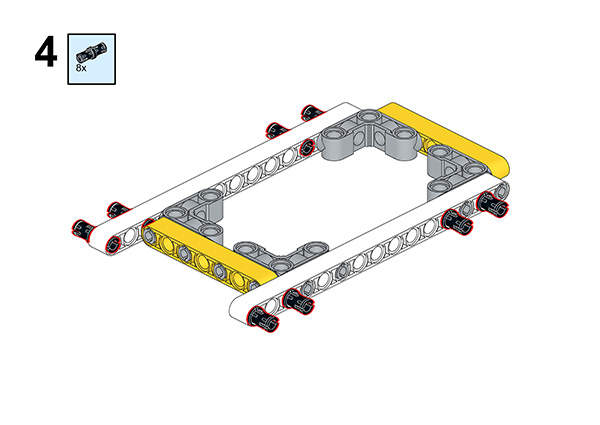

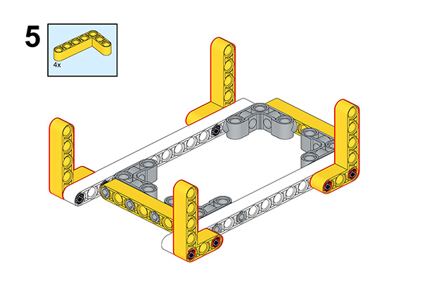

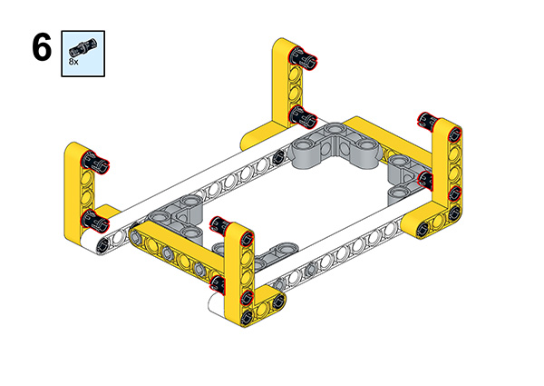

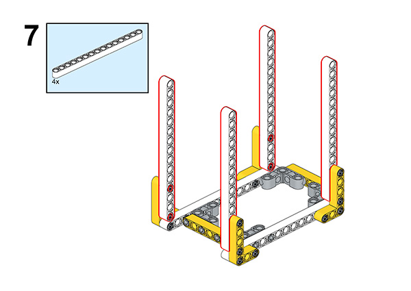

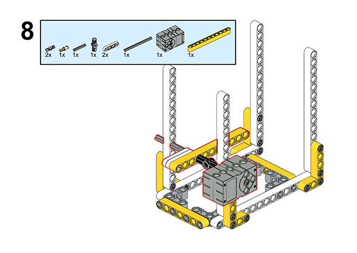

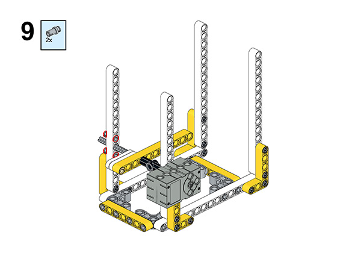

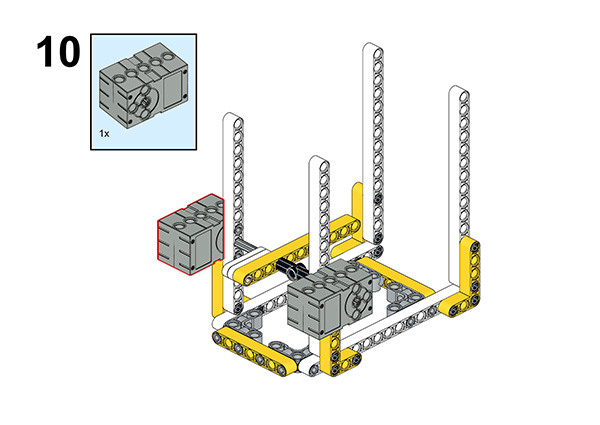

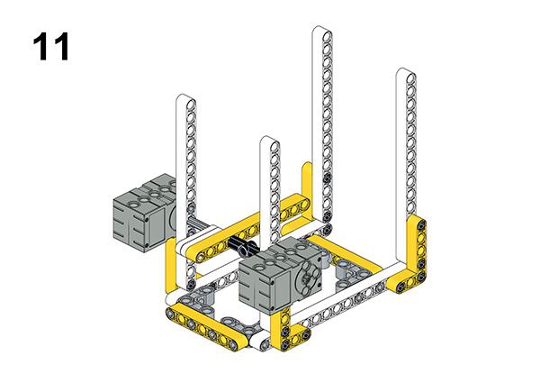

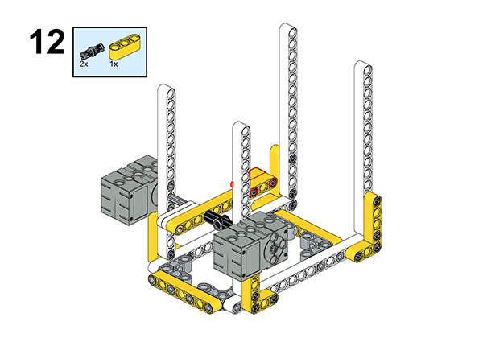

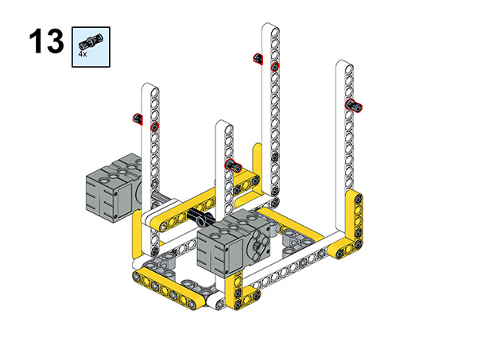

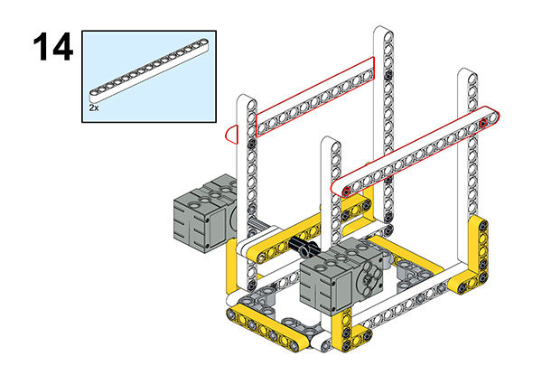

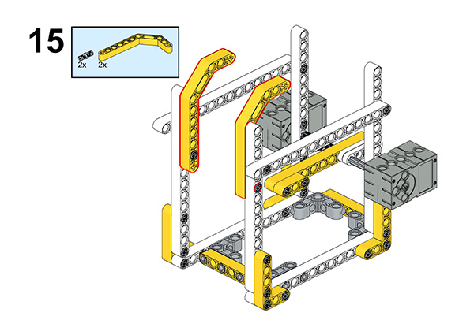

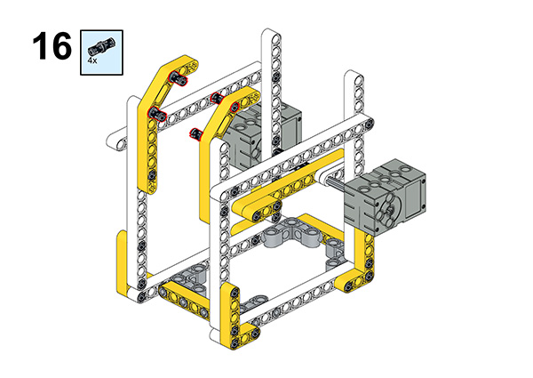

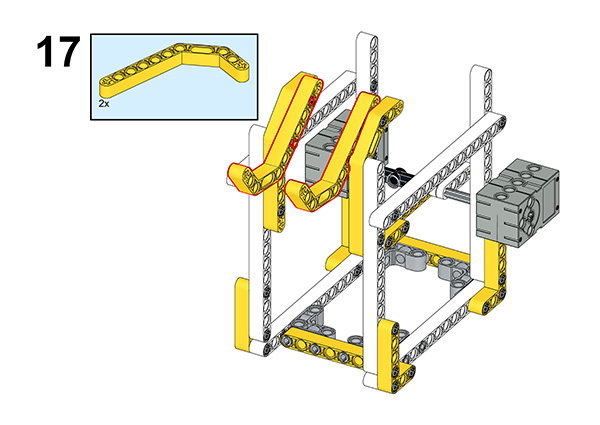

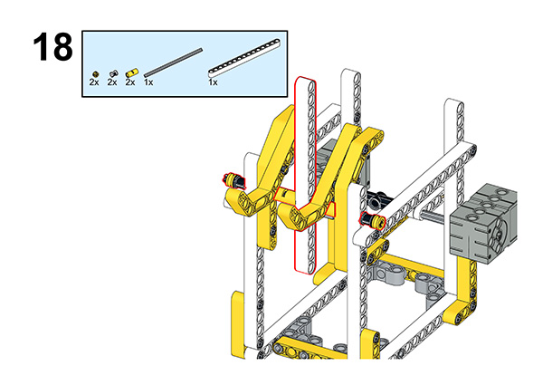

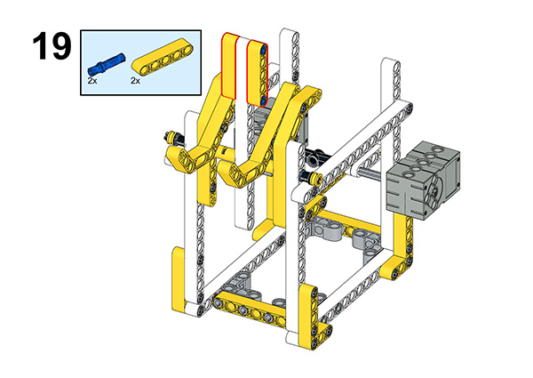

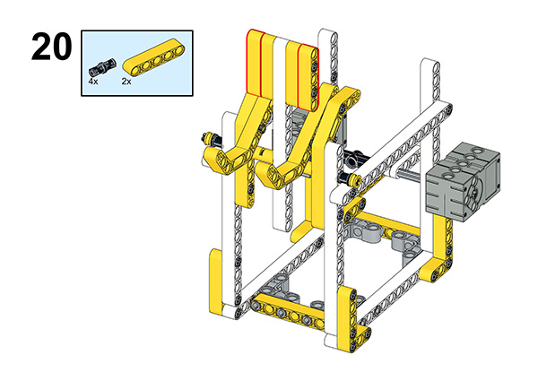

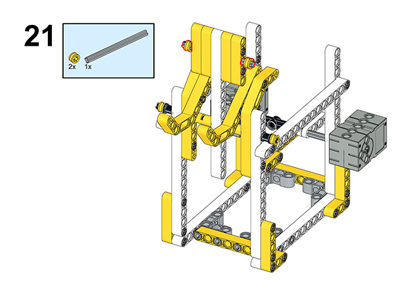

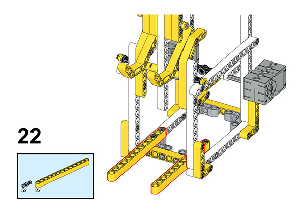

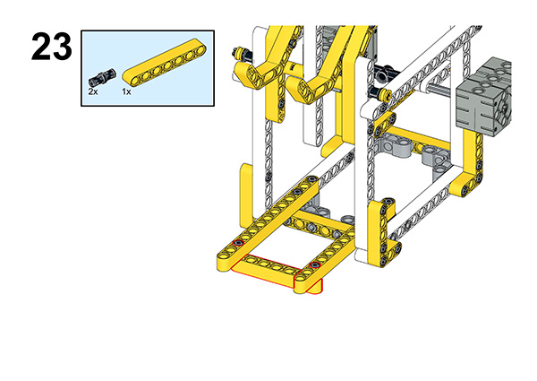

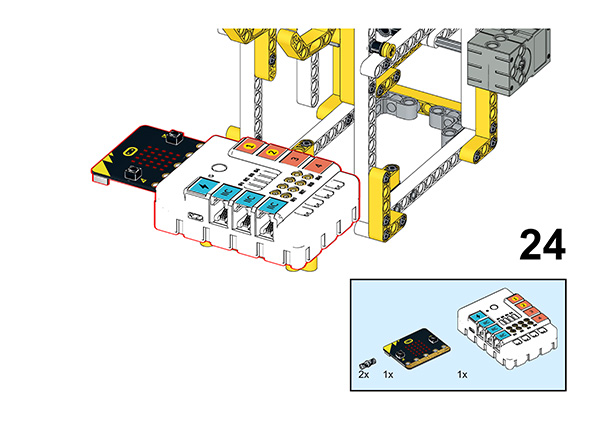

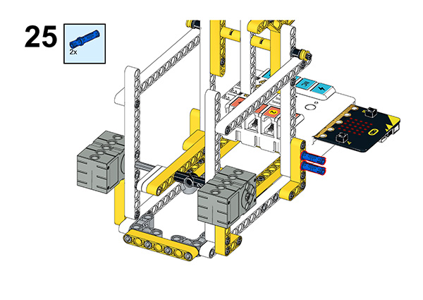

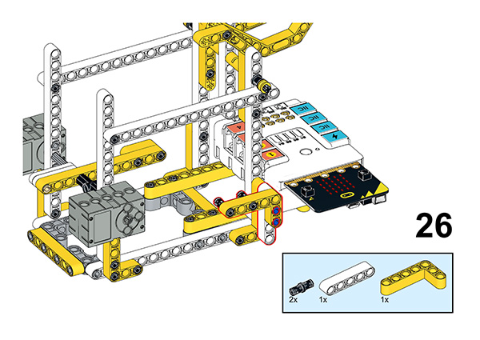

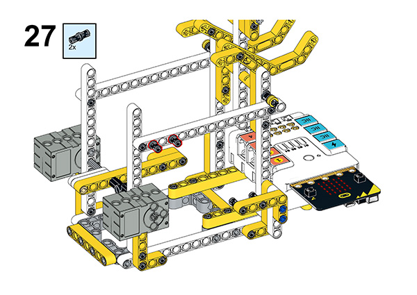

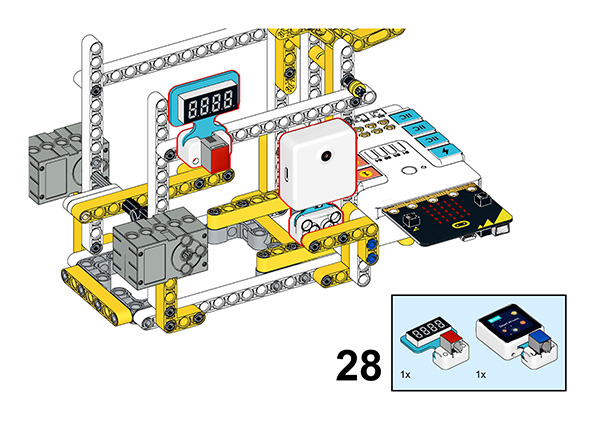

## Connection Diagram

Connect the servo to  S1, S2 and the AI Lens to IIC port, then connect the Seven-segment 4-digit digital tube to J1 port.

##  MakeCode Programming

### Step 1

Click “Advanced” in the MakeCode drawer to see more choices.

For programming the servo, we need to add a package. Click “Extensions” at the bottom of the drawer and search with “nezha” to download it.

For programming the AI Lens and 7 Segment four-digit digital tube sensor, we need to add a package. Search with “PlanetX” in the dialogue box and click to download it.

*Notice*: If you met a tip indicating that some codebases would be deleted due to incompatibility, you may continue as the tips say or create a new project in the menu.

### Reference

The program is shown below:

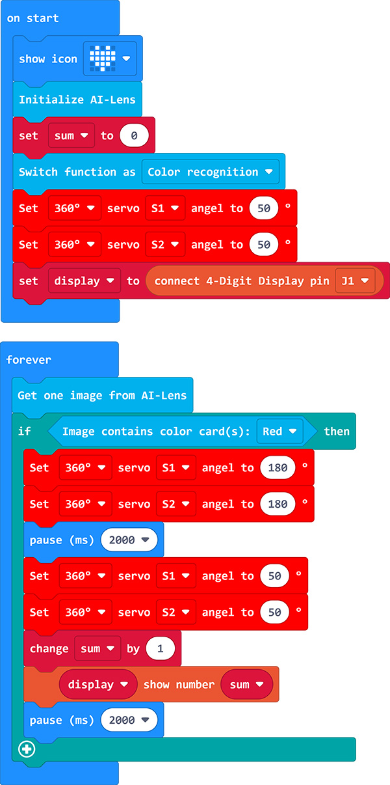

Link: https://makecode.microbit.org/_KbYhPgeR4J6f

You may also download it directly:

<iframe style="position:absolute;top:0;left:0;width:100%;height:100%;" src="https://makecode.microbit.org/#pub:_KbYhPgeR4J6f" frameborder="0" sandbox="allow-popups allow-forms allow-scripts allow-same-origin"></iframe>

### Result

We can see that when a red card is placed in front of the AI lens, the pitcher fires a small ball and then the four-digit digital tube displays the number of the pitches.

