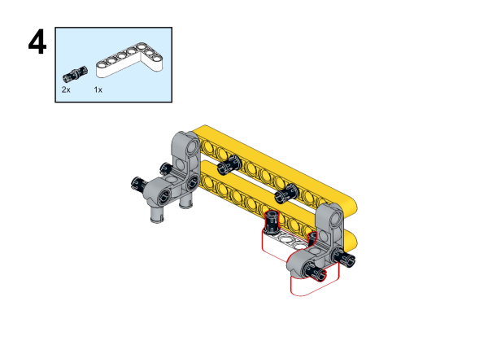
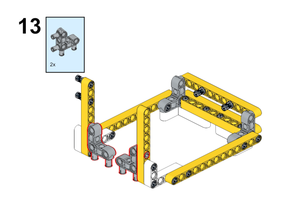
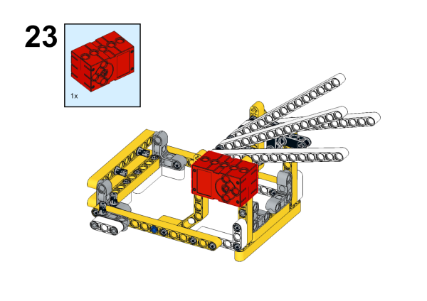
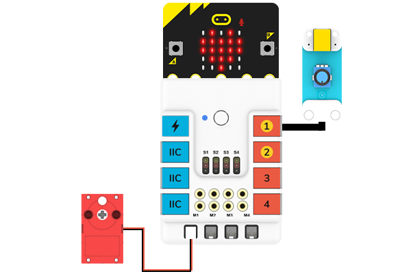

# Case 65: Drum Beater
## Introduction

Use **[Nezha 48 IN 1 Inventor's Kit](https://www.elecfreaks.com/nezha-inventor-s-kit-for-micro-bit-without-micro-bit-board.html)** and [Potentiometer ](https://www.elecfreaks.com/planetx-trimpot.html)to build the drum machine that can control the speed with a knob.

## Case building

### Materials Required

 **[Nezha 48 IN 1 Inventor's Kit](https://www.elecfreaks.com/nezha-inventor-s-kit-for-micro-bit-without-micro-bit-board.html)** 

[Potentiometer ](https://www.elecfreaks.com/planetx-trimpot.html)

### Structure Construction

Parts List

The structure is built as shown in the figure.

Finished picture:

## Connection Diagram

 Connect the [Potentiometer ](https://www.elecfreaks.com/planetx-trimpot.html) to J1 port, and the [Motor](https://www.elecfreaks.com/geekservo-motor-2kg-compatible-with-lego.html) to M1 port on [Nezha Breakout Board](https://www.elecfreaks.com/nezha-breakout-board.html) .

## MakeCode Programming

### Step 1

Click “Advanced” in the MakeCode drawer to see more choices.

For programming the potentiometer, we need to add an extension library. Type "PlanetX" in the dialog box and click Search, then click Download this library.

For programming the Nezha expansion board, we need to add an expansion library. Type "Nezha" in the dialog box and click Search, then click to download this code library.

*Notice*: If you met a tip indicating that some codebases would be deleted due to incompatibility, you may continue as the tips say or create a new project in the menu.

### Step 2

### Write the program as picture suggests

### Reference

Link: [https://makecode.microbit.org/_L7shxbLtVJYY](https://makecode.microbit.org/_L7shxbLtVJYY)

You may also download it directly:

<iframe style="position:absolute;top:0;left:0;width:100%;height:100%;" src="https://makecode.microbit.org/#pub:_L7shxbLtVJYY" frameborder="0" sandbox="allow-popups allow-forms allow-scripts allow-same-origin"></iframe>
  

### Result

The knob potentiometer allows you to control the rhythm of the drummer's strikes.

