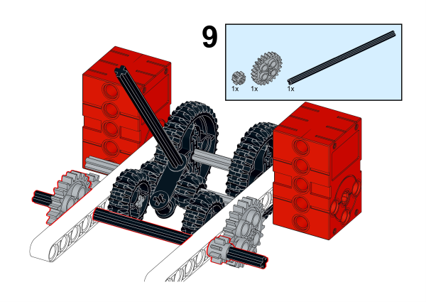

# Case 66: The Voice Control Car

## Introduction

In the previous case, we learned about speech recognition sensors. And we found that using voice to control the movement of the car is more natural and more in line with our daily life habits than using wireless to control the car. So in this lesson, we also use a speech recognition sensor to control the movement of the car, we add an 8*16 dot matrix screen to see the "expression" of the car, and our car can also be shifted like a traditional car, not just through programming. Let's start!

### Materials Required

Nezha expansion board × 1

micro:bit V2 × 1

Speech recognition sensor × 1

8*16 matrix screen  × 1

Motors × 2

360° Servo × 1

RJ11 cables × 2

Bricks × n

**Note: If you want all of the above components, you may purchase the [Nezha 48 IN 1 Inventor's Kit](https://www.elecfreaks.com/nezha-inventor-s-kit-for-micro-bit-without-micro-bit-board.html)**.

### Assembly Steps

Component Details

Build it as the assembly steps suggest:

We can see that the construction is completed as shown in the following figure:

## Connection Diagram

We connect two motors to M1, M2 interface, servo to S1 interface, voice recognition sensor to IIC interface, and 8*16 dot matrix screen to IIC interface, as shown in the following figure:

##  MakeCode Programming

### Step 1

Click “Advanced” in the MakeCode drawer to see more choices.

For programming the servos and the motors, we need to add a package.  Click “Extensions” at the bottom of the drawer and search with “nezha” to download it.

Since we need to use PlanetX Sensor, we need to add PlanetX extension. Search with “PlanetX” in the dialogue box and click to download it.

*Notice*: If you met a tip indicating that some codebases would be deleted due to incompatibility, you may continue as the tips say or create a new project in the menu.

### Reference

The program is shown below:

Link: https://makecode.microbit.org/_RMM5pEJqV5Cr

You may also download it directly:

<iframe style="position:absolute;top:0;left:0;width:100%;height:100%;" src="https://makecode.microbit.org/#pub:_RMM5pEJqV5Cr" frameborder="0" sandbox="allow-popups allow-forms allow-scripts allow-same-origin"></iframe>

### Result

When we say "increase one gear", the car will speed up, when we say "decrease one gear", the car will slow down, and when we say "stop", the car will be in neutral and stop.

