# Case 68: The Weather Stations

## Introduction

In recent years, many places around the world have experienced major natural disasters, such as volcanic eruptions，floods，droughts。fires，etc., and in recent years, there have been more occurrences and greater damage, it is necessary for us to monitor the subtle changes in the data of the surrounding environment at all times in order to anticipate future changes in the surrounding environment. In this case, we will use the BME280 sensor to detect the data from the surrounding environment.

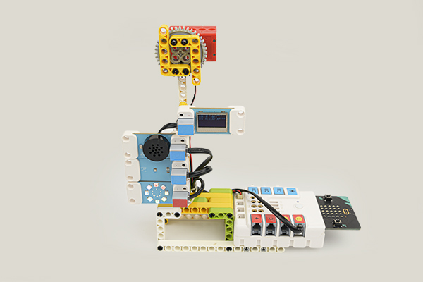

### Materials Required

Nezha expansion board × 1

micro:bit V2 × 1

Speech recognition module × 1

PlanetX LED Rainbow × 1

BME280 Sensor × 1

PlaneX OLED × 1

Motor × 1

RJ11 cables × 1

Bricks × n

**Note: If you want all of the above components, you may purchase the [Nezha 48 IN 1 Inventor's Kit](https://shop.elecfreaks.com/products/elecfreaks-micro-bit-nezha-48-in-1-inventors-kit-without-micro-bit-board?_pos=3&_sid=7e0550154&_ss=r)**.

### Assembly Steps

Component Details

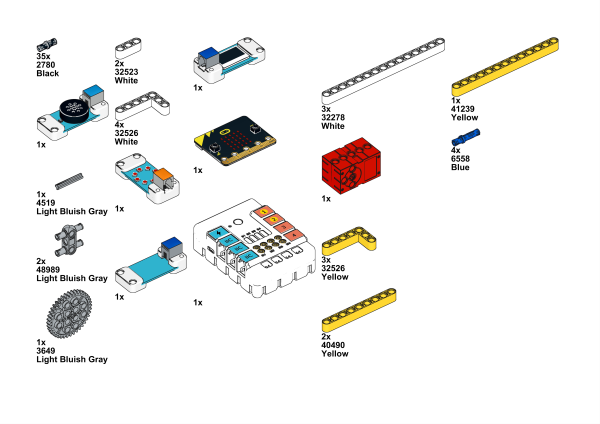

Build it as the assembly steps suggest:

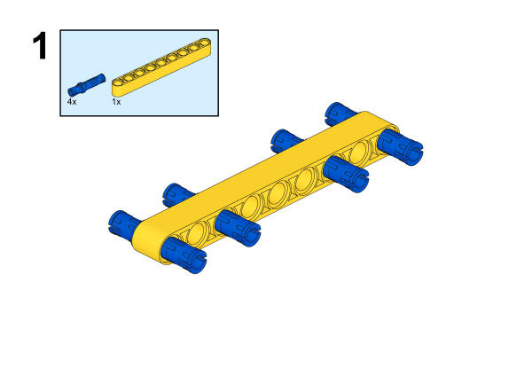

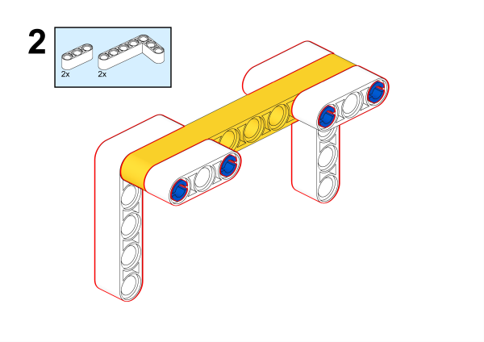

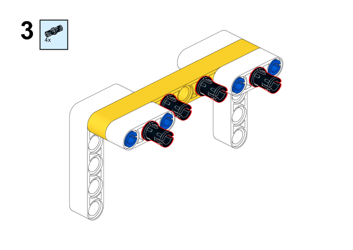

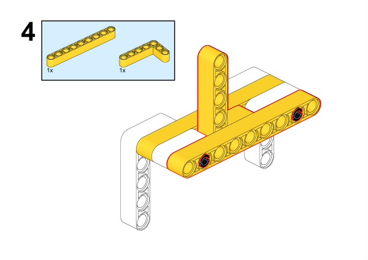

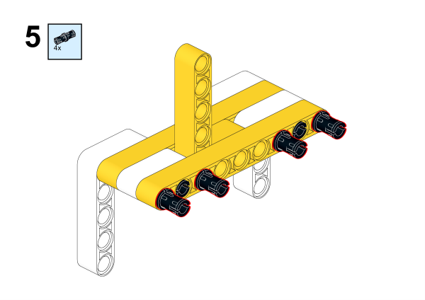

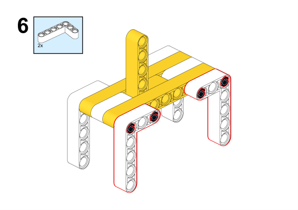

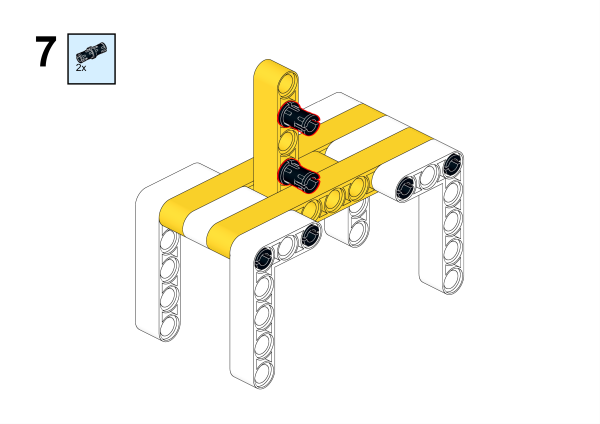

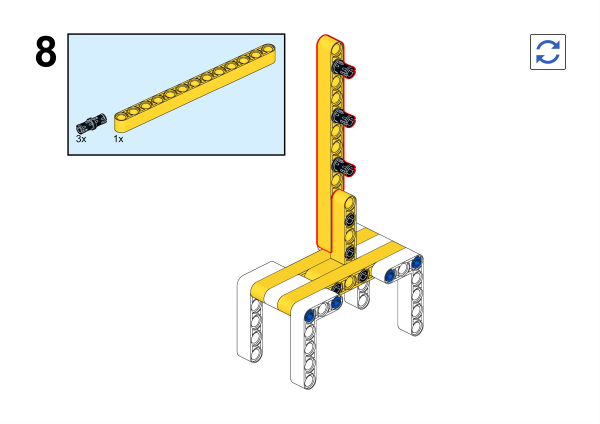

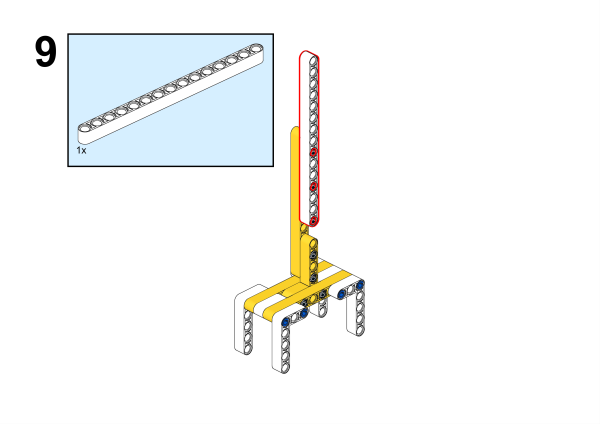

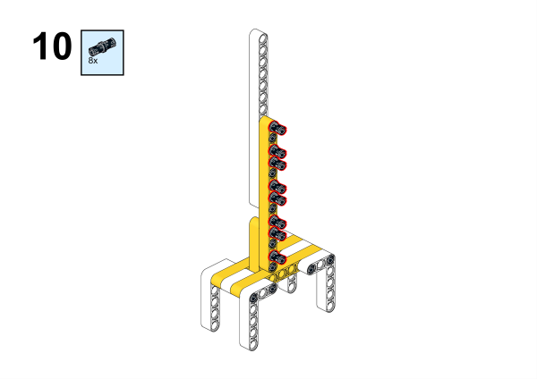

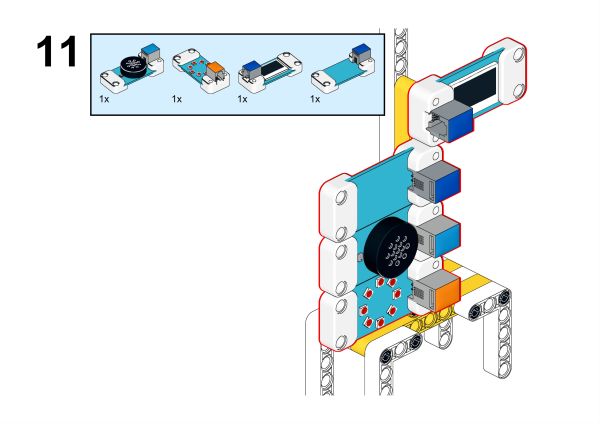

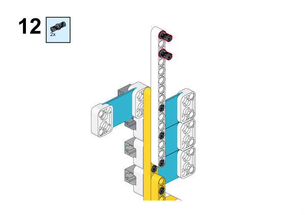

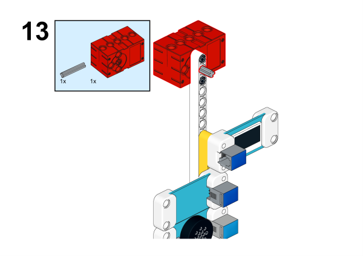

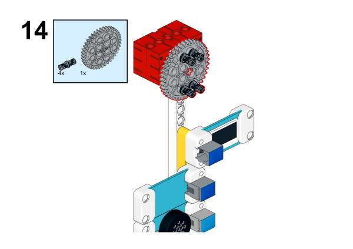

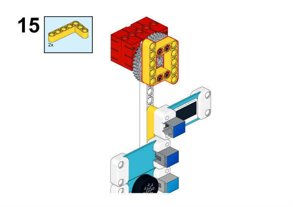

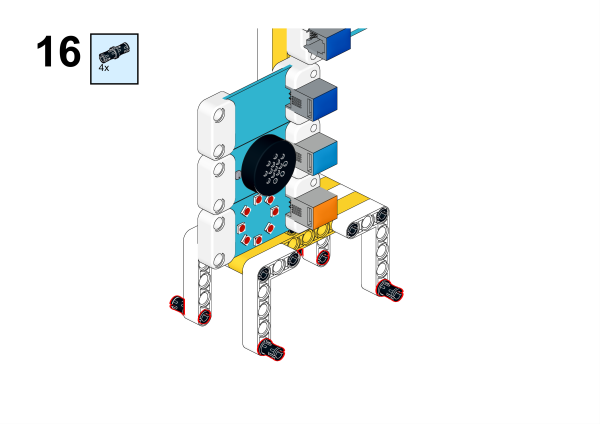

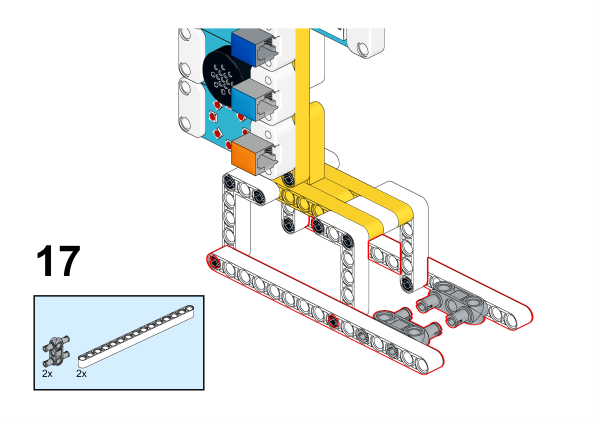

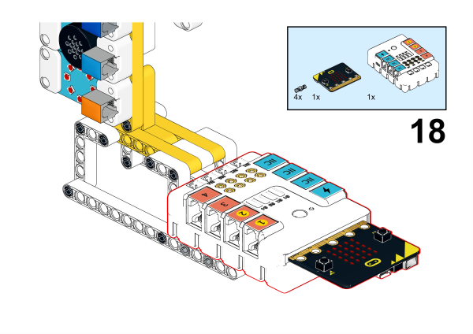

## Connection Diagram

Connect the Speech recognition module, the OLED Screen and the BME280 sensor to the IIC ports，the LED Rainbow to J1 port and motor to M1 port as the diagram displays below:

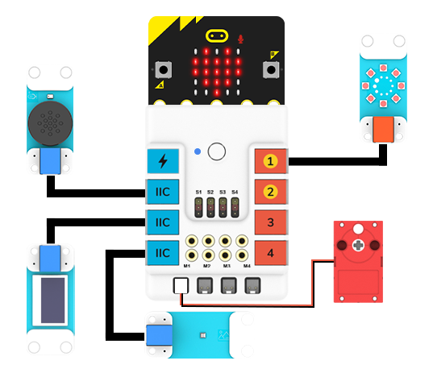

##  MakeCode Programming

### Step 1

Click “Advanced” in the MakeCode drawer to see more choices.

We need to add a package for programming. Click “Extensions” at the bottom of the drawer and search with “nezha” to download it.

We need to add a package for programming. Search with “PlanetX” in the dialogue box and click to download it.

*Notice*: If you met a tip indicating that some codebases would be deleted due to incompatibility, you may continue as the tips say or create a new project in the menu.

### Reference

The program is displayed below:

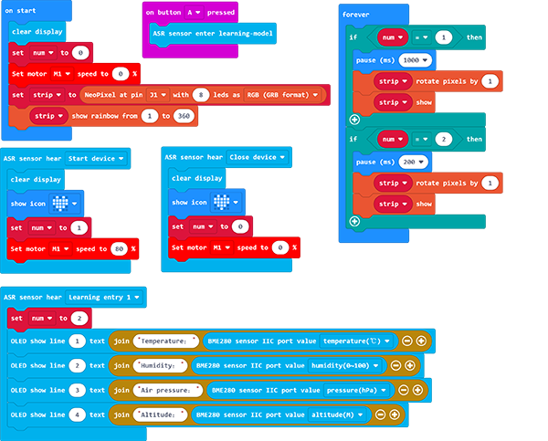

Link: https://makecode.microbit.org/_D9k3XeYpUHL2

You may also download it directly:

<iframe style="position:absolute;top:0;left:0;width:100%;height:100%;" src="https://makecode.microbit.org/#pub:_D9k3XeYpUHL2" frameborder="0" sandbox="allow-popups allow-forms allow-scripts allow-same-origin"></iframe>

### Result

When we say "start device", the weather station will start itself, the motor will start to rotate, and the colored light ring will cycle through the rainbow lights. When we say the learning phrase (in this case, "show ambient data"), the OLED display will show the data. When we say "stop the device", the motor will stop rotating, the color ring will stop cycling the rainbow lights, and the OLED display will clear the data.

