# Case 71: Blocks Sorting Machine
## Introduction

Use [ELECFREAKS micro:bit Nezha 48 IN 1 Inventor's Kit ](https://shop.elecfreaks.com/products/elecfreaks-micro-bit-nezha-48-in-1-inventors-kit-without-micro-bit-board) with [ELECFREAKS Interactive Coding Accessories Pack](https://shop.elecfreaks.com/products/elecfreaks-interactive-coding-accessories-pack) to make a block sorting machine.

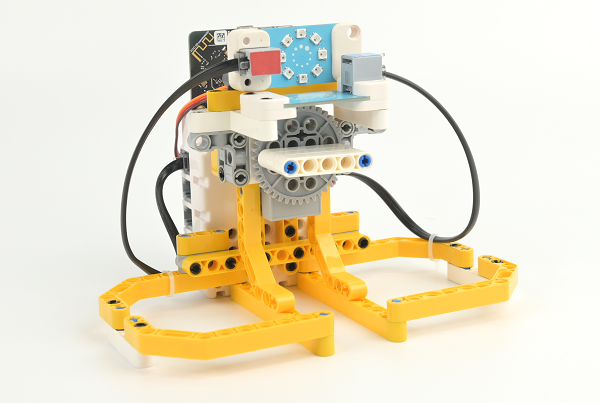

## Case Building

### Materials Required

[ELECFREAKS micro:bit Nezha 48 IN 1 Inventor's Kit ](https://shop.elecfreaks.com/products/elecfreaks-micro-bit-nezha-48-in-1-inventors-kit-without-micro-bit-board)

[ELECFREAKS Interactive Coding Accessories Pack](https://shop.elecfreaks.com/products/elecfreaks-interactive-coding-accessories-pack)

### Structure Building

Parts list

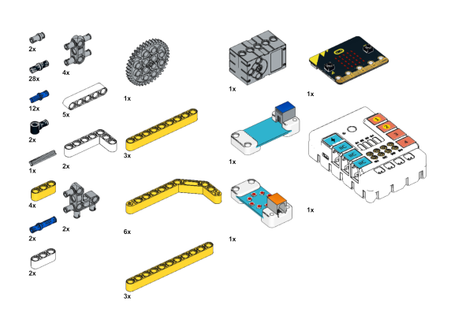

The structure is built as shown in the figure:

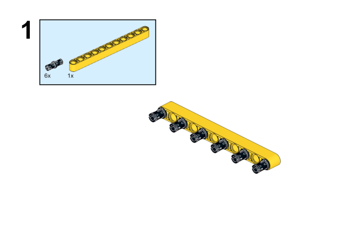

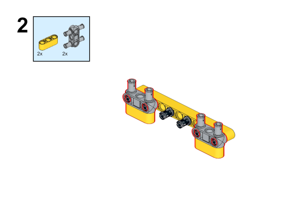

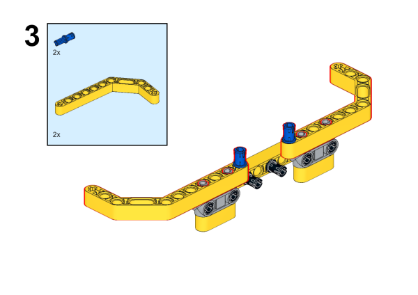

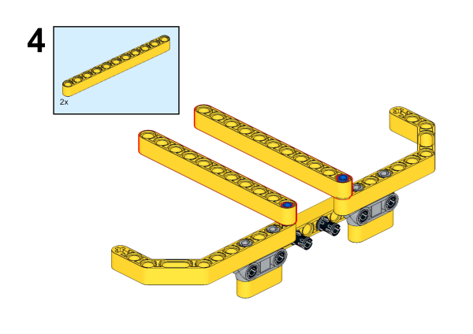

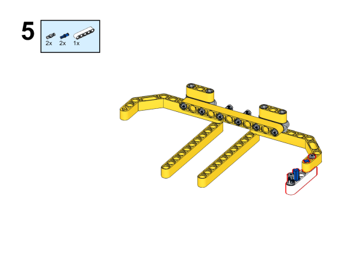

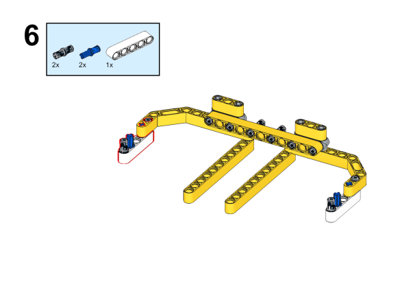

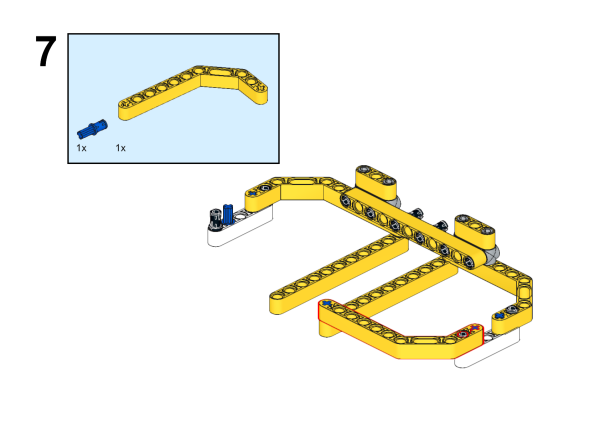

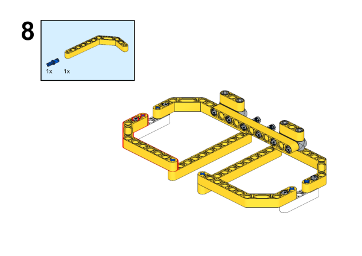

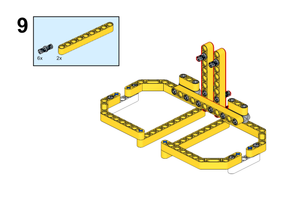

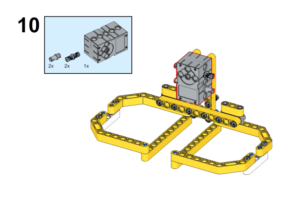

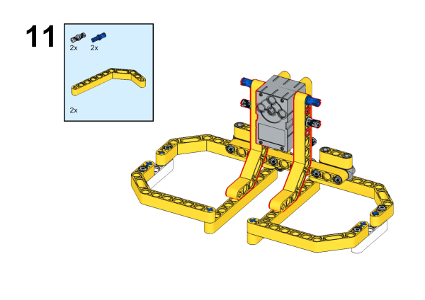

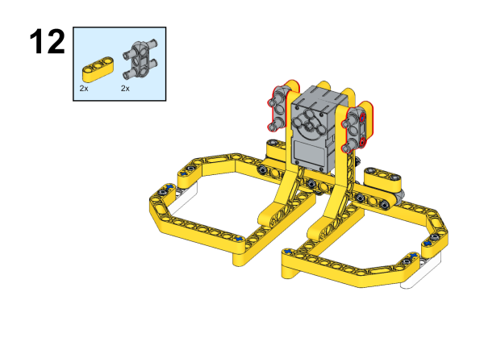

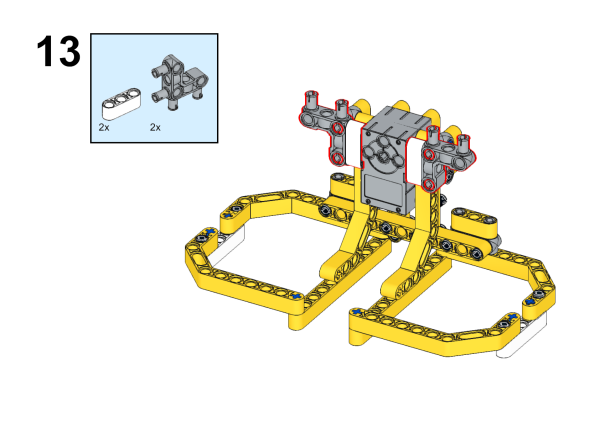

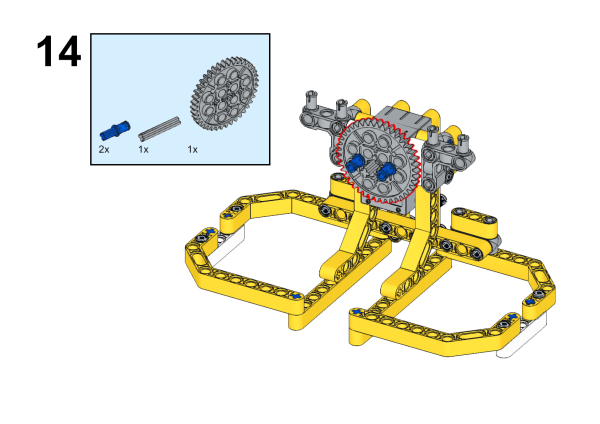

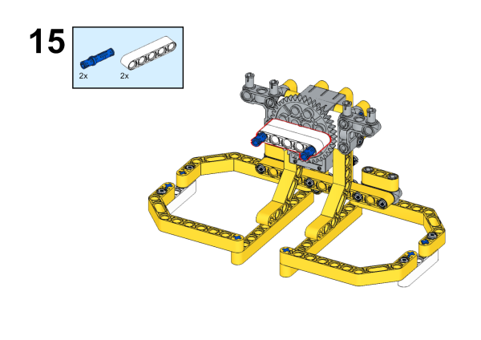

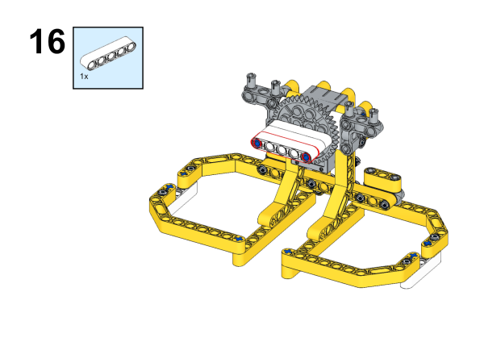

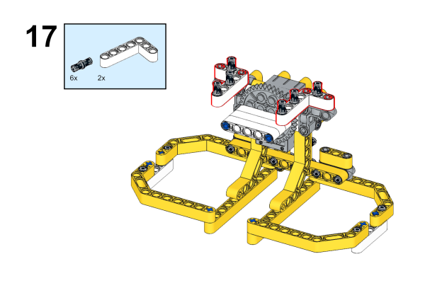

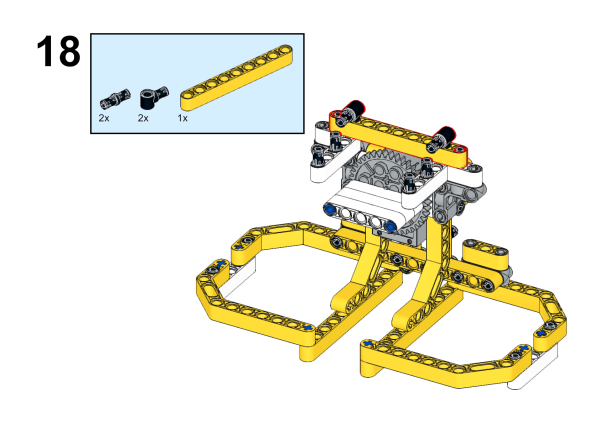

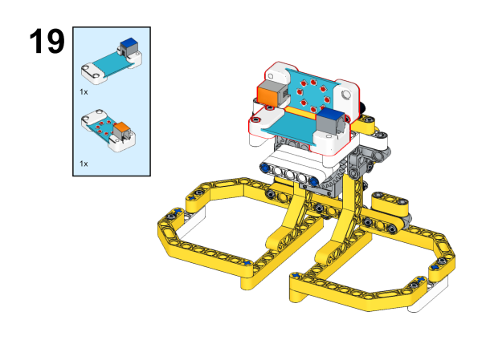

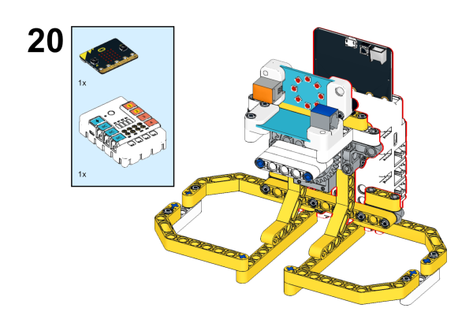

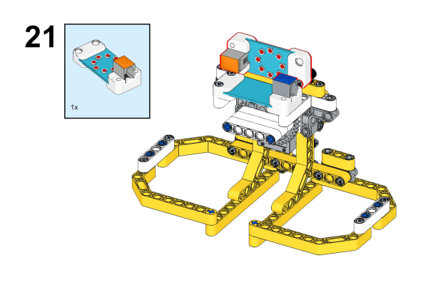

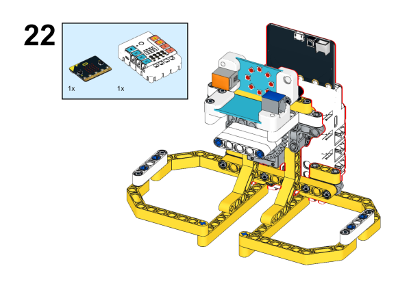

Completed Picture

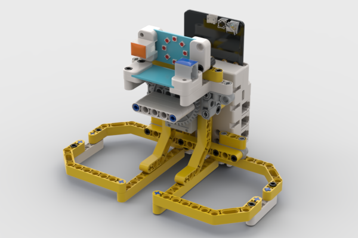

### Connection Diagram

Connect the Rainbow LED to J1, the color sensor to IIC and the servo to S1 on Nezha Breakout board as the picture displays. 

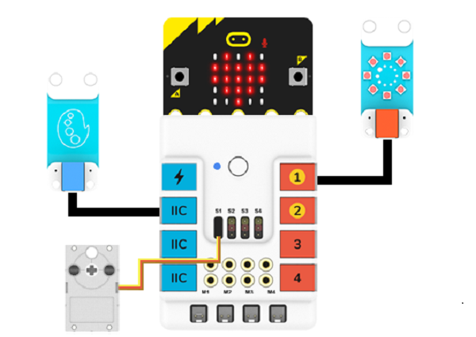

## MakeCode Programming

### Step1

Click "extensions" in the MakeCode drawer.

For programming the potentiometer and the rainbow led，we need to add an extension library. Search with "PlanetX" in the dialog box to download this library.

For programming the Nezha expansion board, we need to add an expansion library. Search with "Nezha" in the dialog box to download it.

*Notice*: If you met a tip indicating that some codebases would be deleted due to incompatibility, you may continue as the tips say or create a new project in the menu.

### Step 2

### Write the program as the picture suggests

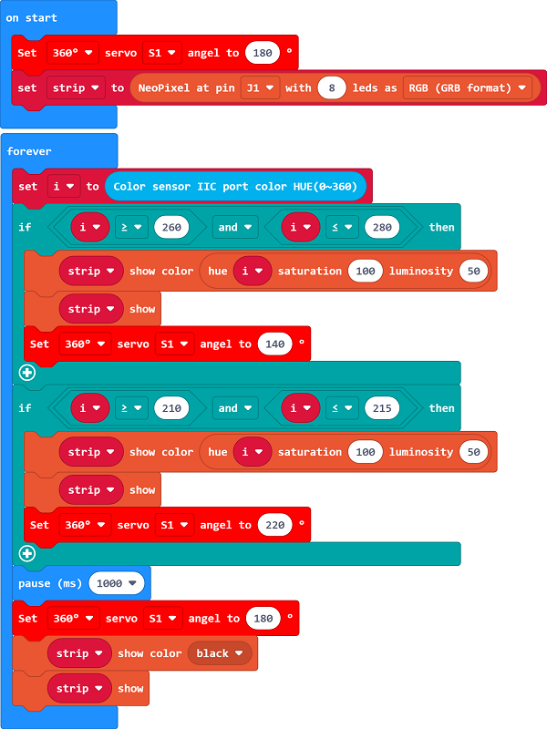

### Reference

Link：[https://makecode.microbit.org/_3tkXK83pFDoH](https://makecode.microbit.org/_3tkXK83pFDoH)

You may also download it directly:

<iframe style="position:absolute;top:0;left:0;width:100%;height:100%;" src="https://makecode.microbit.org/#pub:_3tkXK83pFDoH" frameborder="0" sandbox="allow-popups allow-forms allow-scripts allow-same-origin"></iframe>
  

### Result

The color sensor is used to distinguish the color of the blocks and display them through the rainbow light ring, and the blocks are classified according to the recognized color.

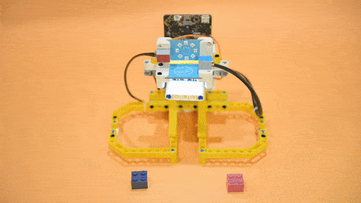

