# Case 72: The Smoke Detection Fan

## Introduction

Make a dust detection device to automatically turn on the fan for ventilation when the dust concentration is too high.

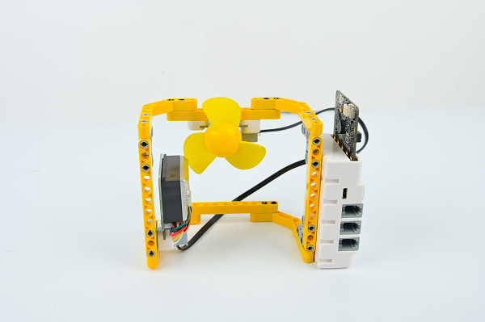

## Case building

### Required equipment

[ELECFREAKS micro:bit Nezha 48 IN 1 Inventor's Kit ](https://shop.elecfreaks.com/products/elecfreaks-micro-bit-nezha-48-in-1-inventors-kit-without-micro-bit-board)

[ELECFREAKS PlanetX Dust Sensor](https://shop.elecfreaks.com/products/elecfreaks-planetx-dust-sensor)

[ELECFREAKS PlanetX Motor Fan](https://shop.elecfreaks.com/products/elecfreaks-planetx-motor-fan)

### Assembly steps

Parts List

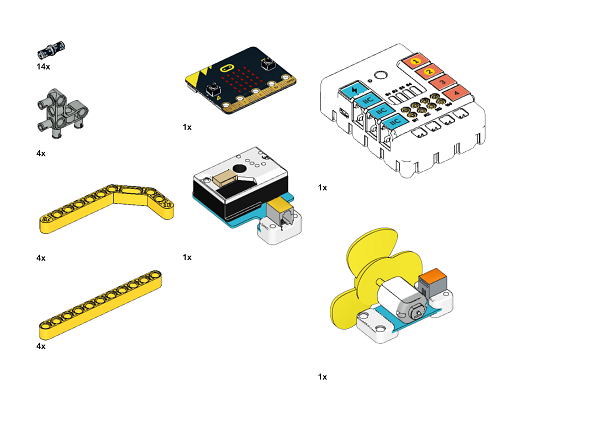

The structure is built as shown in the figure:

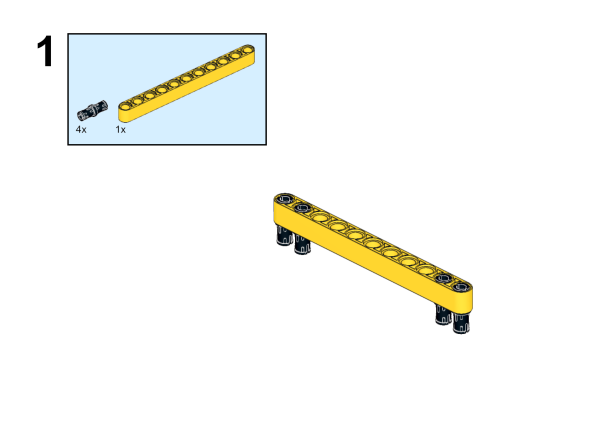

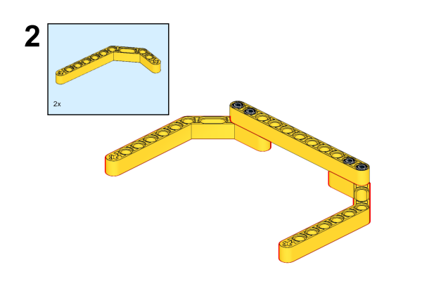

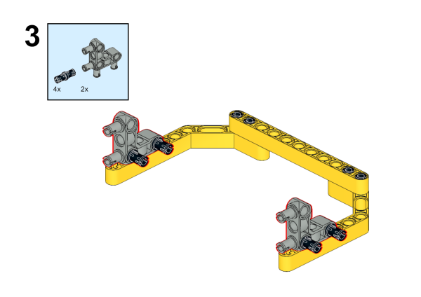

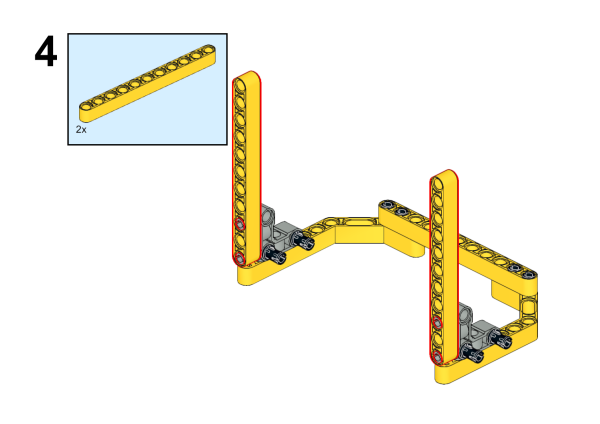

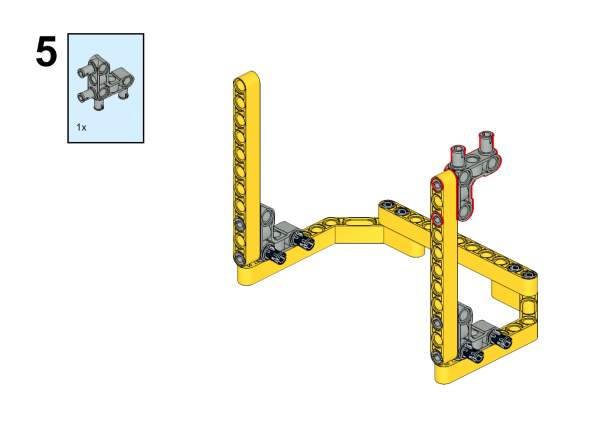

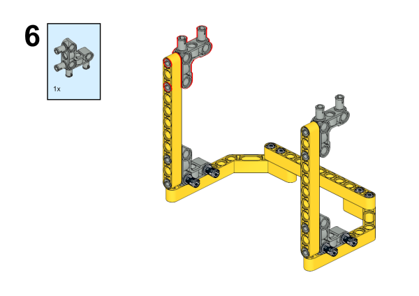

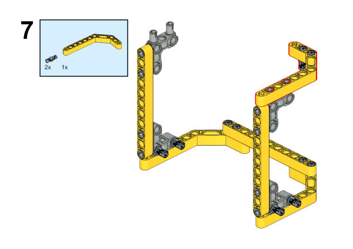

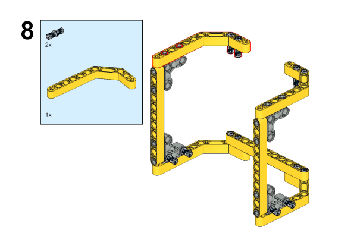

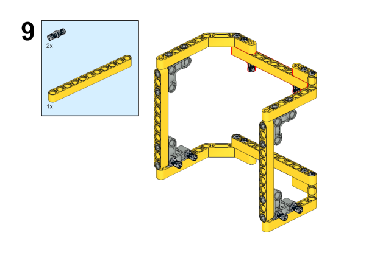

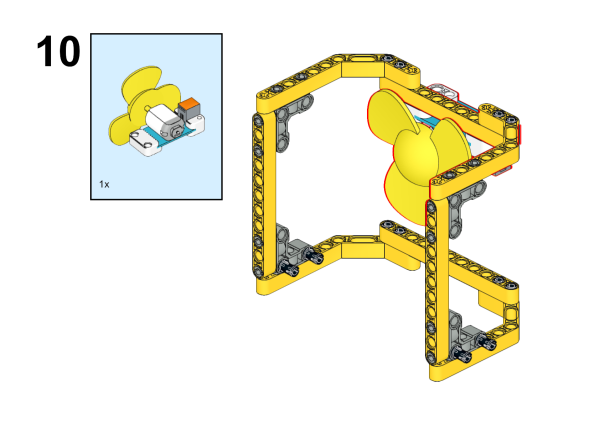

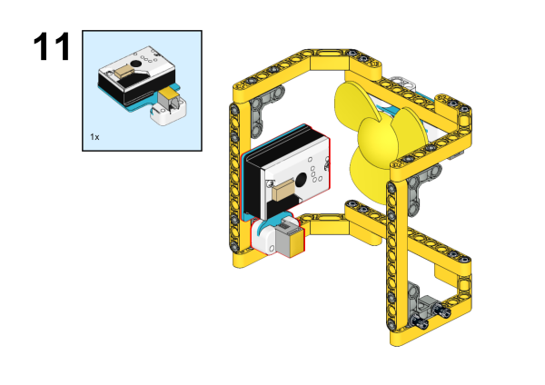

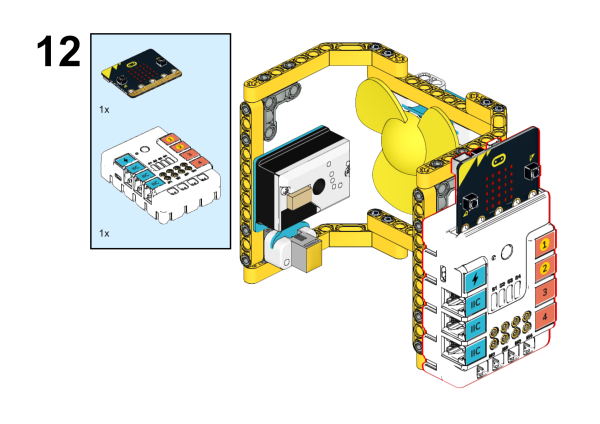

### Connection schematic

In the diagram below, connect the Dust Sensor to the J1 port and the Motor Fan to the J2 port of the Nezha Board.

## Makecode Programming

### Step 1

Click "Extensions" in the MakeCode Drawer.

In order to program the Dust sensor, we need to add an extension library. Search with "PlanetX" in the dialog box to download this library.

*Note: *If you get a prompt saying that some code libraries will be removed for incompatibility reasons, you can either follow the prompt and continue, or create a new project inside the project menu bar.

### Step 2

### Write the program as shown in the figure

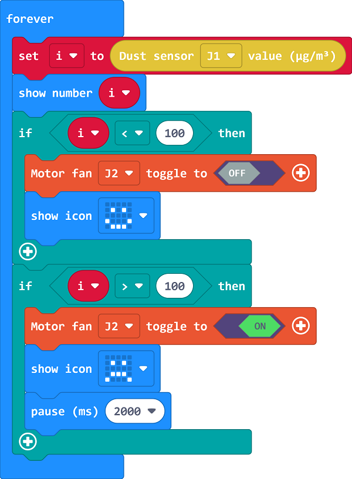

### Reference Program

Link：[https://makecode.microbit.org/_PDhL3PeJkJtV](https://makecode.microbit.org/_PDhL3PeJkJtV)

You can also download the program directly from the following webpage and start running the program once the download is complete.

<iframe style="position:absolute;top:0;left:0;width:100%;height:100%;" src="https://makecode.microbit.org/#pub:_PDhL3PeJkJtV" frameborder="0" sandbox="allow-popups allow-forms allow-scripts allow-same-origin"></iframe>
  

### Results

The dust sensor is used to detect the dust concentration of the current environment, and when the dust concentration is too high, the fan is turned on for automatic ventilation.

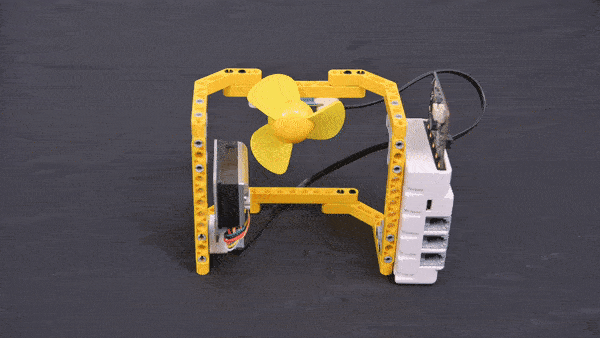

