# Case 73: A Mock Awning 

## Introduction

The right amount of UV rays has a boosting effect on plant growth, but too much UV rays can prevent many of the plant's life activities from going on properly. So we can make a UV shade and open it when the UV index is high to prevent the plants from being sunburned.。

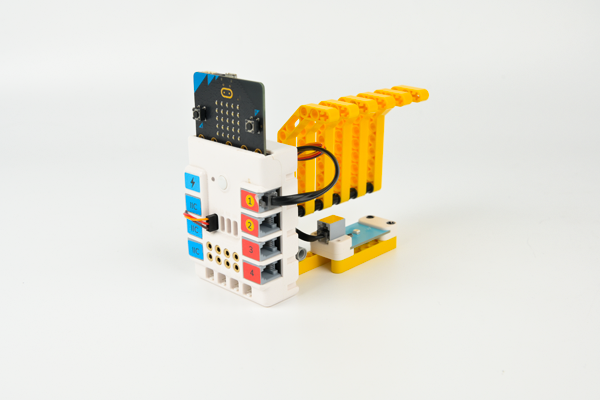

## Case building

### Required equipment

[ELECFREAKS micro:bit Nezha 48 IN 1 Inventor's Kit ](https://shop.elecfreaks.com/products/elecfreaks-micro-bit-nezha-48-in-1-inventors-kit-without-micro-bit-board)

[ELECFREAKS PlanetX UV Sensor](https://shop.elecfreaks.com/products/elecfreaks-planetx-uv-sensor?_pos=1&_sid=4a987bec7&_ss=r)

### Structure construction

Parts List

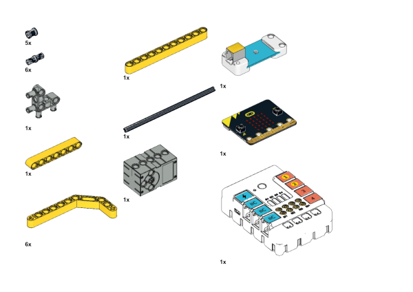

The structure is built as shown in the figure:

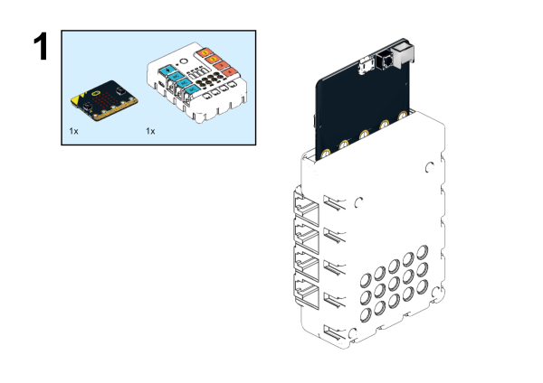

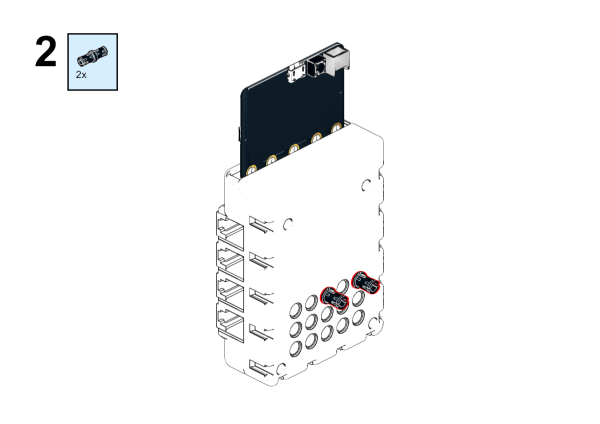

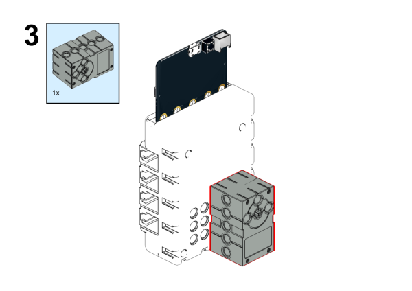

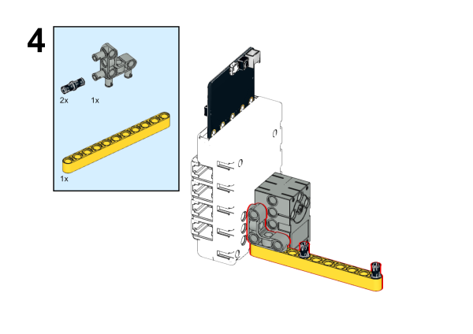

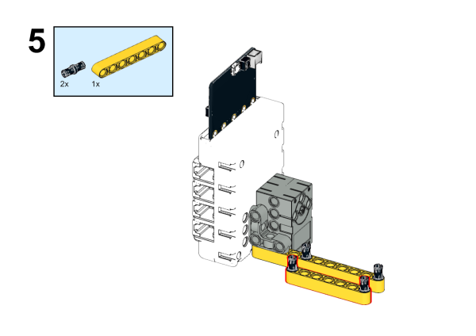

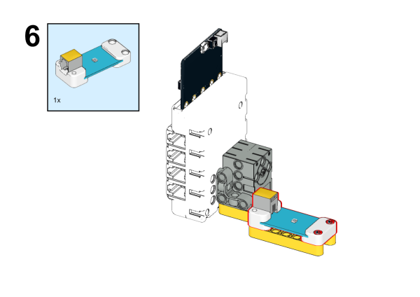

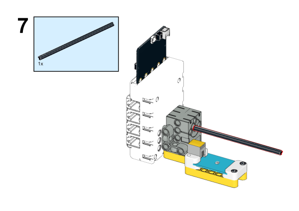

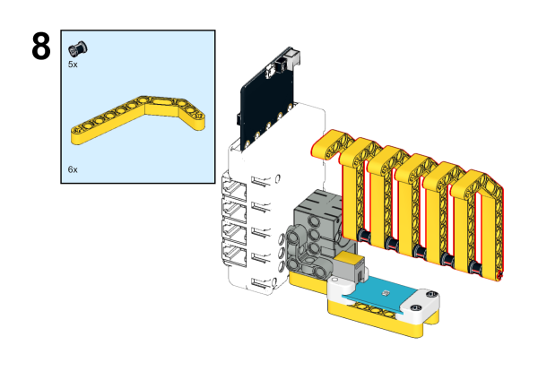

### Connection schematic

In the diagram below, connect the UV sensor to the J1 port and the servo to the S1 port of the Nezha Board.

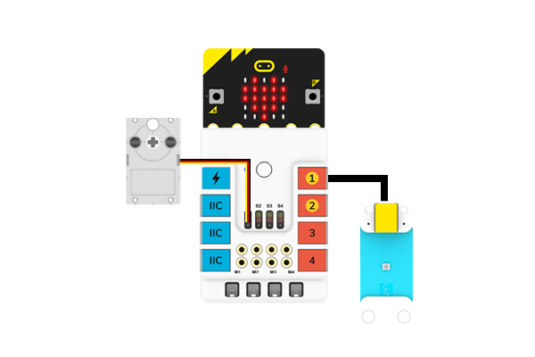

## Makecode Programming

### Step1 
In the code drawer of MakeCode click on "Extensions".

In order to program the UV sensor, we need to add an extension library. Type "PlanetX" in the dialog box and click Search, then click to download this library.

In order to program the Nezha expansion board, we need to add an expansion library. Type "Nezha" in the dialog box and click Search, then click to download this library.

*Note: *If you get a prompt saying that some code libraries will be removed for incompatibility reasons, you can either follow the prompt and continue, or create a new project inside the project menu bar.

### Step 2

### Write the program as shown in the figure

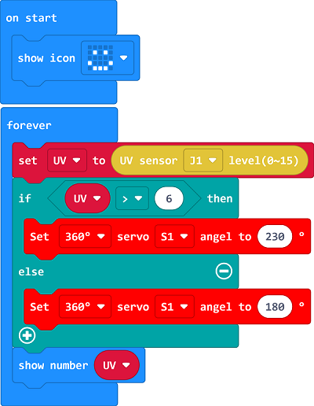

### Reference Program

Link: [https://makecode.microbit.org/_foDXimEEEbhz](https://makecode.microbit.org/_foDXimEEEbhz)

You can also download the program directly from the following webpage and start running the program once the download is complete.

<iframe style="position:absolute;top:0;left:0;width:100%;height:100%;" src="https://makecode.microbit.org/#pub:_foDXimEEEbhz" frameborder="0" sandbox="allow-popups allow-forms allow-scripts allow-same-origin"></iframe>
  

### Results
The UV sensor is used to detect the current ambient UV index, and the shade is opened when the UV index is too high.

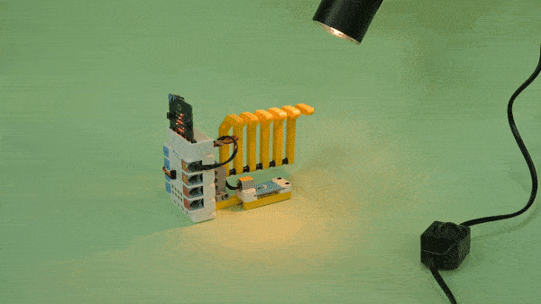

