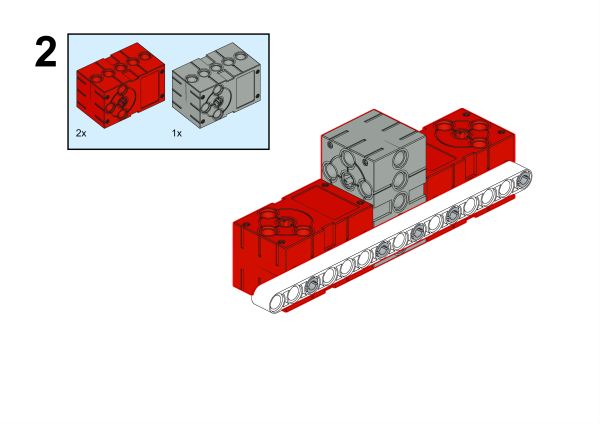
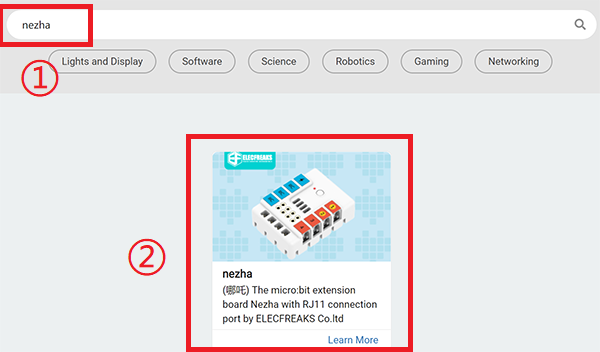

# Case 75: The Magic Painter

## Introduction

In nature, we usually see many beautiful shapes with regular patterns, such as snowflakes, plum blossoms, beehives, etc. When we see these beautiful shapes, we will admire the charm of nature and at the same time, we will want to draw them. Today we will make a piece that can draw many beautiful and regular shapes.

### Materials Required

Nezha expansion board × 1

micro:bit V2 × 1

Servos × 1

[UV sensor](https://shop.elecfreaks.com/products/elecfreaks-planetx-uv-sensor?_pos=1&_sid=7c7ab57bf&_ss=r) × 1

Motors × 2

Bricks × n

**Note: If you want all of the above components, you may purchase the [Nezha 48 IN 1 Inventor's Kit](https://shop.elecfreaks.com/products/elecfreaks-micro-bit-nezha-48-in-1-inventors-kit-without-micro-bit-board?_pos=3&_sid=7e0550154&_ss=r)**.

### Assembly Steps

Components Details

Build it as the assembly steps suggest:

## Connection Diagram

We need to connect the Motors to the M1 and M4 ports， and the UV sensor to the J1 port on Nezha expansion board.

##  MakeCode Programming

### Step 1

Click “Advanced” in the MakeCode drawer to see more choices.

We need to add a package for programming. Click “Extensions” at the bottom of the drawer and search with “nezha” to download it.

We need to add a package for programming. Search with “PlanetX” in the dialogue box and click to download it.

*Notice*: If you met a tip indicating that some codebases would be deleted due to incompatibility, you may continue as the tips say or create a new project in the menu.

### Reference

The program is displayed below:

Link: https://makecode.microbit.org/_dmJ3isbKLLYV

You may also download it directly:

<iframe style="position:absolute;top:0;left:0;width:100%;height:100%;" src="https://makecode.microbit.org/#pub:_dmJ3isbKLLYV" frameborder="0" sandbox="allow-popups allow-forms allow-scripts allow-same-origin"></iframe>

### Result

We can see that when the UV intensity changes, the graphics drawn by the painter are changed, and you can also improve the program to draw more graphics.

