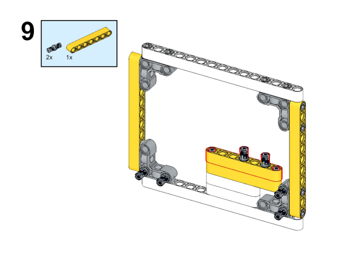

# Case 76: The Tomato Clock

## Introduction

The Tomato Clock is a clock that uses the tomato work method to manage time, helping one to focus and improve efficiency, and is a great aid to work and study.

## Case building

### Required equipment

[ELECFREAKS micro:bit Nezha 48 IN 1 Inventor's Kit ](https://shop.elecfreaks.com/products/elecfreaks-micro-bit-nezha-48-in-1-inventors-kit-without-micro-bit-board)

[ELECFREAKS PlanetX Segment Sensor](https://shop.elecfreaks.com/products/elecfreaks-planetx-segment-sensor?_pos=2&_sid=f9a8632cc&_ss=r)

[ELECFREAKS PlanetX Rainbow LED](https://shop.elecfreaks.com/products/elecfreaks-planetx-led-rainbow?_pos=4&_sid=ca220ba80&_ss=r)

### Assembly steps

Parts List

The structure is built as shown in the figure:

### Connection schematic

In the diagram below, connect the Dust Sensor to the J1 port and the Motor Fan to the J2 port on the Nezha Board.

## Makecode Programming

### Step 1

Click "Extensions" in the MakeCode drawer.

In order to program the PlanetX sensor, we need to add an extension library. Search with "PlanetX" in the dialog box to download this library.

*Note: *If you get a prompt saying that some code libraries will be removed for incompatibility reasons, you can either follow the prompt and continue, or create a new project.

### Step 2

### Write the program as shown in the figure

### Reference Program

Link: [https://makecode.microbit.org/_AY6FuKHFs6H0](https://makecode.microbit.org/_AY6FuKHFs6H0)

You can also download the program directly from the following webpage and start running the program once the download is completed.

<iframe style="position:absolute;top:0;left:0;width:100%;height:100%;" src="https://makecode.microbit.org/#pub:_AY6FuKHFs6H0" frameborder="0" sandbox="allow-popups allow-forms allow-scripts allow-same-origin"></iframe>
  

### Results

Countdown to 25 seconds, the device will play music and lighting effects after the countdown.

