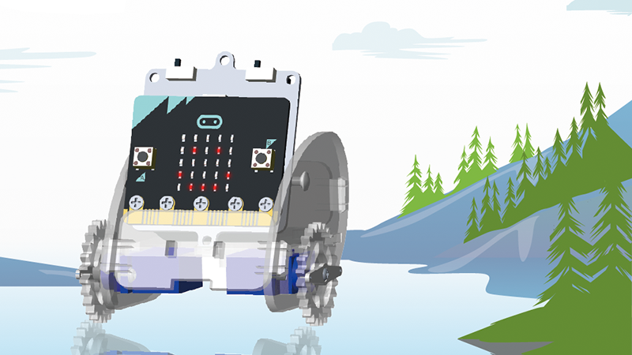
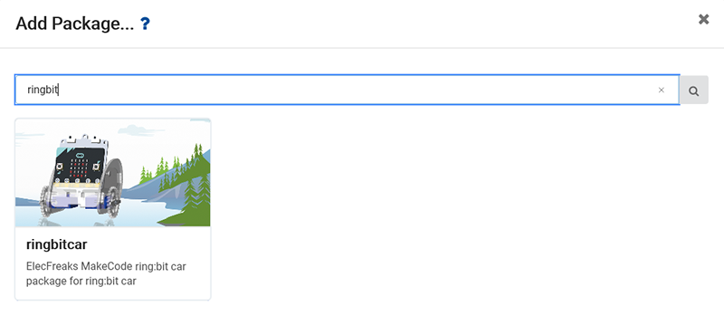
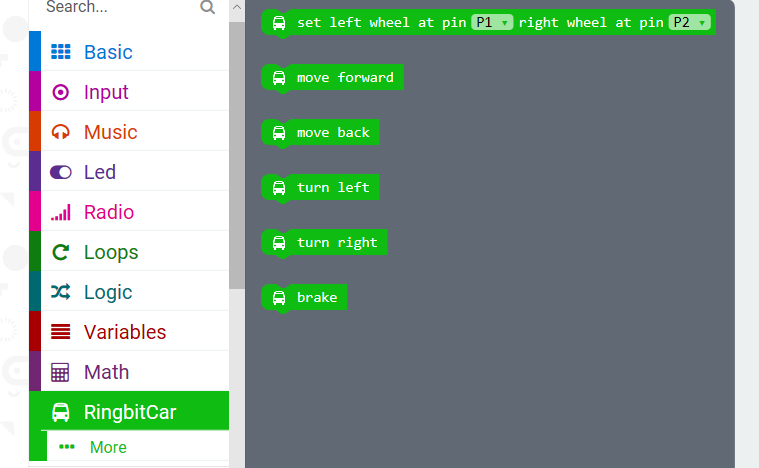
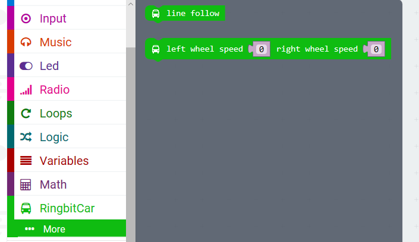

# case 01 Add Package

> This ElecFreaks Ring:bit Car package was developed by [ElecFreaks](https://www.elecfreaks.com/) with minor assistance from [Tinkercademy](https://tinkercademy.com/).  

## What is ring:bit car ?   
---

Ring:bit Car is a DIY smart car which is based on BBC micro:bit and ELECFREAKS ring:bit. Ring:bit has extended 3 channels of GPIO, among which 2 channels are used for driving servos and one channel of GPIO is undefined. The basic version of ring:bit car can realize functions like road design, wireless remote control, graphic drawing etc.. By increasing other sensors' extension, this car can also realize functions line follow, light tracking, barrier avoidance and so on.  

## How to add ring:bit car package?   
---
Click **Add Package** and then search for **ringbit** so that you can add ring:bit car package.  
  

  

## Introduction of Major Bricks  
---
### set left wheel pin and right wheel pin  
  

Initialize the pins of left and right servos. By default, connect the left servo to P1 and the right servo to P2.   

**Note: The direction of left or right all depends on the driver's view.**  

### move forward  
  
The two wheels move forward at full speed.   

### move back  
  
The two wheels move backward at full speed.   

### turn left  
  
Turn left.(The left wheel move backward while the right wheel move forward.)   

### turn right  
  
Turn right.(The left wheel move forward while the right wheel move backward.)   

### break  
  
Stop moving. 

## Others  
---
More senior functions are in developing.   

   

