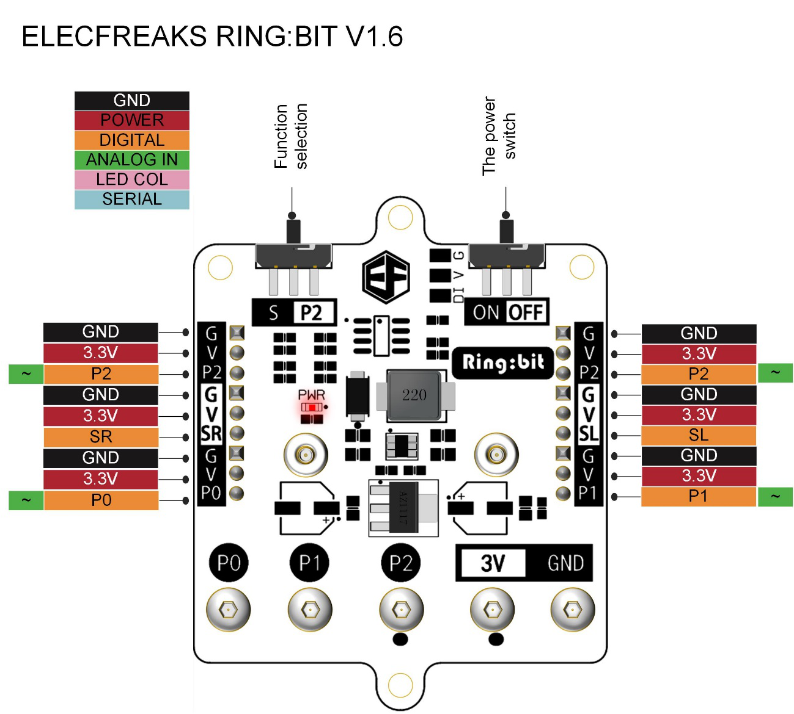
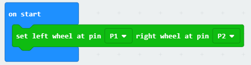
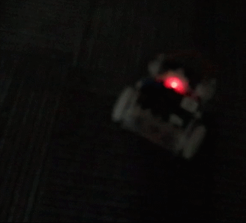

# case 07 Light Follow

## Our Goal
---

- Make the ring:bit car to light follow. 

## Requiered Materials
---

- 1 x Ring:bit Car

## Hardware Connect
---
- Connect the left wheel servo to P1 of the Ring:bit expansion board and the right wheel servo to P2.

## Software
---
[makecode](https://makecode.microbit.org/#)
 

## Coding
---
### Step 1
- Click on "Advanced" in the MakeCode Drawer to see more code sections.

- Search for “ringbitcar” and click on the ring:bit car package to add it to your project. (As below picture)

Note：If you get a warning telling you some packages will be removed because of incompatibility issues, either follow the prompts or create a new project in the Project file menu.

### Step 2
---
- Snap the `on start` block from the Basic and initialize the P1 port to left wheel and the P2 port to right wheel.

### Step 3
---
- Snap the `light level` from the Input. The car will move to the light source when the light level is greater than the defined value.
- The car will spin around to find the light source when the light level is less than the defined value.

### Program

Program Link：[https://makecode.microbit.org/_K3J3EhLamU80](https://makecode.microbit.org/_K3J3EhLamU80)

If you don't want to type these code by yourself, you can directly download the whole program from the link below:

<iframe style="position:absolute;top:0;left:0;width:100%;height:100%;" src="https://makecode.microbit.org/#pub:_K3J3EhLamU80" frameborder="0" sandbox="allow-popups allow-forms allow-scripts allow-same-origin"></iframe>
  
---

## Result
---

- The car spins around and will move to the light source when it is detecting the light.

## Think
---

- How can you make a smart car to detect the fire?

## Questions
---

## More Information  
---

