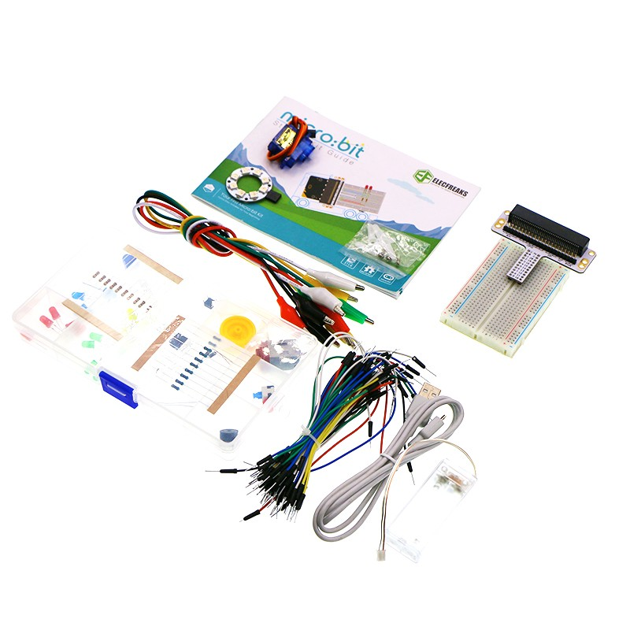
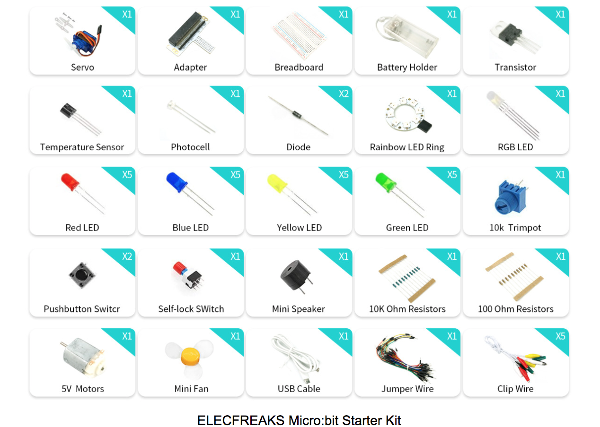

# Introduction

[ElecFreaks Micro:bit Starter Kit](https://www.elecfreaks.com/micro-bit-starter-kit.html) is designed for people who is at the door step of learning electric circuit and programming knowledge. 
The kit has provided some basic electronic components like LED, button, buzzer, temperature sensor, steering engine and motor etc. 
[Micro:bit Starter Kit](https://www.elecfreaks.com/micro-bit-starter-kit.html)  can help you enter a wonderful of electronic world.

## Components

## FAQ

