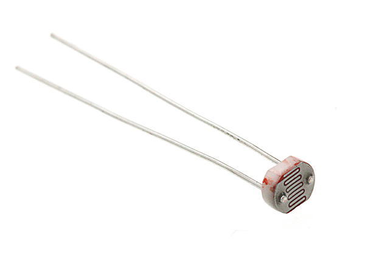
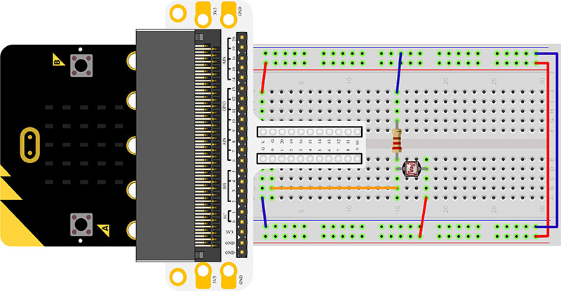
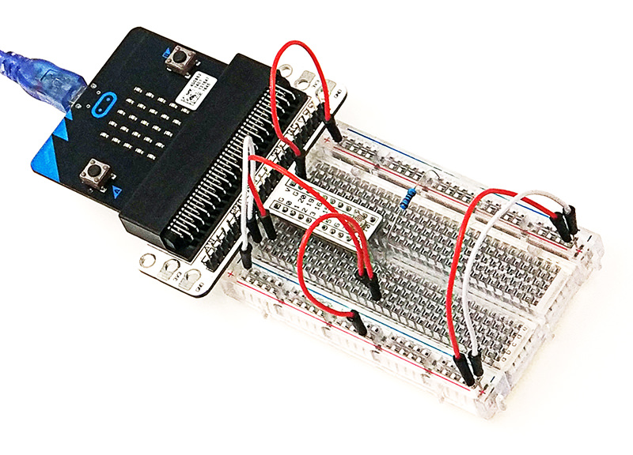
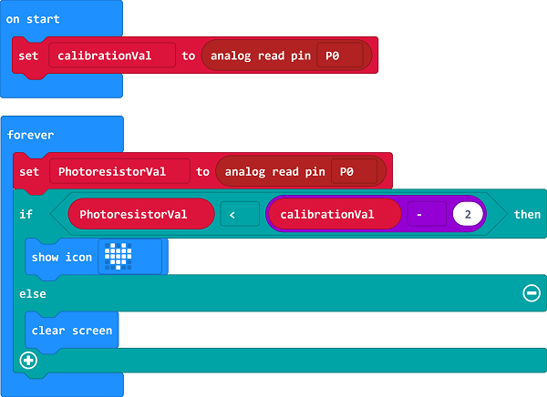
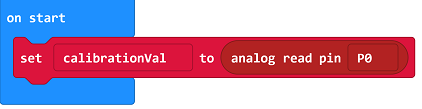
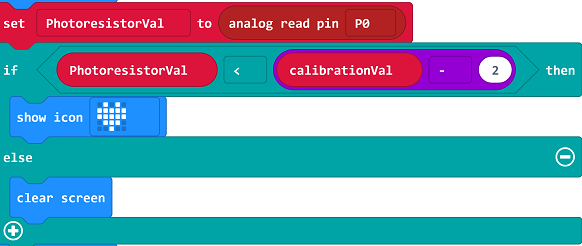
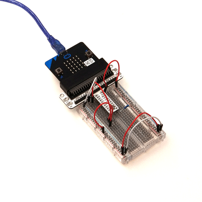

# Lesson 04 Photocell 

 

## Introduction:
---
Photocell is a kind of special resistor based on internal photoelectric effect. Its value of resistance is opposite to the brightness of the light, the brighter of the light is,  the lower of the value of the resistance will be. Usually photocell is the core component of a photoswitch. In the following experiment, we are going to use photocell to control the brightness of 5*5 LED screen on micro:bit.

## Components List:
---
### Hardware:

- 1 x micro:bit Board
- 1 x Micro-B USB Cable
- 1 x micro:bit Breadboard Adapter
- 1 x Transparent Breadboard - 83 * 55 mm
- 1 x Photocell
- 1 x 10kΩ Resistors
- n x Breadborad jumper wire 65pcs pack

****Tips: If you want to buy all components above, then you will need Elecfreaks micro:bit Starter Kit.****

## Major Components Introduction
---
### Photocell

Photocell is a kind of special resistor made of semi-conductor materials like Cds or CdSe based on internal photoelectric effect. The brighter of the light is,  the lower of the value of the resistance will be. with the intensity of light increasing, its resistant value decreased sharply, and the minimum light resistant value can drop down to below 1KΩ. Photocell is very sensitive to light. When there is no light, its resistant value arrives to its maximum and its dark resistant value usually can reach 1.5MΩ at max.

## Experimental Procedure
---
### Hardware Connection
Connect your components according to the picture below: 

- 1.Connect the Photocell to P0 port.
- 2.Connect the 10kΩ resistor with the Photocell in parallel.

You would see as  below after you finish the connection: 

### Software Programming

Click to open [Microsoft Makecode](https://makecode.microbit.org/), write the following code in the editor.

### Program as the picture shows:

### Details for the code:
- 1.Analog read the voltage as the reference value for the brightness in "on start"

- 2.In the brick of "forever", analog read the voltage from P0 port repeatedly. Once the voltage lower than reference value minus 2( it shows if the intensity of light increases, the resistant value of photocell would decrease), then it tells the light has been turned off.  At the moment, an icon is showing on the micro:bit, the calibrationVal minus 2 is used to adjust the sensitivity,  the lower value is,  the higher of the sensitivity would be.

### Reference
Links:[https://makecode.microbit.org/_3tFFoPhLF7hX](https://makecode.microbit.org/_3tFFoPhLF7hX)

You can also download the links directly:

<iframe style="position:absolute;top:0;left:0;width:100%;height:100%;" src="https://makecode.microbit.org/#pub:_3tFFoPhLF7hX" frameborder="0" sandbox="allow-popups allow-forms allow-scripts allow-same-origin"></iframe>
  

## Result
---
Turn on the light, the LED screen on micro:bit shows nothing. Turn off light, the LED screen displays an icon.

## Elploration
---
If we want to use photocell to control a LED,  how to design circuit and program? 

## FAQ
---

