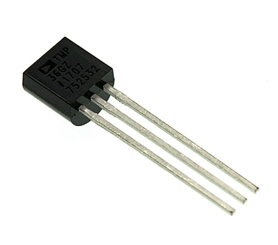
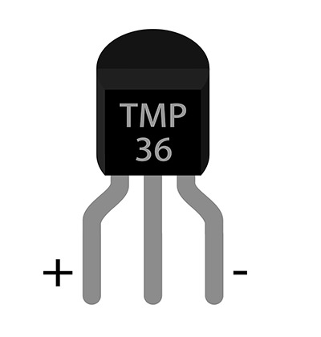
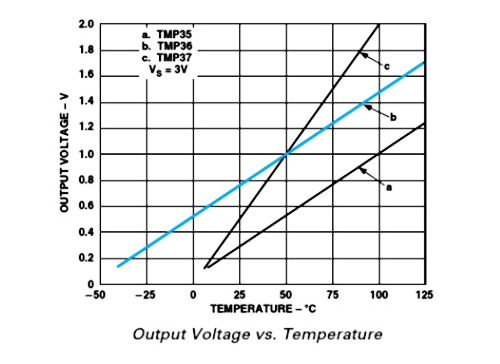
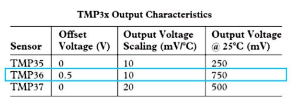
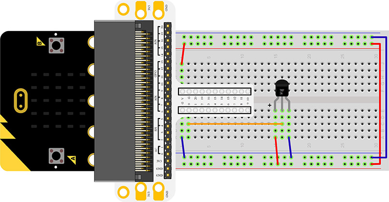
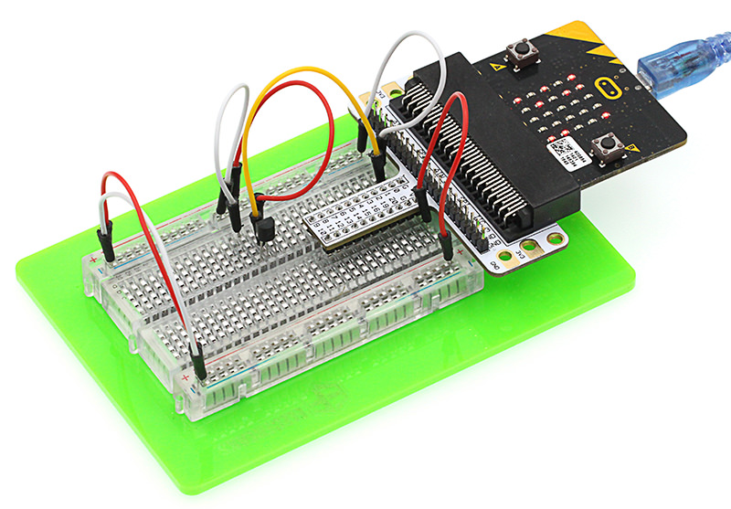
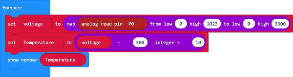
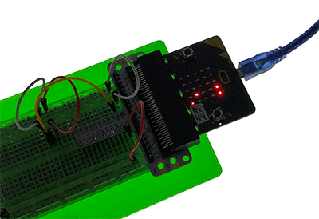

# Lesson 07 Temperature Sensor 

 

## Introduction

---
Temperature sensor is a kind of sensor that can detect temperature and transfer it into output data. Temperature sensor is the core component of temperature gauges and instruments with multiple categories. In this experiment, we are going to learn analog temperature sensor--TMP36 and display its data on micro:bit.

## Components List

---
### Hardware:
- 1 x micro:bit Board
- 1 x Micro-B USB Cable
- 1 x microbit Breadboard Adapter
- 1 x Transparent Breadboard - 83 * 55 mm
- 1 x TMP36 Temperature Sensor
- n x Breadborad Jumper Wire 65pcs Pack

****Tips: If you want all components above, you may need Elecfreaks Micro:bit Starter Kit.****

## Major Components Introduction
---
### TMP36

TMP36 is a kind of analog temperature sensor. Its output voltage and temperature forms a linear relationship. That means higher temperature will have bigger output voltage.

**Note:**
When we look at the front side marked “TMP36”, the left side pin of the chip is VCC, middle is Vout, and the right side pin is GND. Do not connect it wrong or the components connected might be damaged.

Here’s the curve chart for output voltage of TMP36 changing with temperature:

We can know from the above chart that the temperature formula is:

Temperature（℃）=(Output Voltage（mV）-500)/10

## Experimental Procedure
---
### Hardware Connection
Connect your components according to the picture below:

- 1.Connect the sensor to P0 port of the breadboard adapter.

You would see as  below after you finish the connection:

### Software Programming

Click to open [Microsoft Makecode](https://makecode.microbit.org/), write the following code in the editor.

### Program as the picture shows:

### Details for the code:
- 1.Use the "map" function to confirm a value between 0~1023 with the value detected by the sensor through P0 port, then save it in voltage.
- 2.Transforming the value saved in voltage into temperature and show it on the micro:bit.

### Reference
Links:[https://makecode.microbit.org/_AKuYFoDsLJ7D](https://makecode.microbit.org/_AKuYFoDsLJ7D)

You can also download the links directly:

<iframe style="position:absolute;top:0;left:0;width:100%;height:100%;" src="https://makecode.microbit.org/#pub:_AKuYFoDsLJ7D" frameborder="0" sandbox="allow-popups allow-forms allow-scripts allow-same-origin"></iframe>
  

## Result
---
The current temperature is showing on the micro:bit.

## Exploration
---

## FAQ
---

