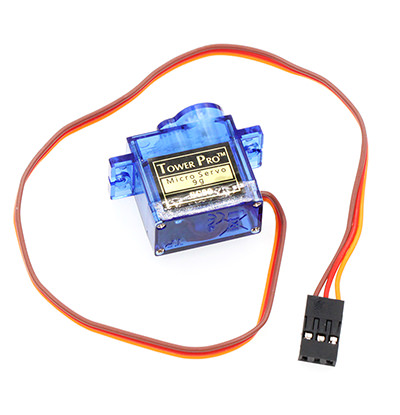
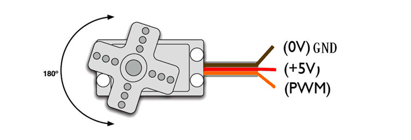
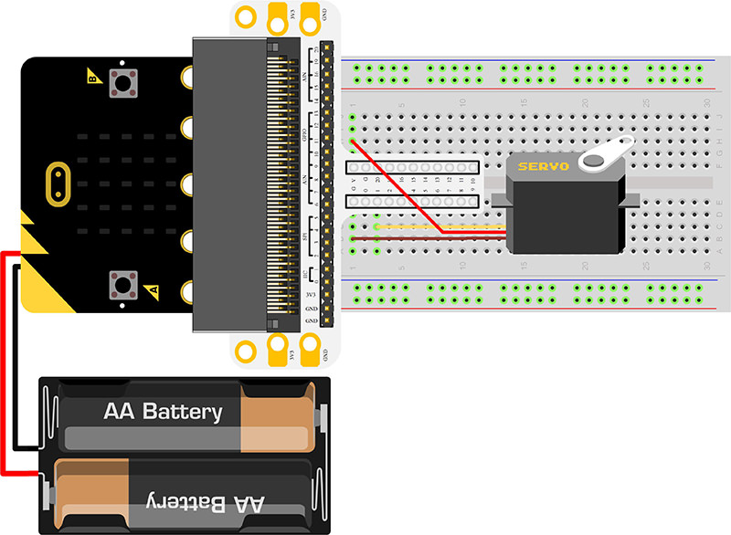
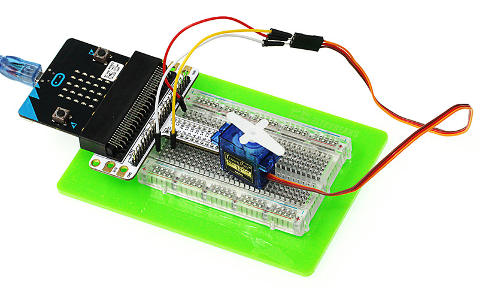
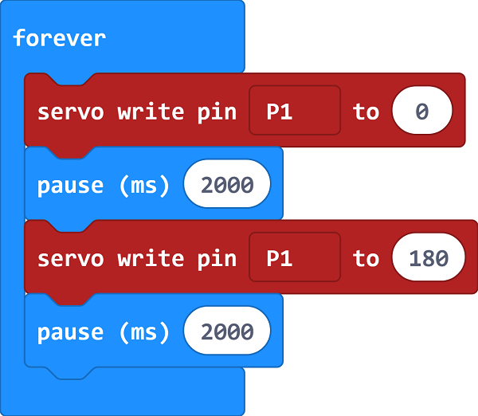
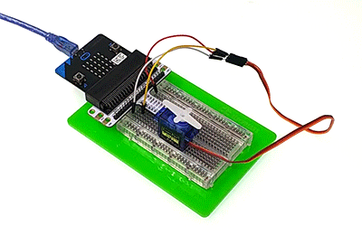

# Lesson 08 Servo 

 

## Introduction

---
Servo is a kind of driver for position (angle) servo. It is suitable to control system with constant angle change and can remain its status. In this experiment, we are going to use micro:bit to make a servo rotate circularly within a travel range.

## Component List

---
### Hardware：

- 1 x micro:bit Board
- 1 x Micro-B USB Cable
- 1 x microbit Breadboard Adapter
- 1 x Transparent Breadboard - 83 * 55 mm
- 1 x TowerPro SG-90 Mini Servo(1.6kg)
- n x Breadborad Jumper Wire 65pcs Pack

****Tips: If you want all components above, you may need Elecfreaks Micro:bit Starter Kit.****

## Major Component Introduction

---
### Servo  

Servo is a set of automatic control system, which consists of DC motor, reduction gear unit, potentiometer and control circuit. It can define rotate angle of output shaft by sending signals. Usually, a servo has a maximum rotate angle(e.g. 180 degrees). Compared with ordinary DC motor, servo rotates within a certain angle range only while ordinary DC motor rotates in circle. This is the major difference between ordinary DC motor and servo. Servo can not rotate in circle. (Note: digital servo do not have this problem because it can switch between servo mode and motor mode.) Ordinary DC motor can not give us feedback about rotate angle but servo can do it. Their usage are different too. Ordinary DC motor use a whole circle rotation as power while servo use certain angle of an object it controlled such as robot joint. The servo system can be controlled by impulse, which can change its width. We use control cable to transmit impulse. The parameter of impulse has maximum value, minimum value and frequency. Generally speaking, the cycle of servo reference signal is 20ms and the width is 1.5ms. The position defined by servo reference signal is middle position. Since servo has a maximum rotate angle, the definition of middle position is from this position the maximum value and the minimum value are the same. Most importantly, different servo may have different maximum rotate angle but the impulse width of middle position is the same and that is 1.5ms.

Note: Micro:bit official has loaded servo control code into bricks. When using Makecode to program, you don’t have to take some complex information (e.g. the width of impulse) into consideration.

Servo has many categories. However, all of servos have three cables connected externally. These cables usually have three different colors( brown, red, orange ) to differentiate each other. (Different servos brand may have different cable colors.) The brown cable is for connecting GND, red cable is for positive power cable and orange cable is for signal cable.  

## Experimental Procedure
---
### Hardware Connection
Connect your components according to the picture below: 
- 1.Connect the servo to P1 port of the breadboard adapter.

You would see as below after you finish the connection: 

### Software Programming

Click to open [Microsoft Makecode](https://makecode.microbit.org/), write the following code in the editor.

### Program as the picture shows:

### Details for the code:
- 1.Analog write pin P1 to 0 in PWM, then pause 2s.
- 2.Analog write pin P1 to 1 in PWM, then pause 2s.
- 3.Show the PWM value repeatedly.

### Reference
Links:[https://makecode.microbit.org/_52MVspRmRWjc](https://makecode.microbit.org/_52MVspRmRWjc)

You can also download the links directly:

<iframe style="position:absolute;top:0;left:0;width:100%;height:100%;" src="https://makecode.microbit.org/#pub:_52MVspRmRWjc" frameborder="0" sandbox="allow-popups allow-forms allow-scripts allow-same-origin"></iframe>
  

## Result
---
We can see the servo rotates with angle range from 0 degree to 180 degree.

## Exploration
---
If we want to use temperature sensors and servos to make a dial thermometer, then how to design circuit and program? 

## FAQ
---

