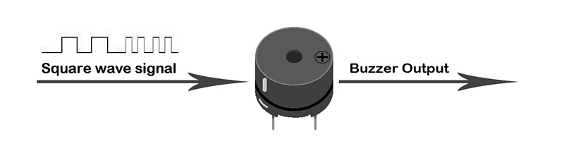
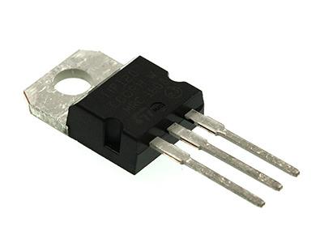
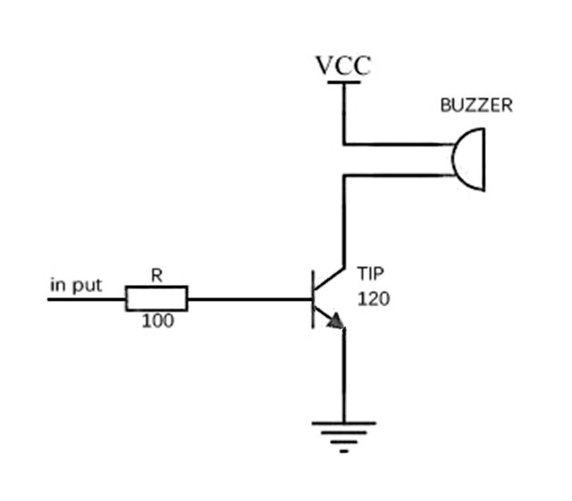
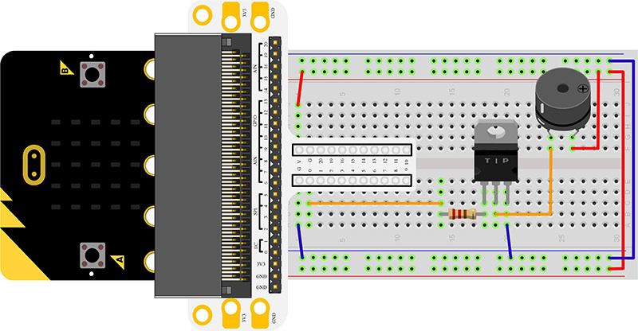
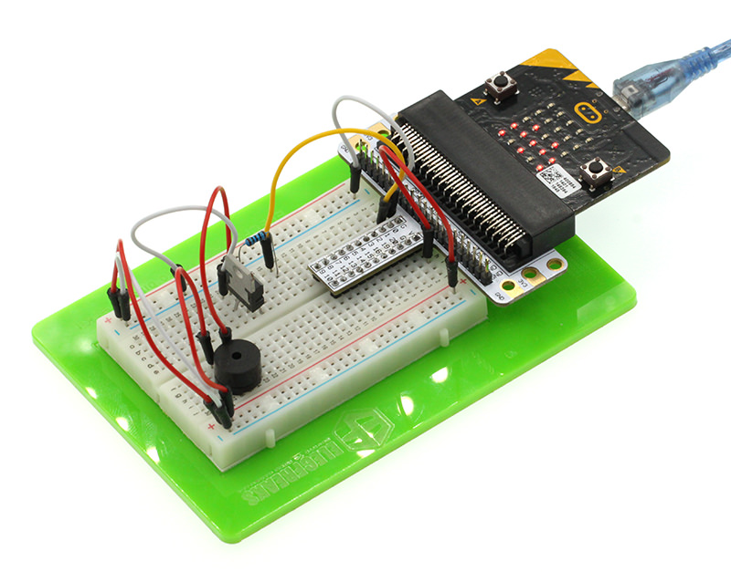
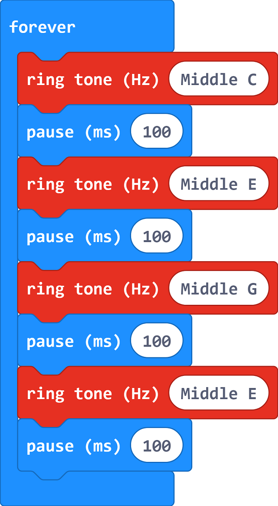
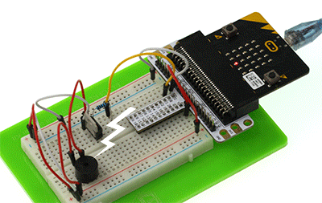

# Lesson 09 Buzzer 

 

## Introduction

---
Buzzer is a kind of electronic sound receiver with integrated structure. It is widely used as a voice device in electronic products like computers, printers, copying machines, alarm apparatus, electronic toys, auto electronic devices, telephones, etc..In this experiment, we are going to use micro:bit to drive buzzer and make its sound circulate between high frequency and low frequency just like alarm song. And we will present its sound frequency on micro:bit  with bar chart format.

## Components List:
---
### Hardware:
- 1 x micro:bit Board
- 1 x Micro-B USB Cable
- 1 x microbit Breadboard Adapter
- 1 x Transparent Breadboard - 83 * 55 mm
- 1 x Mini Speaker (Buzzer)
- 1 x TIP 120 NPN Transistor
- 1 x 100 Ohm Resistors
- 1 x Breadborad Jumper Wire 65pcs Pack

****Tips: If you want all components above, you will need Elecfreaks micro:bit Starter Kit.****

## Major Component Introduction

---
### Buzzer

Buzzer is a kind of voice device. It is made of vibration and resonance device. According to the difference of control method, we can divide buzzer into active type and passive type.

Here’s the working principle of active buzzer: 
Because active buzzer has integrated amplify sampling circuit and resonance system, when DC power input passes through active buzzer, it will make resonance device generate sound signal. We can see the schematic diagram below for the working principle of active buzzer:

 

The working principle of passive buzzer is: When square wave signal passes through the buzzer, its resonance device will transform the square wave signal input into sound signal output. Below is the schematic diagram for the working principle of passive buzzer:

Note: In this experiment, we use passive buzzer only.

### Transistor

Transistor is a kind of semi-conductor component for current control. It is used to amplify the weak signal to signal with larger frequency.

If we input PWM signal produced by micro:bit into buzzer directly, the buzzer will send out feeble voice. This is because the drive current of I/O port is usually too weak to directly drive components like buzzer. At this time, we have to use transistor to amplify the current of PMW signal so that the buzzer can alarm properly. Here is the circuit diagram for a typical application of using transistor to drive buzzer:

## Experimental Procedure
---
### Hardware Connection
Connect your components according to the picture below: 

- 1.Connect the buzzer, the 100Ω resistor and the transistor in series, then connect to P0 port.

You would see as  below after you finish the connection: 

### Software Programming

Click to open Microsoft Makecode, write the following code in the editor.

### Program as the picture shows:

### Details for the code:
- 1.Make a middle C sound in the code and pause 100s; Programme EGE in a similar way.

### Reference
Links:[https://makecode.microbit.org/_DdPPjDCdmM1a](https://makecode.microbit.org/_DdPPjDCdmM1a)

You can also download the links directly:

<iframe style="position:absolute;top:0;left:0;width:100%;height:100%;" src="https://makecode.microbit.org/#pub:_DdPPjDCdmM1a" frameborder="0" sandbox="allow-popups allow-forms allow-scripts allow-same-origin"></iframe>
  

## Result
---
The sound sent out by buzzer changes between high frequency and low frequency. And we can see the bar chart of frequency on the micro:bit.

## Exploration
---
If we want to make a high temperature alarming device with a temperature sensor and a buzzer, then how can we design circuit and program? 

## FAQ
---

