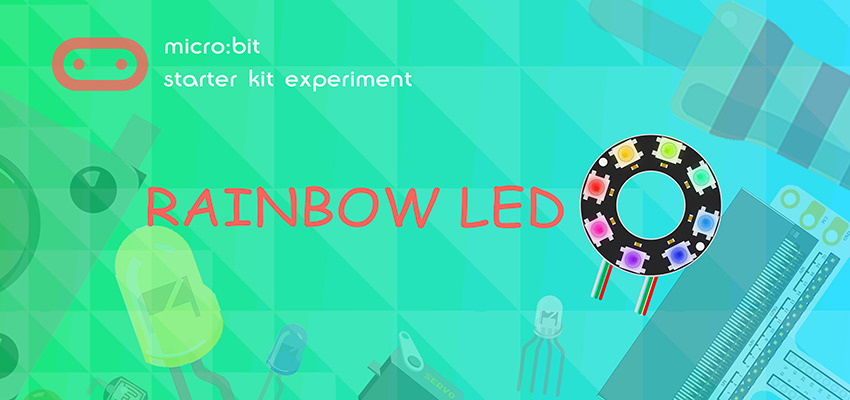
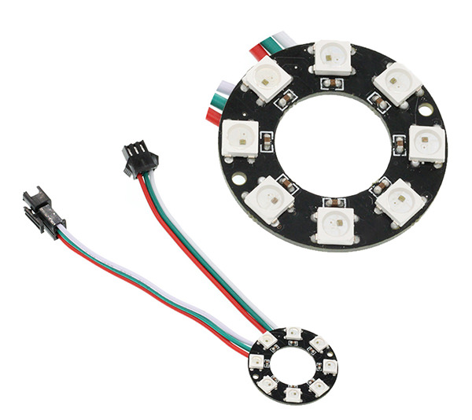
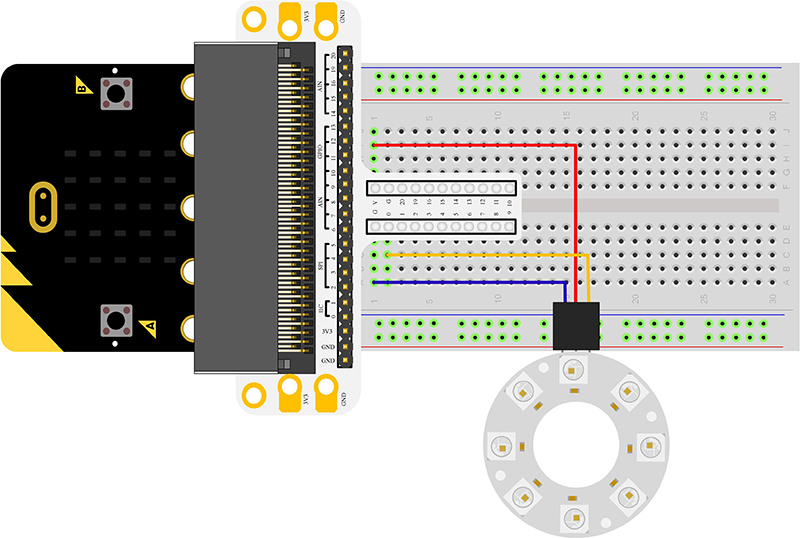
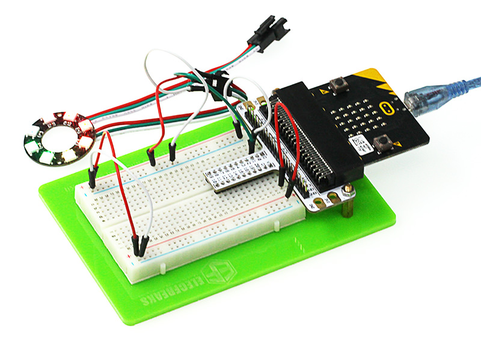
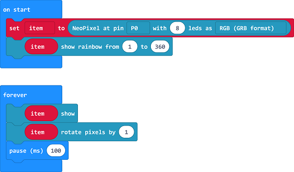
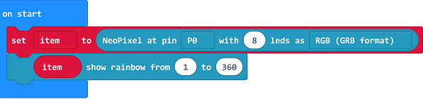
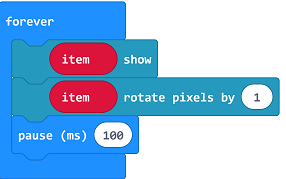

# Lesson 11 Rainbow LED 

    

## Introduction

8 RGB Rainbow LED Ring is based on ws2812b bead. Its biggest characteristic is single IO control and infinite cascade connection. In this experiment, we are going to use micro:bit to drive 8 RGB Rainbow LED Ring and realize rainbow color gradual change.

## Component List

### Hardware:

- 1 x micro:bit Board
- 1 x Micro-B USB Cable
- 1 x micro:bit Breadboard Adapter
- 1 x Transparent Breadboard - 83 * 55 mm
- 1 x 8 RGB Rainbow LED Ring
- n x Breadborad Jumper Wire 65pcs Pack

***Tips: If you want all components above, you may need Elecfreaks Micro:bit [Starter Kit](https://shop.elecfreaks.com/products/elecfreaks-micro-bit-starter-kit?_pos=2&_sid=fc5b895f2&_ss=r) .***

## Major Component Introduction

### **8 RGB Rainbow LED Ring**

8 RGB Rainbow LED Ring is an LED ring made of 8 ws2812b beads in cascade connection. Ws2812b is an intelligent outer control LED source, which has integrated control circuit and light emitting circuit. It has same appearance with 5050LED bead. 

The digital protocol adopts communication method of single line goes to zero. After pixel point restoration, DIN will receive the data sent from the controller. Once the first 24-bit data received was extracted by the first pixel point, it will be sent to the internal digital lock storage device of pixel point and the rest data amplified through the inner transformation processing circuit will be sent to the next pixel point from DO port. Every time it passes through a pixel point transmission, the signal will decrease 24bit. The pixel point uses automatic transformation forwarding technique, thus the pixel cascade connection quantity do not limited by signal transmission but the speed of transmission only.

LED has advantages of low voltage drive, energy-saving and environment protect, wide scattering angle, good consistency, ultra-long life, etc.. To integrate control circuit onto LED, the circuit will become more simple, easier to install and have smaller volume.

## Experimental Procedure

### Hardware Connection

Connect your components according to the picture below: 

- 1. Connect the signal wire of the LED ring to the P0 port of the breadboard adapter.

***Note:*** There are two cables led out by the ring. One is DI and the other is DO. We should connect DI.
After connection, we can see:

 

### Software Programming

Click to open Microsoft Makecode, write the following code in the editor.(https://makecode.microbit.org/)

### Add Package
- Click "Advanced"in the choice of the MakeCode to find more choices.

Click "Extensions", search "neopixel"in the dialog box and then download the "neopixel".

### Program as the picture shows:

### Details for the code:
- Set the 8 led to RGB mode and set the pins to P0 port.

 

- 2.Show the color of RGB and set color gradient.

### Reference
Links:[https://makecode.microbit.org/_LybdqfauX3TR](https://makecode.microbit.org/_LybdqfauX3TR)

You can also download the links directly:

<iframe style="position:absolute;top:0;left:0;width:100%;height:100%;" src="https://makecode.microbit.org/#pub:_LybdqfauX3TR" frameborder="0" sandbox="allow-popups allow-forms allow-scripts allow-same-origin"></iframe>
  

## Result

We can see the light of 8 RGB Rainbow LED Ring is rotating with rainbow color.

## Exploration

Imagine the ring is a big eye, in order to make it twinkle, then how to design circuit and program? 

## FAQ

