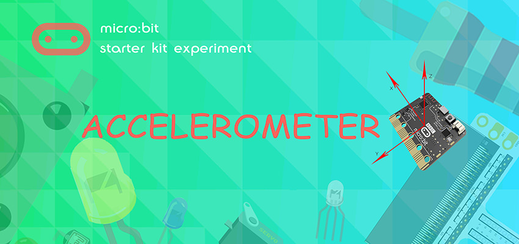
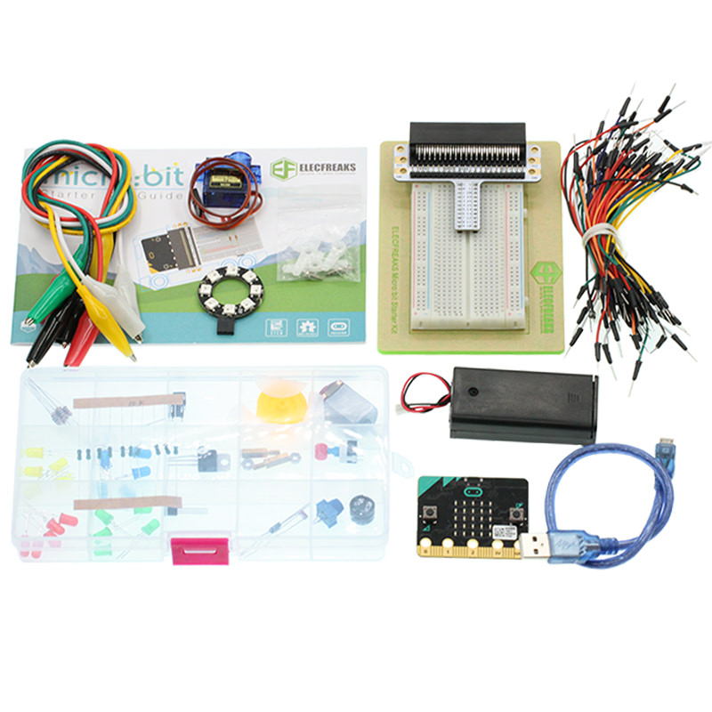
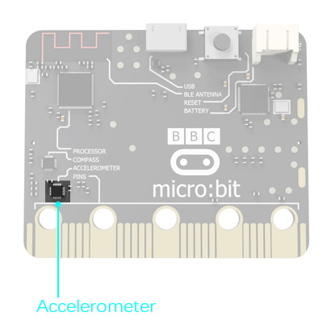
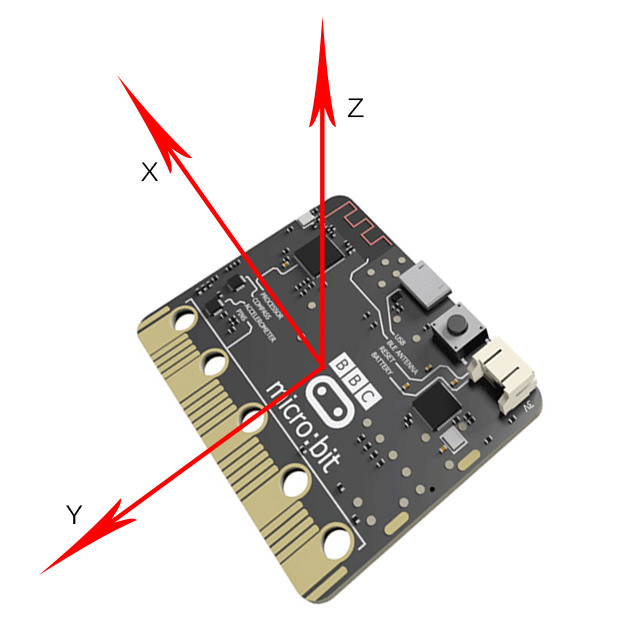
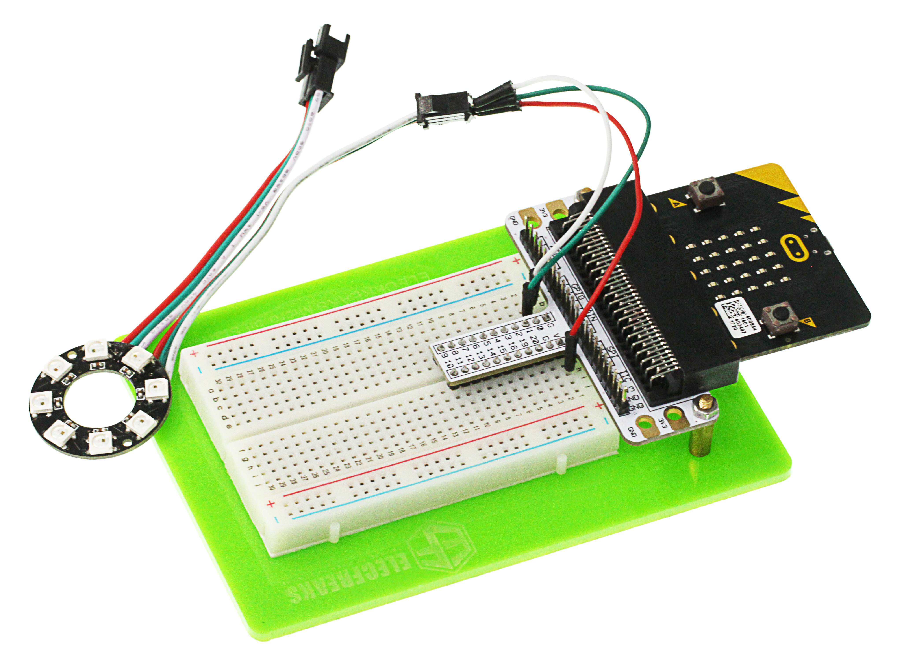
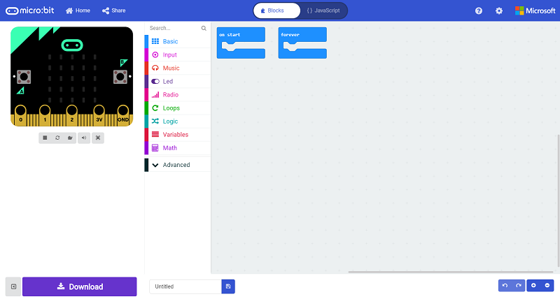
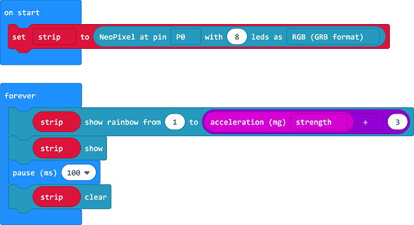
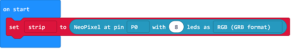
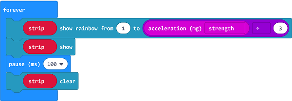
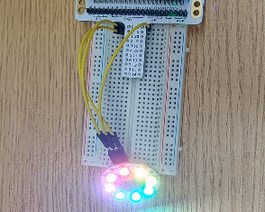

# Lesson 12 Accelerometer 

   

## Introduction

micro:bit has integrated multiple sensors including accelerometer. Today, we are going to use accelerometer to make a level device and display the inclination on RainbowLED ring in bar chart format.

## Component List

### Hardware:

- 1 x micro:bit Board
- 1 x USB Cable
- 1 x micro:bit Breadboard Adapter
- 1 x Transparent Breadboard - 83 * 55 mm
- 1 x 8 RGB RainbowLED Ring
- n x Breadborad Jumper Wire 65pcs Pack

***Tips: If you want all components above, you may need Elecfreaks Micro:bit [Starter Kit](https://www.elecfreaks.com/micro-bit-starter-kit.html) .***

## Major Component Introduction

### **Accelerometer**

There is an accelerometer on your micro:bit which detects the speed change of micro:bit. It converts analog information into digital form that can be used in micro:bit programs. Output is in milli-g. The device will also detect a small number of standard actions, e.g. shake, tilt and free-fall.

The corresponding X, Y, Z axle direction of accelerometer are showed below:

 

## Experimental Procedure

### Hardware Connection
Connect your components according to the picture below: 

- Connect the signal wire of the LED ring to the P0 port of the breadboard adapter.

After connection, we can see:

 

### Software Programming

Click to open Microsoft Makecode, write the following code in the editor.(https://makecode.microbit.org/)

### Add Package

Click "Advanced"in the choice of the MakeCode to find more choices.

Click "Extensions", search "neopixel"in the dialog box and then download the "neopixel".

### Program as the picture shows:

### Details for the code:
- Set P0 port as the pin for LED beads and set it in RGB mode, then light on all the LED.

- Set the color of the light is changed with the accelerated speed.

### Reference
Links:[https://makecode.microbit.org/_0Y07f36Y77sa](https://makecode.microbit.org/_0Y07f36Y77sa)

You can also download the links directly:

<iframe style="position:absolute;top:0;left:0;width:100%;height:100%;" src="https://makecode.microbit.org/#pub:_0Y07f36Y77sa" frameborder="0" sandbox="allow-popups allow-forms allow-scripts allow-same-origin"></iframe>
  

## Result

The RGB LED ring lights on in different color with the movement of the micro:bit.

## Exploration

If we want to set 4 of the LEDs to light on in turns, how can we design the circuit and program?

## FAQ

