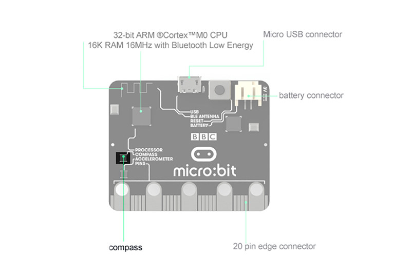
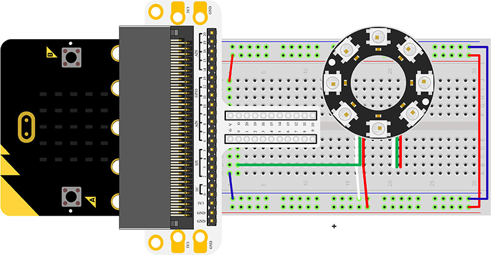
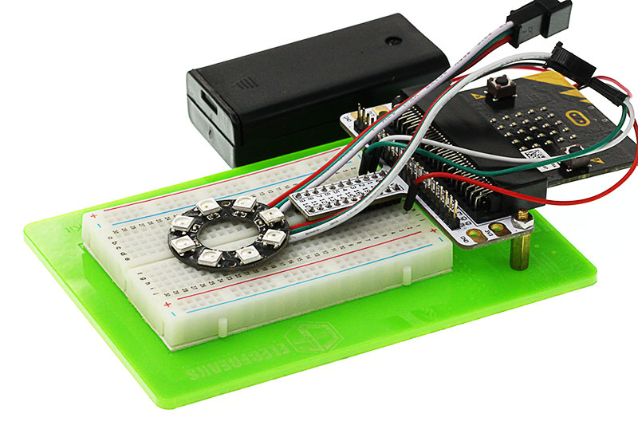
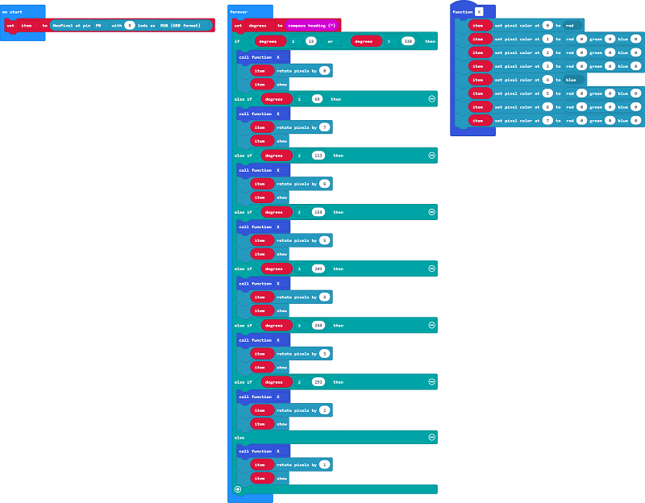
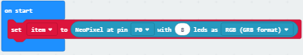
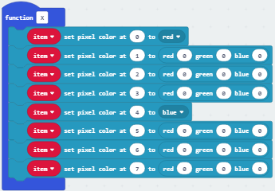
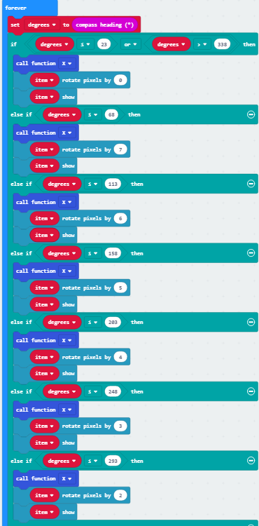
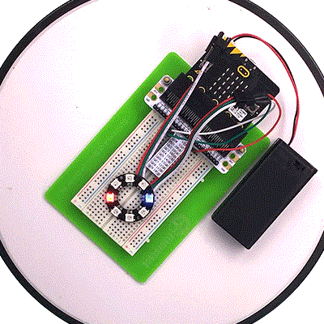

# Lesson 13 Compass 

  

## Introduction

Do you know compass? I believe most of you have played it ever. Today I am going to use micro:bit to create a compass and display its direction on RainbowLED ring. Want to know how I do it? Just read the article below and follow my steps. Let’s go!

## Component List

---
### Hardware:

- 1 x micro:bit Board
- 1 x Micro-B USB Cable
- 1 x micro:bit Breadboard Adapter
- 1 x Transparent Breadboard - 83 * 55 mm
- 1 x 8 RGB Rainbow LED Ring
- n x Breadborad Jumper Wire 65pcs Pack

****Tips: If you want all components above, you may need Elecfreaks Micro:bit Starter Kit.****

## Major Component Introduction
---
### **Compass**

Here, compass in reality is a magnetometer. The magnetometer is a separate chip that provides magnetic field strength sensing. A software algorithm in the standard runtime uses the on board accelerometer to turn these readings into a board orientation independent compass reading. The compass must be calibrated before use, and the calibration process is automatically initiated by the runtime software. This device is connected to the application processor via the I2C bus.

 

## Experimental Procedure
---
### Hardware Connection
Connect your components according to the picture below: 

- Connect the signal wire of the LED ring to the P0 port of the breadboard adapter.

After connection, we can see:

### Software Programming

Click to open Microsoft Makecode, write the following code in the editor.(https://makecode.microbit.org/)

### Add Package

  Click "Advanced"in the choice of the MakeCode to find more choices.

Click "Extensions", search "neopixel"in the dialog box and then download the "neopixel".

### Program as the picture shows:

### Details for the code:
- 1.Set P0 port as the pin to control the ring and set its color mode to RGB.

- 2.Set a function to make the 1st and 5th LED light on with red and blue.

- 3.Read the value detected by the compass, change the color of the LEDs according to them.

### Reference
Links:[https://makecode.microbit.org/_L88UK5VdmR9A](https://makecode.microbit.org/_L88UK5VdmR9A)

You can also download the links directly:

<iframe style="position:absolute;top:0;left:0;width:100%;height:100%;" src="https://makecode.microbit.org/#pub:_L88UK5VdmR9A" frameborder="0" sandbox="allow-popups allow-forms allow-scripts allow-same-origin"></iframe>
  

## Result
---
Rotate the whole device, you can see the Rainbow LED Ring always point at the same direction. 
***Note:*** Every time you start to use the compass (for example, if you have just turned the micro:bit on), the micro:bit will start to calibrate compass (adjust itself). It will ask you to draw a circle by tilting the micro:bit. If you are calibrating or using the compass near metal, it might confuse the micro:bit.

## Exploration
---
If this experiment does not use Rainbow LED Ring but use the arrow displayed on micro:bit as indicator, then how to design circuit and program? 

## FAQ
---

