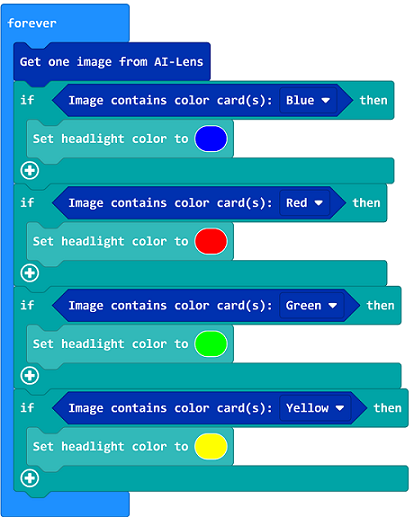
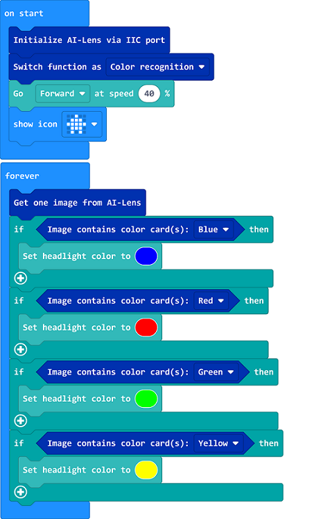

# Case 21: Color Recognition with TPBot 

## Purpose
---
- Using Smart AI Lens to recognize the color and display it on the head lights of TPBot. 

## Materials required

---

- 1 x [TPBot](https://www.elecfreaks.com/tpbot.html)


- 1 x  [AI Lens](https://www.elecfreaks.com/elecfreaks-smart-ai-lens-kit.html)


## Hardware Connections

Connect the AI Lens to the IIC port on TPBot. 


## Software 

---

[MicroSoft MakeCode](https://makecode.microbit.org/#)


## MakeCode Programming

---


- Click "Advanced" to see more choices in the MakeCode drawer. 


- We need to add a package for programming. Click "Extensions" in the bottom of the drawer and seach with "tpbot" in the dialogue box to download it.  


- We need to add a package for programming the AI Lens kit. Click "Extensions" in the bottom of the drawer and seach with `https://github.com/elecfreaks/pxt-PlanetX-AI` in the dialogue box to download it.  


##Sample Code

- Initialize the AI lens kit in the On start brick and switch its function to color recognition, then show an icon. 


- In forever brick, get an image from the AI lens and adjust TPBot's headlights' color by the color recognized in the lens. 


- Complete Code:




### Reference
- Link: [https://makecode.microbit.org/_aAsAR1Tfj8kk](https://makecode.microbit.org/_aAsAR1Tfj8kk)

- You may also download it directly below:

<div style="position:relative;height:0;padding-bottom:70%;overflow:hidden;"><iframe style="position:absolute;top:0;left:0;width:100%;height:100%;" src="https://makecode.microbit.org/#pub:_aAsAR1Tfj8kk" frameborder="0" sandbox="allow-popups allow-forms allow-scripts allow-same-origin"></iframe></div>  
--
---


## Python Programming
---
Add TPBot extension: [https://www.elecfreaks.com/learn-cn/microbitKit/TPbot_tianpeng/TPbot-python.html](https://www.elecfreaks.com/learn-cn/microbitKit/TPbot_tianpeng/TPbot-python.html)
Add AI Lens extension: [https://www.elecfreaks.com/learn-cn/microbitplanetX/ai/Plant-X-EF05035-python.html](https://www.elecfreaks.com/learn-cn/microbitplanetX/ai/Plant-X-EF05035-python.html)

### Code

```
from microbit import *
from AILens import *
from TPBot import *

tp = TPBOT()
ai = AILENS()
# Set the function of AI Lens in color recognition
ai.switch_function(Color)
tp.set_motors_speed(40,40)
while True:
    #  Get an image
    ai.get_image()
    if (ai.get_color_type() == "Blue"):
        tp.set_car_light(0, 0, 255)
        tp.set_car_light(0, 0, 255)
    if (ai.get_color_type() == "Red"):
        tp.set_car_light(255, 0, 0)
        tp.set_car_light(255, 0, 0)
    if (ai.get_color_type() == "Green"):
        tp.set_car_light(0, 255, 0)
        tp.set_car_light(0, 255, 0)
    if (ai.get_color_type() == "Yellow"):
        tp.set_car_light(255, 255, 0)
        tp.set_car_light(255, 255, 0)     
```


---
## Result
---
The TPBot drives forward,
If the blue card is recognized, the TPBot lights on in blue;
If the red card is recognized, the TPBot lights on in red;
If the green card is recognized, the TPBot lights on in green;
If the yellow card is recognized, the TPBot lights on in yellow.


## Exploration
---


## FAQ
---
Q: TPBot doesn't work with the sample code. 
A: It is probably due to the lack of battery power, please try adding the speed of the TPBot or replacing with new batteries. 
Q: The AI Lens is not working,  and it does not go to the function page with the sample code. 
A: Please try replacing with new batteries. 

## Relevant File
---

