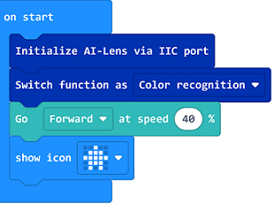
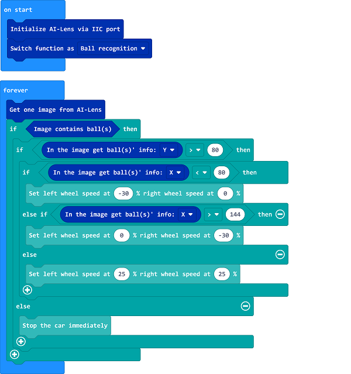

# Case 22: Balls Tracking with TPBot

## Purpose
---
- Use TPBot to build a ball-tracking car. 

## Materials required
---

- 1 x [TPBot](https://shop.elecfreaks.com/products/elecfreaks-micro-bit-tpbot-car-kit-without-micro-bit-board?_pos=1&_sid=f32828112&_ss=r)


- 1 x  [AI Lens](https://shop.elecfreaks.com/products/elecfreaks-smart-ai-lens-kit?_pos=1&_sid=068025047&_ss=r)


## Hardware Connections
---
Connect the AI Lens to the IIC port on TPBot. 


## Software 
---
[MicroSoft MakeCode](https://makecode.microbit.org/#)


## MakeCode Programming
---


- Click "Advanced" to see more choices in the MakeCode drawer. 


- We need to add a package for programming. Click "Extensions" in the bottom of the drawer and seach with "tpbot" in the dialogue box to download it.  


- We need to add a package for programming the AI Lens kit. Click "Extensions" in the bottom of the drawer and seach with `https://github.com/elecfreaks/pxt-PlanetX-AI` in the dialogue box to download it.  


### Sample Code

- Initialize the AI lens kit in the On start brick and switch its function to balls recognition. 



- In forever brick, get an image from the AI lens and adjust TPBot's movement by the balls recognized in the lens. 


- Complete code:




### Link
- Link: [https://makecode.microbit.org/_TY634U7x5RaH](https://makecode.microbit.org/_TY634U7x5RaH)

- You may also download it directly here:

<div style="position:relative;height:0;padding-bottom:70%;overflow:hidden;"><iframe style="position:absolute;top:0;left:0;width:100%;height:100%;" src="https://makecode.microbit.org/#pub:_TY634U7x5RaH" frameborder="0" sandbox="allow-popups allow-forms allow-scripts allow-same-origin"></iframe></div>  


## Python Programming
---
Add TPBot extension: [https://www.elecfreaks.com/learn-cn/microbitKit/TPbot_tianpeng/TPbot-python.html](https://www.elecfreaks.com/learn-cn/microbitKit/TPbot_tianpeng/TPbot-python.html)

Add AI Lens extension: [https://www.elecfreaks.com/learn-cn/microbitplanetX/ai/Plant-X-EF05035-python.html](https://www.elecfreaks.com/learn-cn/microbitplanetX/ai/Plant-X-EF05035-python.html)

### Code

```
from microbit import *
from AILens import *
from TPBot import *

tp = TPBOT()
ai = AILENS()
# Set the function of AI Lens in balls recognition
ai.switch_function(Ball)

while True:
    # Get an image
    ai.get_image()
    buff = ai.get_ball_data()
    # "buff[1]" means the Y coordinates data of the ball detected in AI lens 
    if (buff[1] > 80):
        # "buff[0]" means the X coordinates data of the ball detected in AI lens
        if (buff[0]< 80):
            tp.set_motors_speed(-30,0)  
        elif (buff[0] > 144):
            tp.set_motors_speed(0,-30)
        else:
            tp.set_motors_speed(25,25)
    else:
        tp.set_motors_speed(0,0)
```

### Result

The TPBot moves with the ball and it stops while walking in the right front of the ball. 


## Exporation
---


## FAQ
---
Q: TPBot doesn't work with the sample code.   
A: It is probably due to the lack of battery power, please try adding the speed of the TPBot or replacing with new batteries.   
Q: The AI Lens is not working,  and it does not go to the function page with the sample code.   
A: Please try replacing with new batteries. 

## Relevant File
---

