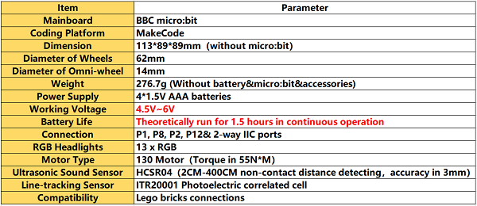
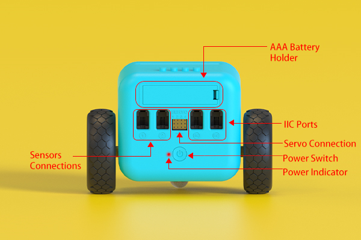
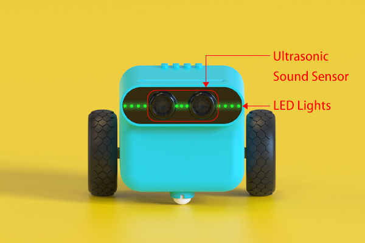
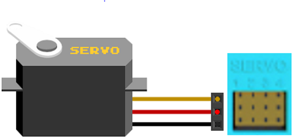
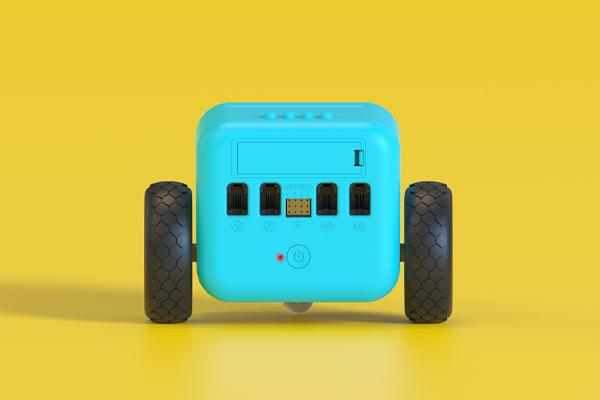
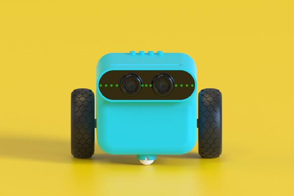
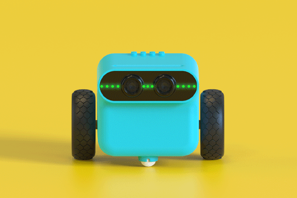

# 1. TPBot Introduction 

## 1.1 Introduction
---

- TP Bot is a smart coding car for micro:bit. It can be regarded as a toy for its preset functions that do not need a micro:bit; it can also be used as a teaching aid at the same time, you can code it via the micro:bit or make extensions for the other modules and the Lego bricks to develop children’s imagination and creativity. 

## 1.2 Picture
---

## 1.3 Parameter
---

## 1.4 Purchasing Link
---

- 1 x [TPBot](https://item.taobao.com/item.htm?spm=a1z10.5-c-s.w4002-18602834185.41.68d15ccfBFHNPy&id=618758535761)

## Connections Diagram
---

Note: The connection to servos shall be inserted vertically with the Ground wire in the bottom. 

## User Guide
---
- TPBot is available to operate even without the micro:bit, here are the instructions: 
- Press the power button to enter into its standby mode, here lights on the power indicator and the LEDs in breathing green. 

- While in its standby mode, press the power button to enter into the line-tracking & obstacles-avoidance mode, here lights on the LEDs in rainbow mode at the same time.

-  While in its line-tracking & obstacles-avoidance mode, the headlights turn to red and it stops moving if an obstacle was detected. 

- While in its line-tracking & obstacles-avoidance mode, press the power button to get back to the standby mode. 
- No matter in its line-tracking & obstacles-avoidance mode or the standby mode, double click the power button to power off the TPBot. 

## Components
---
TPBot Smart Car * 1
Sticker(s) * 1
Map * 1
Manual book * 1
Batteries * 4

## FAQ
---

## Relevant File 
---

