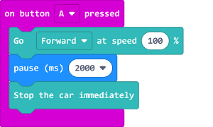

# Case 01: Running Control

## Purpose
---
- Learn to control the movement of TPBot via programming.

## Materials 
---

- 1 x [TPBot]

## Software
---
[MicroSoftmakecode](https://makecode.microbit.org/#)

## Programming
---

- Click "Advanced" to see more choices in the MakeCode drawer. 

-  We need to add a package for programming. Click "Extensions" in the bottom of the drawer and seach with "tpbot" in the dialogue box to download it.  

##Sample A
- Drag the brick of setting the speed in both 100 for both wheels of TPBot into the "On Start". 

### Link
- Link: [https://makecode.microbit.org/_LvPT8LYs3CUV](https://makecode.microbit.org/_LvPT8LYs3CUV)

- You may also download it directly below:

<iframe style="position:absolute;top:0;left:0;width:100%;height:100%;" src="https://makecode.microbit.org/#pub:_LvPT8LYs3CUV" frameborder="0" sandbox="allow-popups allow-forms allow-scripts allow-same-origin"></iframe>
  
---

## Conclusion
---
- TPBot keeps moving forward. 

##Sample B
- Drag and set the brick of moving forward at the speed of 100 and lasting for 3 seconds into the "On Start". 

### Link
- Link: [https://makecode.microbit.org/_i6AHuhJWFhbH](https://makecode.microbit.org/_i6AHuhJWFhbH)

- You may also download it directly below:

<iframe style="position:absolute;top:0;left:0;width:100%;height:100%;" src="https://makecode.microbit.org/#pub:_i6AHuhJWFhbH" frameborder="0" sandbox="allow-popups allow-forms allow-scripts allow-same-origin"></iframe>
  
---

## Conclusion
---

- TPBot moves forward at full speed for 3 seconds and then stops. 

##Sample C
- Drag and set the brick of moving forward at the speed of 100 into the brick of "while button A being pressed", then set to pause for 2000ms, and drag the stops immediately brick as the pic says. 

### Link
- Link: [https://makecode.microbit.org/_3rDfkgbx93hr](https://makecode.microbit.org/_3rDfkgbx93hr)

- You may also download it directly below:

<iframe style="position:absolute;top:0;left:0;width:100%;height:100%;" src="https://makecode.microbit.org/#pub:_3rDfkgbx93hr" frameborder="0" sandbox="allow-popups allow-forms allow-scripts allow-same-origin"></iframe>
  
---

## Conclusion
---

- While button A being pressed, TPBot moves forward at the full speed for two seconds and then stops. 

## Exploration
---

## FAQ
---

## Relevant File 
---

